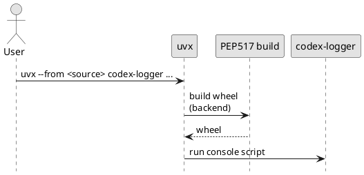

# adr-00004 Python build backend（ビルドバックエンド選定）

## 結論（Decision） (必須)
- 決定: build backend は **hatchling**（Option A）を採用する。

## 背景（Context） (必須)
- 背景/制約（なぜ今決める必要があるか）:
  - `uvx --from <source> codex-logger ...` で実行するため、リポジトリは PEP 517 でビルド可能である必要がある。
  - MVP では「設定が少ない」「壊れにくい」構成を優先する。
- 前提:
  - パッケージ構成は `src/` レイアウトを採用する。
  - console script 名は `codex-logger`。

### UML（uvx 実行時のビルド/起動イメージ）

## 選択肢（Options considered） (必須)
- Option A: hatchling
  - 概要:
    - `build-backend = "hatchling.build"`
    - 設定が少なく、現代的なデフォルトに寄せやすい
  - Pros:
    - 設定が少なく、MVP で導入が早い
    - `src/` レイアウトと相性が良い
  - Cons:
    - setuptools より馴染みがない環境がある
  - 棄却理由（棄却する場合）:
    - （未決）
- Option B: setuptools
  - 概要:
    - `build-backend = "setuptools.build_meta"`
    - 最も一般的で互換性が高い
  - Pros:
    - 実績があり、利用者が多い
  - Cons:
    - 設定が増えがち（MVP の「最短で動かす」にはやや重い場合がある）
  - 棄却理由（棄却する場合）:
    - （未決）

## 判断理由（Rationale） (必須)
- 判断軸:
  - uvx 実行に必要な最小構成で実装できること
  - 設定が少なく、理解コストが低いこと
  - console script の提供が容易であること
- 推奨案（暫定）:
  - Option A（hatchling）

## 影響（Consequences） (必須)
- Positive（良い点）:
  - hatchling を選ぶと `pyproject.toml` が簡潔になり、MVP の導入が早い
- Negative / Debt（悪い点 / 将来負債）:
  - backend 変更は `pyproject.toml` とビルド手順に影響する（ただし早期なら移行は容易）
- 影響範囲（コード/テスト/運用/データ）:
  - `epic-00002` の packaging 実装（`pyproject.toml`）
- 移行/ロールバック:
  - 不都合があれば setuptools へ変更（同一コードでも可能）
- Follow-ups（追加の Epic/Issue/ADR）:
  - 結論確定後、この ADR を `accepted` にし、`epic-00002` の TBD を解消する

## 参考（References） (任意)
- 関連仕様（requirement/design/plan/report）:
  - `spec-dock/initiatives/init-00001-codex-notify-json-logger/epics/epic-00002-packaging-and-cli/requirement.md`
  - `spec-dock/initiatives/init-00001-codex-notify-json-logger/epics/epic-00002-packaging-and-cli/plan.md`
- PR/実装:
  - （未実装）
- 外部資料:
  - PEP 517 / PEP 621
