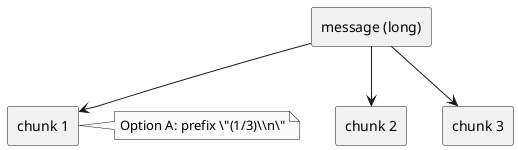

# adr-00007 Telegram chunk numbering（分割投稿の連番付与）

## 結論（Decision） (必須)
- 決定: 分割投稿には **連番を付与する**（Option A）。
  - 形式: `(<i>/<n>)\\n<chunk>`
  - 制約: Telegram の 4096 文字制限には **prefix を含めて**収める（例: `max_body_len = 4096 - len(prefix)`）
  - 長さの単位:
    - 4096 は **文字数（characters）**として扱い、実装では Python 文字列の `len(text)`（Unicode 文字単位）で判定する。
    - 分割/切り詰めは文字境界で行う（UTF-8 のバイト境界破壊は起こさない）。

## 背景（Context） (必須)
- 背景/制約（なぜ今決める必要があるか）:
  - `last-assistant-message` が長文の場合、4096 文字制限を超えるため複数投稿になる。
  - 分割は改行境界優先で行うが、受信側の読みやすさのため「何分割か」「どの順番か」を示したいケースがある。
- 前提:
  - 送信するのは最終アウトプットのみ（入力/トークン等は送らない）。
  - 分割は改行境界優先 + 強制分割フォールバック（既決）。

### UML（分割と連番の関係）

## 選択肢（Options considered） (必須)
- Option A: 連番を付与する（例: `"(1/3)\\n" + chunk`）
  - 概要:
    - 分割後の各チャンク先頭に連番を付ける（総数が確定後に付与）
  - Pros:
    - 受信側が追いやすい（欠落/順序ミスに気づける）
  - Cons:
    - 連番分の文字数が増える（4096 に収まるよう分割アルゴリズムが prefix 長を考慮する必要）
  - 棄却理由（棄却する場合）:
    - （未決）
- Option B: 連番を付与しない
  - 概要:
    - 素の chunk をそのまま送信する
  - Pros:
    - 実装が単純（分割のみ）
  - Cons:
    - 受信側が「途中から読んでしまう」「何分割か分からない」等の読みにくさが残る
  - 棄却理由（棄却する場合）:
    - （未決）

## 判断理由（Rationale） (必須)
- 判断軸:
  - 受信側の可読性
  - 実装の単純さ（prefix 長の考慮が増えるか）
- 結論:
  - Option A（連番付与）

## 影響（Consequences） (必須)
- Positive（良い点）:
  - 分割投稿でも読みやすくなる
- Negative / Debt（悪い点 / 将来負債）:
  - prefix を含めて 4096 に収める必要がある（テストが増える）
- 影響範囲（コード/テスト/運用/データ）:
  - `epic-00004` の分割送信ロジック
  - テスト（連番付与 + 4096 超過しないこと）
- 移行/ロールバック:
  - 連番は UI 表示のみで、mapping やローカル保存には影響しない
- Follow-ups（追加の Epic/Issue/ADR）:
  - 決定後、この ADR を `accepted` にし、`epic-00004` の実装/テストへ反映する

## 参考（References） (任意)
- 関連仕様（requirement/design/plan/report）:
  - `spec-dock/initiatives/init-00001-codex-notify-json-logger/epics/epic-00004-telegram-topics-delivery/requirement.md`
- PR/実装:
  - （未実装）
- 外部資料:
  - Telegram 4096 文字制限
