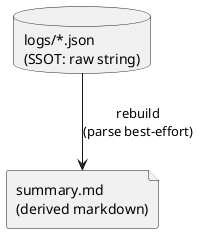

# adr-00010 Event log format (JSON files)

## 結論（Decision） (必須)
- 個別ログ（SSOT）は `.codex-log/logs/*.json` に **notify payload の raw 文字列をそのまま**保存する。
  - 重要: 受信した payload は parse → dump して正規化しない（raw 保持）。
  - payload が不正 JSON の場合でも、raw 保存は継続する（summary 生成時に warn として扱う）。
- `summary.md` は個別ログ（raw）から毎回フル再構築する **派生物** とし、SSOT ではない。

### UML（SSOT と派生物の関係）

## 背景（Context） (必須)
- notify payload は将来的に仕様変更/拡張があり得る。
- 個別ログを「人間向け Markdown」に変換して保存すると、変換仕様の揺れで SSOT が壊れやすい。
- そのため、まずは raw を SSOT として保持し、必要な表示は `summary.md` を都度生成して得る。

## 判断理由（Rationale） (必須)
- 変更耐性（schema 変更に強い）を最優先する。
- 不正 JSON / 欠損フィールドなど異常系でも「データを落とさない」ことを優先する。

## 影響（Consequences） (必須)
- Positive:
  - 仕様変更後でも raw を再解析して追従しやすい
  - 変換ロジックのバグで SSOT を汚染しない
- Negative / Debt:
  - `.json` 拡張子でも中身が不正 JSON の可能性がある（summary 側での堅牢な扱いが必要）
  - 人間が直接読むには不便（summary を主に参照する前提）

## 参考（References） (任意)
- `adr-00001-notify-logger-output-and-telegram.md`
- `adr-00003-filename-safe-id-format.md`
