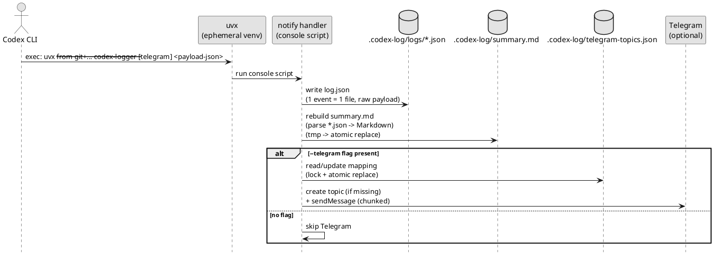
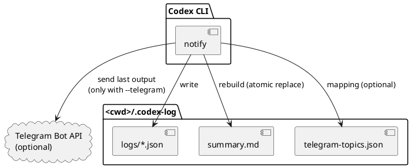

# init-00001 Codex Notify Json Logger — 設計（HOW / Guardrails）

## アーキテクチャ上の狙い（Architectural drivers） (必須)
- 信頼性: ローカル保存を最優先し、外部送信（Telegram）が失敗してもログは残る
- 変更容易性: notify payload のフィールド追加/変更に耐える（raw JSON を SSOT とする）
- 運用性: `.codex` を汚さず、`<cwd>/.codex-log/` に閉じた運用にする
- 安全性: Telegram へは最終アウトプットのみ送る（入力/トークン等は送らない）

## 現状の把握（As-Is） (必須)
- システム構成（簡易）:
  - Codex CLI の `notify` で外部コマンド実行は可能だが、保存/集約/配信の規約がない
- 主要な問題の根（ボトルネック/技術的負債/運用負債）:
  - 受信 JSON を体系的に保存/検索できず、後追い調査が難しい
  - 外部共有が必要でも、入力を含む全文は送れない（内容の切り分けが必要）

## 目指す姿（To-Be） (必須)
- To-Be 概要（文章でOK。図は必要なら各セクション内の UML 小項目に）:
  - `notify` handler（ツール）は JSON payload を **コマンド引数として**受け取り（追加引数がある場合は末尾に付与されるため、最後の引数を JSON として解釈する）、`<cwd>/.codex-log/` へ保存する。
  - `logs/` に「1イベント=1ファイル」の **raw JSON（SSOT）** を残し、`summary.md` は毎回 JSON をパースして Markdown に変換して **原子的に置換**する（`summary.md.tmp` → rename）。
  - Telegram は任意で、環境変数が揃って **かつフラグ `--telegram` が指定された場合のみ**、`last-assistant-message` を topic へ送る。
- 境界（モジュール/責務/データ境界の方針）:
  - 入力（payload）: Codex CLI notify JSON（raw を SSOT）
  - 出力（永続）: raw JSON ログ（SSOT）+ summary Markdown（派生物）
  - 外部送信: Telegram（最終アウトプットのみ）

### UML（任意） (任意)


## システム境界 / 依存（Context） (必須)
- 対象範囲（in scope のシステム/モジュール）:
  - notify handler（CLI から呼び出されるスクリプト/バイナリ）
  - ローカル保存（`.codex-log/`）とサマリ生成
- 外部依存（他サービス/外部API/チーム）:
  - Telegram Bot API（任意）
- 互換性の方針（後方互換/段階移行/破壊的変更の扱い）:
  - raw JSON を常に保存し、Markdown の「表示フィールド」は追加/変更があっても破壊しにくい形にする

### UML（任意） (任意)


## ガードレール（Must-follow constraints） (必須)
- 互換性（API/データ）:
  - notify payload は未知フィールドが増える前提で、パース失敗時も raw を保存する
- セキュリティ（権限/監査/PII）:
  - Telegram に送るのは `last-assistant-message` のみ（入力/トークン等は送らない）
  - `.codex` を汚さない（ログは `.codex-log/` のみ）
  - ファイル名へ `thread-id`/`turn-id` を生で埋め込まない（正規化/短縮/ハッシュ等で安全化し、生値は raw JSON に残す）
  - 同名ファイルが発生しても上書きしない（排他的作成 + サフィックス等で必ず別名保存）
  - `.codex-log/` 配下は機密を含み得るため、可能な範囲で restrictive な権限（例: dir 0700 / file 0600）で作成する
- 観測性（ログ/メトリクス/トレース）:
  - 失敗は stderr に出し、exit code で検知できるようにする（ローカル保存の失敗は非許容）
- 品質ゲート（必須テスト/レビュー条件）:
  - ログ生成（ファイル名/内容）と summary 再生成の E2E テスト
  - Telegram 分割送信（改行境界/4096 超過）のユニットテスト
  - Telegram 分割で改行が無い超長文に対し、強制分割フォールバックがある

## 契約（外部I/F・データ境界） (必須)
- 外部I/F（API/イベント/ファイル等）:
  - 入力: コマンド引数の末尾に付与される JSON 文字列（`notify` payload）
  - 出力: `<cwd>/.codex-log/logs/*.json`, `<cwd>/.codex-log/summary.md`
  - 外部API（任意）: Telegram Bot API（topic 作成、メッセージ投稿）
- データ境界（どこが正で、どこまで整合性を要求するか）:
  - SSOT: 保存した raw JSON（`logs/*.json`）
  - summary.md は派生物（常に `logs/` から再生成可能）

## 移行 / ロールアウト方針（原則） (必須)
- 段階導入:
  - Phase 1: ローカル保存 + summary 再生成のみ
  - Phase 2: Telegram topic 作成/送信（環境変数が揃っており、かつ `--telegram` 指定時のみ）
- ロールバック:
  - Telegram を無効化（環境変数未設定）してもローカル保存は継続できる

## ディレクトリ構成（出力: `.codex-log/`） (必須)
> 仕様は requirement に同じ。ここでは「生成/更新方式」を設計として補足する。

```text
<cwd>/.codex-log/
├── logs/                      # 1イベント=1ファイル
├── summary.md                 # logs/ からフル再構築（派生物）
├── summary.md.tmp             # 原子置換用
└── telegram-topics.json       # (optional) topic mapping（lock + 原子置換）
```

### 更新方式（事故防止）
- `summary.md`: lock → `summary.md.tmp` に生成 → fsync → rename で原子的に置換（失敗時は旧 summary を維持）
- `telegram-topics.json`: lock → read-modify-write（tmp + rename）で破損しにくくする

## 配布/実行（uvx） (必須)
### 目的
- ローカル clone/インストール無しで、GitHub リポジトリ URL を指定して都度実行できるようにする。

### リポジトリ構成（MVP 想定）
```text
repo-root/                               (dir)
├── pyproject.toml                       (file) x 1
├── README.md                            (file) x 1
├── src/                                 (dir)
│   └── codex_logger/                    (dir)  # Python package
│       ├── __init__.py                  (file) x 1
│       ├── cli.py                       (file) x 1  # console script entry
│       ├── notify_payload.py            (file) x 1  # JSON parsing/normalization
│       ├── storage.py                   (file) x 1  # logs + atomic summary
│       └── telegram.py                  (file) x 1  # topics + chunking (optional)
└── tests/                               (dir)  # テスト（件数は Issue 化で確定）
    └── test_*.py                        (file) x N
```

### 想定コマンド（例）
```bash
# ローカル保存のみ（Telegramは送らない）
uvx --from git+https://github.com/<owner>/<repo> codex-logger '<payload-json>'

# Telegram送信あり（最終アウトプットのみ）
uvx --from git+https://github.com/<owner>/<repo> codex-logger --telegram '<payload-json>'

# GitHub 指定 + タグ/コミット固定（例）
uvx --from git+https://github.com/<owner>/<repo>@v0.1.0 codex-logger '<payload-json>'
uvx --from git+https://github.com/<owner>/<repo>@<commit-sha> codex-logger '<payload-json>'

# ローカル clone のパス指定（例）
uvx --from /path/to/local/clone codex-logger '<payload-json>'
uvx --from . codex-logger '<payload-json>'  # repo-root で実行する場合
```

### Codex CLI `notify` 設定例（概念）
> `notify = [...]` の末尾に Codex が JSON payload を追加するため、ツールは「最後の引数を JSON」として扱う。

```toml
# Telegram なし
notify = ["uvx", "--from", "git+https://github.com/<owner>/<repo>", "codex-logger"]

# Telegram あり
notify = ["uvx", "--from", "git+https://github.com/<owner>/<repo>", "codex-logger", "--telegram"]
```

## 観測性（Observability） (必須)
- ログ（必須キー、マスキング、サンプリング）:
  - handler 自身の stderr ログ: ファイル保存失敗、JSON パース失敗、Telegram API 失敗
- メトリクス（成功/失敗/レイテンシ/キュー長など）:
  - （任意）将来的に、保存成功/失敗カウンタや Telegram 成功/失敗を追加
- アラート（SLO/しきい値/対応導線）:
  - 初期は無し（ローカル運用）。必要なら CI/ログ収集で検知する

## 非機能（NFR）設計（性能/可用性/監査/セキュリティ） (必須)
- 性能:
  - 受信ごとに `summary.md` を再生成するため O(n)（n=ログ件数）。まずは簡潔さ/安全性を優先する。
- 可用性/信頼性:
  - ローカル保存は必達。Telegram はベストエフォート（失敗してもログは残す）。
  - `summary.md` と `telegram-topics.json` は一時ファイル経由の原子的置換で破損しにくくする。
- 監査:
  - raw JSON を保存することで追跡可能性を担保する（ただし機密の扱いは別途検討）
- セキュリティ:
  - Telegram 送信は最終アウトプットのみ + 送信先は環境変数で制御

## 主要リスクと軽減策 (必須)
- R-001: ログに機密が混入（影響: 情報漏洩 / 対応: Telegram 送信は最終アウトプットのみ、将来マスキング方針）
- R-002: Telegram topics 前提（影響: 送信不可 / 対応: 無効化してローカル保存のみで運用可能にする）

## ADR index（意思決定の一覧） (必須)
- adr-00001-notify-logger-output-and-telegram: 出力先/summary/Telegram topics/分割送信の方針
- adr-00002-telegram-topic-naming: Telegram topic 名の命名規則
- adr-00003-filename-safe-id-format: ファイル名の safe id 形式
- adr-00004-python-build-backend: Python build backend 選定
- adr-00005-dotenv-loading-strategy: `.env` の注入方式
- adr-00006-uvx-ref-pinning-strategy: uvx の ref 固定運用
- adr-00007-telegram-chunk-numbering: Telegram 分割投稿の連番付与
- adr-00008-telegram-failure-exit-codes: Telegram 失敗時の exit code
- adr-00009-token-usage-logging: token 使用量の扱い
- adr-00010-event-log-format-json-files: 個別ログは JSON、summary は Markdown

## 未確定事項（TBD） (必須)
- 該当なし（意思決定済み）
  - token 使用量: `adrs/adr-00009-token-usage-logging.md`（MVPでは扱わない）

## 失敗時ポリシー（暫定） (必須)
- ローカル保存（個別ログ or summary）に失敗: 非0で終了（通知フック失敗として検知できる）
- Telegram 送信に失敗: stderr に warn を出し、原則は 0 で終了（ローカル保存優先）
  - ただし「Telegram も必達」にしたい場合は、後続 ADR で明文化する

## 省略/例外メモ (必須)
- 該当なし
