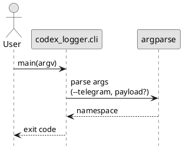
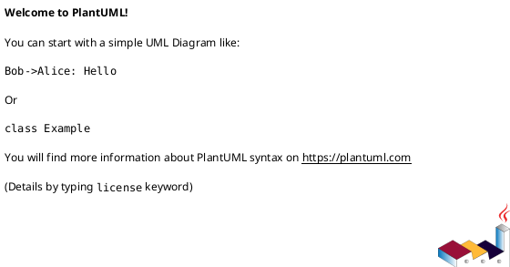
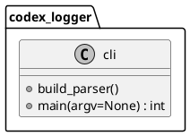

# iss-00005 Packaging Skeleton and CLI Entry — 設計（HOW）

## 目的・制約（要件から転記・圧縮） (必須)
- 目的:
  - `codex-logger` を uvx 経由で起動できる “配布/実行の土台” を作る。
  - `--telegram` と末尾 payload の引数契約を unit test で固定する。
- MUST:
  - `pyproject.toml`（hatchling）+ `src/` レイアウト + console script（`adr-00004`）
  - CLI 引数（`codex-logger [--telegram] <payload>`）をテストで担保
- MUST NOT:
  - `.codex/` の変更
  - ログ保存/summary/Telegram 送信の実装（別Issue）
- 非交渉制約:
  - build backend は hatchling
  - コマンド名は `codex-logger`
- 前提:
  - Python `>=3.11`

---

## 既存実装/規約の調査結果（As-Is / 99.9%理解） (必須)
- 参照した規約/実装（根拠）:
  - `AGENTS.md`: 会話/運用の制約（日本語、git操作制約、コミットルール）
  - `spec-dock/initiatives/init-00001-codex-notify-json-logger/epics/epic-00002-packaging-and-cli/requirement.md`: Epic の E-RQ/E-AC（CLI 契約）
  - `spec-dock/initiatives/init-00001-codex-notify-json-logger/adrs/adr-00004-python-build-backend.md`: hatchling 採用
- 観測した現状（事実）:
  - ルートに `pyproject.toml` が無く、Python パッケージとして uvx 実行できない。
- 採用するパターン（命名/責務/例外/DI/テストなど）:
  - `src/` レイアウト（`src/codex_logger/`）
  - CLI の entrypoint は `codex_logger.cli:main`
  - テストは pytest（CLI 引数パースを unit test）
- 採用しない/変更しない（理由）:
  - `spec-dock/`（仕様ツリー）は変更しない（実装とは別文脈）
- 影響範囲（呼び出し元/関連コンポーネント）:
  - 利用者の `uvx --from <source> codex-logger ...` 実行
  - 後続Issue（ログ保存/Telegram）が `codex_logger.cli` の引数契約に依存

## 主要フロー（テキスト：AC単位で短く） (任意)
- Flow for AC-001（--help）:
  1) `argparse` が help を出力して exit 0
- Flow for AC-002（--version）:
  1) version を出力して exit 0（payload 不要）
- Flow for AC-003（--telegram + payload）:
  1) flags を解釈
  2) 末尾引数を payload として保持（処理本体は別Issue）

### UML（任意） (任意)


## データ・バリデーション（必要最小限） (任意)
- MODEL-001: <Entity/DTO/Table名>
  - Fields: ...
  - Constraints/Validation: ...
- ...

### UML（任意） (任意)


## 判断材料/トレードオフ（Decision / Trade-offs） (任意)
- 論点: ...
  - 選択肢A: ...（Pros/Cons）
  - 選択肢B: ...（Pros/Cons）
  - 決定: ...
  - 理由: ...

## インターフェース契約（ここで固定） (任意)
### 関数・クラス境界（重要なものだけ）
- IF-001: `codex_logger.cli::main(argv: list[str] | None = None) -> int`
  - Input: CLI 引数（`--telegram`, `--version`, `--help`, payload）
  - Output: exit code（0=成功、非0=usage error など）
  - Errors/Exceptions: `argparse` による usage error（`SystemExit`）
- IF-002: `codex_logger.cli::build_parser() -> argparse.ArgumentParser`
  - 責務: 引数契約の定義（flags + 位置引数 payload）

### UML（任意） (任意)


### クラス/インターフェース詳細設計（主要なもの） (任意)
> この Issue を “単独の作業単位” として完結させるために、必要な範囲だけ詳細化する。

- Class: `<ClassName>`
  - Responsibility（責務）:
    - ...
  - Public methods（公開メソッド）:
    - `method(arg: Type) -> Return`
  - Invariants（不変条件）:
    - ...
  - Collaboration（協調関係）:
    - `<OtherClass>`（理由: ...）
- Interface / Protocol: `<InterfaceName>`
  - Contract（契約）:
    - ...
  - 実装候補:
    - `<ImplClass>`

#### UML（任意） (任意)


### 例外/エラー契約（重要なものだけ） (任意)
- ERR-001: <エラー名/コード>
  - 発生条件:
    - ...
  - 呼び出し元への返し方（例: 例外/戻り値/HTTP）:
    - ...
  - ログ/監視:
    - ...

## 変更計画（ファイルパス単位） (必須)
- 追加（Add）:
  - `pyproject.toml`: packaging 設定（hatchling / scripts / dependency groups）
  - `src/codex_logger/__init__.py`: パッケージ初期化（version 取得ヘルパ）
  - `src/codex_logger/cli.py`: CLI entrypoint（argparse / exit code）
  - `tests/test_cli_args.py`: CLI 引数契約の unit test
- 変更（Modify）:
  - `AGENTS.md`:（必要なら）開発者向けの運用メモ追記
- 削除（Delete）:
  - なし
- 移動/リネーム（Move/Rename）:
  - なし
- 参照（Read only / context）:
  - `spec-dock/.../epics/epic-00002-packaging-and-cli/requirement.md`: E-AC を満たすため

## マッピング（要件 → 設計） (必須)
- AC-001 → IF-001（`cli.main` の help 出力）、`pyproject.toml`（scripts）
- AC-002 → IF-001（`--version`）
- AC-003 → IF-002（argparse 定義）、`tests/test_cli_args.py`
- EC-001/EC-002 → `cli.main`（usage error / exit code）、`tests/test_cli_args.py`
- 非交渉制約（hatchling / scripts 名）→ `pyproject.toml`

## テスト戦略（最低限ここまで具体化） (任意)
- 追加/更新するテスト:
  - Unit:
    - `tests/test_cli_args.py`（payload の有無、`--telegram`、`--version`）
- どのAC/ECをどのテストで保証するか:
  - AC-001 →（スモーク）`uvx --from . codex-logger --help`
  - AC-002 →（スモーク）`codex-logger --version`
  - AC-003 → `tests/test_cli_args.py::test_parse_payload_and_telegram_flag`
  - EC-001 → `tests/test_cli_args.py::test_missing_payload_errors`
  - EC-002 → `tests/test_cli_args.py::test_unknown_option_errors`

### テストマトリクス（AC/EC → テスト） (任意)
- AC-001:
  - Unit: ...
  - Integration: ...
  - E2E: ...
- EC-001:
  - Unit: ...
  - Integration: ...
  - E2E: ...
- 非交渉制約（requirement.md）をどう検証するか:
  - 制約: ...
    - 検証方法（テスト/計測点/ログ/運用確認など）: ...
- 実行コマンド（該当するものを記載）:
  - ...
- 変更後の運用（必要なら）:
  - 移行手順: ...
  - ロールバック: ...
  - Feature flag: ...

## リスク/懸念（Risks） (任意)
- R-001: <リスク>（影響: ... / 対応: ...）
- R-002: ...

## 未確定事項（TBD） (必須)
- 該当なし

---

## ディレクトリ/ファイル構成図（変更点の見取り図） (任意)
```text
<repo-root>/
├── pyproject.toml                     # Add
├── src/                               # Add
│   └── codex_logger/
│       ├── __init__.py                # Add
│       └── cli.py                     # Add
└── tests/
    └── test_cli_args.py               # Add
```

## 省略/例外メモ (必須)
- 該当なし
