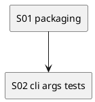

# iss-00005 Packaging Skeleton and CLI Entry — 実装計画（TDD: Red → Green → Refactor）

## この計画で満たす要件ID (必須)
- 対象AC: AC-001, AC-002, AC-003
- 対象EC: EC-001, EC-002
- 対象制約:
  - hatchling backend / `src/` レイアウト / console script 名（`design.md` の変更計画）

## ステップ一覧（観測可能な振る舞い） (必須)
- [ ] S01: `uvx --from . codex-logger --help` が exit 0 で動く
- [ ] S02: `--telegram` と末尾 payload の引数契約が unit test で固定されている

### UML（任意） (任意)

### 要件 ↔ ステップ対応表 (必須)
- AC-001 → S01
- AC-002 → S02（`--version`）
- AC-003 → S02
- EC-001 → S02
- EC-002 → S02
- 非交渉制約 → S01（`pyproject.toml` / entrypoint）

---

## 実装ステップ（各ステップは“観測可能な振る舞い”を1つ） (必須)

### S01 — `uvx --from . codex-logger --help` が exit 0 で動く (必須)
- 対象: AC-001
- 設計参照:
  - 対象IF: IF-001（`codex_logger.cli:main`）
  - 対象成果物: `pyproject.toml`, `src/codex_logger/cli.py`
- このステップで「追加しないこと（スコープ固定）」:
  - ログ保存/summary/Telegram の実装（別Issue）

#### update_plan（着手時に登録） (必須)
- [ ] `update_plan` に、このステップの作業ステップ（調査/Red/Green/Refactor/品質ゲート/報告/コミット）を登録した
- 登録例:
  - （調査）既存挙動/影響範囲の確認、設計参照の確認
  - （Red）失敗するテストの追加/修正
  - （Green）最小実装
  - （Refactor）整理
  - （品質ゲート）format/lint/test
  - （報告）`./spec-dock/active/issue/report.md` 更新
  - （コミット）このステップの区切りでコミット

#### 期待する振る舞い（テストケース） (必須)
- Given: リポジトリ root
- When: `uvx --from . codex-logger --help`
- Then: help が表示され exit 0
- 観測点: stdout / exit code
- 追加/更新するテスト: （このステップはスモーク中心。unit test は S02）

#### Red（失敗するテストを先に書く） (任意)
- 期待する失敗:
  - ...

#### Green（最小実装） (任意)
- 変更予定ファイル:
  - Add: `pyproject.toml`, `src/codex_logger/__init__.py`, `src/codex_logger/cli.py`
- 追加する概念（このステップで導入する最小単位）:
  - console script 定義（`project.scripts`）
  - `cli.main`（`--help` が動く最小実装）
- 実装方針（最小で。余計な最適化は禁止）:
  - argparse の `--help` をそのまま利用する（独自 UI は作らない）

#### Refactor（振る舞い不変で整理） (任意)
- 目的:
  - ...
- 変更対象:
  - ...

#### ステップ末尾（省略しない） (必須)
- [ ] 期待するテスト（必要ならフォーマット/リンタ）を実行し、成功した
- [ ] `./spec-dock/active/issue/report.md` に実行コマンド/結果/変更ファイルを記録した
- [ ] `update_plan` を更新し、このステップの作業ステップを完了にした
- [ ] コミットした（エージェント）

---

### S02 — `--telegram` と末尾 payload の引数契約が unit test で固定されている (必須)
- 対象: AC-002, AC-003 / EC-001, EC-002
- 設計参照:
  - 対象IF: IF-001, IF-002
  - 対象テスト: `tests/test_cli_args.py`
- このステップで「追加しないこと（スコープ固定）」:
  - payload JSON の中身の解釈（thread-id 等）は行わない（別Issue）

#### update_plan（着手時に登録） (必須)
- [ ] `update_plan` に、このステップの作業ステップ（調査/Red/Green/Refactor/品質ゲート/報告/コミット）を登録した

#### 期待する振る舞い（テストケース） (必須)
- Given: `argv=["--telegram", "{\"type\":\"agent-turn-complete\"}"]`
- When: CLI 引数を解釈する
- Then: `telegram=True` かつ payload 文字列を取得できる
- 観測点: unit test
- 追加/更新するテスト:
  - `tests/test_cli_args.py::test_parse_payload_and_telegram_flag`
  - `tests/test_cli_args.py::test_missing_payload_errors`
  - `tests/test_cli_args.py::test_unknown_option_errors`

#### ステップ末尾（省略しない） (必須)
- [ ] `uv run pytest -q` を実行し、成功した
- [ ] `./spec-dock/active/issue/report.md` に実行コマンド/結果/変更ファイルを記録した
- [ ] `update_plan` を更新し、このステップの作業ステップを完了にした
- [ ] コミットした（エージェント）

---

## 未確定事項（TBD） (必須)
- 該当なし

## 完了条件（Definition of Done） (必須)
- 対象AC/ECがすべて満たされ、テストで保証されている
- MUST NOT / OUT OF SCOPE を破っていない
- 品質ゲート（フォーマット/リント/テストのうち該当するもの）が満たされている

## 省略/例外メモ (必須)
- 該当なし
