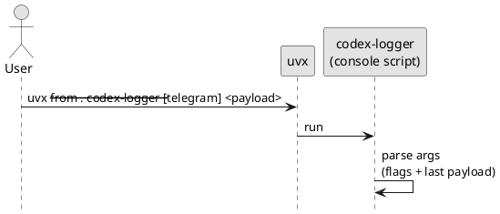

# iss-00005 Packaging Skeleton and CLI Entry — 要件定義（WHAT / WHY）

## 目的（ユーザーに見える成果 / To-Be） (必須)
- `codex-logger` コマンド（console script）が提供され、`uvx --from . codex-logger --help` が成功する。
- `codex-logger [--telegram] <notify-payload-json>` の **引数契約（末尾JSON + フラグ）** がテストで固定される。

## 背景・現状（As-Is / 調査メモ） (必須)
- 現状の挙動（事実）:
  - リポジトリは spec-dock のドキュメントのみで、Python パッケージとしての `pyproject.toml` が存在しない。
  - そのため `uvx --from . codex-logger ...` で実行できない。
- 現状の課題（困っていること）:
  - notify handler を GitHub 参照（tag/sha固定）で導入したいが、配布/実行の土台がない。
  - 後続実装（ログ保存/summary/Telegram）が CLI 契約に依存するため、先に引数契約を固定したい。
- 観測点（どこを見て確認するか）:
  - CLI: `--help` / `--version` の stdout と exit code
  - 自動テスト: 引数パース（payload とフラグの解釈）
- 情報源（ヒアリング/調査の根拠）:
  - Epic 仕様: `spec-dock/initiatives/init-00001-codex-notify-json-logger/epics/epic-00002-packaging-and-cli/requirement.md`
  - ADR: `adr-00004-python-build-backend.md`（hatchling）, `adr-00006-uvx-ref-pinning-strategy.md`（ref 固定）

## 対象ユーザー / 利用シナリオ (任意)
- 主な利用者（ロール）:
  - Codex CLI を使う開発者（notify handler を導入する人）
- 代表的なシナリオ:
  - `notify` の handler として `uvx --from git+...@<ref> codex-logger ...` を設定する（運用は別Issueで整備）。
  - 手元で `uvx --from . codex-logger --help` を叩いて導入確認する。

### UML（任意） (任意)

## スコープ（暴走防止のガードレール） (必須)
- MUST（必ずやる）:
  - PEP517/PEP621 の `pyproject.toml` を追加し、hatchling backend でビルド可能にする（`adr-00004`）。
  - `src/` レイアウトで Python パッケージ（`codex_logger`）を作成する。
  - console script `codex-logger` を提供する。
  - CLI の引数契約（`--telegram` + 末尾payload）を unit test で固定する。
- MUST NOT（絶対にやらない／追加しない）:
  - `.codex/` 配下の設定/ファイルを変更しない（ユーザー環境を汚さない）。
  - ログ保存/summary/Telegram 送信はこの Issue では実装しない（別Issue）。
- OUT OF SCOPE:
  - `.codex-log/` への保存（`iss-00008` / `iss-00009`）
  - Telegram topic 作成/送信（`iss-00010`）
  - README 整備（`iss-00006`）
  - CI 整備（`iss-00007`）

## 境界（Always / Ask / Never） (必須)
- Always（常に守る）:
  - コマンド名は `codex-logger`（console script）とする。
  - notify payload は「末尾の1引数」を JSON 文字列として扱う（flags と共存）。
- Ask（迷ったら相談）:
  - 依存追加（標準ライブラリ以外）を行う場合（例: `.env` / HTTP クライアントなど）。
  - Python のサポートバージョン境界。
- Never（絶対にしない）:
  - 破壊的・不可逆な Git 操作（履歴改変/強制 push 等）

## 非交渉制約（守るべき制約） (必須)
- build backend は hatchling（`adr-00004`）。
- パッケージ構成は `src/` レイアウト。
- CLI 契約（`codex-logger [--telegram] <payload>`）は破壊しない（notify 設定が壊れるため）。

## 前提（Assumptions） (必須)
- 利用者は `uv` / `uvx` を利用できる。
- Python は `>=3.11` を想定する（uvx 実行環境は利用者依存）。

## 判断材料/トレードオフ（Decision / Trade-offs） (任意)
- 論点: テスト用依存（pytest）をどこで定義するか
  - 方針: uv の dependency group `dev` を使い、`uv run pytest` を成立させる（実装で確定）。

## リスク/懸念（Risks） (任意)
- R-001: CLI 契約の曖昧さ（影響: notify が動かない / 対応: 引数パースの自動テストを必須にする）

## 受け入れ条件（観測可能な振る舞い） (必須)
- AC-001:
  - Actor/Role: 開発者
  - Given: リポジトリをチェックアウトしている
  - When: `uvx --from . codex-logger --help` を実行する
  - Then: ヘルプが表示され、exit code 0 で終了する
  - 観測点: stdout / exit code
- AC-002:
  - Actor/Role: 開発者
  - Given: payload が無い
  - When: `codex-logger --version` と `codex-logger --telegram --version` を実行する
  - Then: バージョンが表示され、exit code 0 で終了する
  - 観測点: stdout / exit code
- AC-003:
  - Actor/Role: 開発者
  - Given: `--telegram` と payload JSON（文字列）が与えられる
  - When: CLI 引数を解釈する
  - Then: `--telegram` が payload と誤認されず、payload が末尾引数として取得できる
  - 観測点: 自動テスト（引数パース）

### 入力→出力例 (任意)
- EX-001:
  - Input: `codex-logger --telegram '{"type":"agent-turn-complete"}'`
  - Output: `--telegram=True` / `payload='{"type":"agent-turn-complete"}'` として解釈される（送信/保存自体は別Issue）

## 例外・エッジケース（仕様として固定） (必須)
- EC-001:
  - 条件: `--help` / `--version` 以外で payload が無い
  - 期待: usage とエラーが表示され、exit code が非0
  - 観測点: stderr / exit code
- EC-002:
  - 条件: 不明なオプションまたは余計な位置引数がある
  - 期待: usage とエラーが表示され、exit code が非0
  - 観測点: stderr / exit code

## 用語（ドメイン語彙） (必須)
- TERM-001: uvx = GitHub/ローカルパス等から Python パッケージを解決して実行する uv のコマンド
- TERM-002: console script = `pyproject.toml` の `project.scripts` で定義される実行コマンド
- TERM-003: notify payload = Codex CLI `notify` が末尾引数として渡す JSON 文字列

## 未確定事項（TBD / 要確認） (必須)
- 該当なし

## Definition of Ready（着手可能条件） (必須)
- [ ] 目的が 1〜3行で明確になっている
- [ ] MUST/MUST NOT/OUT OF SCOPE が書けている
- [ ] Always/Ask/Never が書けている
- [ ] AC/EC が観測可能（テスト可能）な形になっている
- [ ] 観測点（UI/HTTP/DB/Log など）または確認方法が明記されている
- [ ] 未確定事項が「質問/選択肢/推奨案/影響範囲」で整理されている

## 完了条件（Definition of Done） (必須)
- すべてのAC/ECが満たされる
- 未確定事項が解消される（残す場合は「残す理由」と「合意」を明記）
- MUST NOT / OUT OF SCOPE を破っていない

## 省略/例外メモ (必須)
- 該当なし
