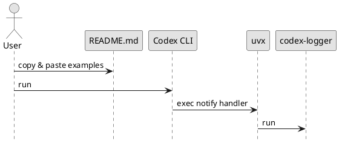

# iss-00006 README and Usage Examples — 設計（HOW）

## 目的・制約（要件から転記・圧縮） (必須)
- 目的:
  - README のみで導入/運用（uvx 実行、notify 組み込み）に到達できるようにする。
- MUST:
  - uvx 実行例（GitHub/tag/sha/local）と notify 設定例（Telegram なし/あり）を載せる。
  - Telegram 前提・機密注意・`.env` 方針（`adr-00005`）を載せる。
- MUST NOT:
  - 機密情報を載せない（プレースホルダのみ）
  - 実装仕様を README に重複して全文転記しない（spec-dock/ADR 参照）
- 非交渉制約:
  - ref 固定は tag 基本（`adr-00006`）
- 前提:
  - `codex-logger` が uvx で起動できる（`iss-00005`）

---

## 既存実装/規約の調査結果（As-Is / 99.9%理解） (必須)
- 参照した規約/実装（根拠）:
  - `spec-dock/.../epic-00002-packaging-and-cli/requirement.md`: README に載せるべき E-RQ/E-AC
  - `spec-dock/.../adrs/adr-00006-uvx-ref-pinning-strategy.md`: ref 固定の推奨（tag/sha）
  - `spec-dock/.../adrs/adr-00005-dotenv-loading-strategy.md`: `.env` の扱い
- 観測した現状（事実）:
  - README が未整備。
- 採用するパターン（命名/責務/例外/DI/テストなど）:
  - README は「導入 → 実行 → notify 組み込み → Telegram（任意） → Troubleshooting」の順で並べる。
- 採用しない/変更しない（理由）:
  - spec-dock の詳細（ADR/設計）を README にコピペしない（重複/陳腐化を避ける）。
- 影響範囲（呼び出し元/関連コンポーネント）:
  - 利用者の notify 設定（コピペして使う箇所）

## 主要フロー（テキスト：AC単位で短く） (任意)
- Flow for AC-001（uvx 実行例）:
  1) GitHub（tag/sha）と local path のコマンド例を提示
  2) `--help` で動作確認できる導線を提示
- Flow for AC-002（notify 設定例）:
  1) Telegram 無し/ありの notify handler 例を提示
  2) payload は末尾に自動付与される旨を明記

### UML（任意） (任意)


## データ・バリデーション（必要最小限） (任意)
- 該当なし（ドキュメントのみ）

## 判断材料/トレードオフ（Decision / Trade-offs） (任意)
- 論点: ...
  - 選択肢A: ...（Pros/Cons）
  - 選択肢B: ...（Pros/Cons）
  - 決定: ...
  - 理由: ...

## インターフェース契約（ここで固定） (任意)
### README 構成（見出し）
- IF-README-001: `README.md` は次の見出しを持つ（順序は推奨）
  - Quickstart（uvx 実行 / `--help`）
  - Run via uvx（GitHub + `@tag` / `@sha` / local path）
  - Codex `notify` integration（Telegram なし/あり）
  - Telegram（前提、必要 env、権限、機密注意）
  - `.env`（`<cwd>/.env` 自動読込、環境変数優先、`uvx --env-file` は任意）
  - Troubleshooting（`--help`、env 不足時の挙動）

### 関数・クラス境界（重要なものだけ）
- 該当なし（ドキュメントのみ）

### 例外/エラー契約（重要なものだけ） (任意)
- 該当なし（ドキュメントのみ）

## 変更計画（ファイルパス単位） (必須)
- 追加（Add）:
  - なし（README が無い場合は Add として扱う）
- 変更（Modify）:
  - `README.md`: 導入/運用例の追記
- 削除（Delete）:
  - なし
- 移動/リネーム（Move/Rename）:
  - なし
- 参照（Read only / context）:
  - `spec-dock/initiatives/init-00001-codex-notify-json-logger/artifacts/notify-payload.md`: notify payload の前提を参照するため
  - `spec-dock/initiatives/init-00001-codex-notify-json-logger/adrs/adr-00005-dotenv-loading-strategy.md`: `.env` 方針を参照するため
  - `spec-dock/initiatives/init-00001-codex-notify-json-logger/adrs/adr-00006-uvx-ref-pinning-strategy.md`: uvx ref 固定方針を参照するため

## マッピング（要件 → 設計） (必須)
- AC-001 → IF-README-001（Run via uvx セクション）
- AC-002 → IF-README-001（Codex notify integration セクション）
- AC-003 → IF-README-001（Telegram / `.env` / 機密注意 セクション）
- EC-001 → README のプレースホルダ方針（機密を載せない）
- EC-002 → README の ref 固定方針（`adr-00006`）

## テスト戦略（最低限ここまで具体化） (任意)
- 追加/更新するテスト:
  - Unit: ...
  - Integration: ...
  - Frontend: ...
- どのAC/ECをどのテストで保証するか:
  - AC-001 → `<test_file_path>::<test_name>`
  - EC-001 → ...

### テストマトリクス（AC/EC → テスト） (任意)
- AC-001:
  - Unit: ...
  - Integration: ...
  - E2E: ...
- EC-001:
  - Unit: ...
  - Integration: ...
  - E2E: ...
- 非交渉制約（requirement.md）をどう検証するか:
  - 制約: ...
    - 検証方法（テスト/計測点/ログ/運用確認など）: ...
- 実行コマンド（該当するものを記載）:
  - ...
- 変更後の運用（必要なら）:
  - 移行手順: ...
  - ロールバック: ...
  - Feature flag: ...

## リスク/懸念（Risks） (任意)
- R-001: <リスク>（影響: ... / 対応: ...）
- R-002: ...

## 未確定事項（TBD） (必須)
- 該当なし

---

## ディレクトリ/ファイル構成図（変更点の見取り図） (任意)
```text
<repo-root>/
└── README.md                          # Modify/Add
```

## 省略/例外メモ (必須)
- 該当なし
