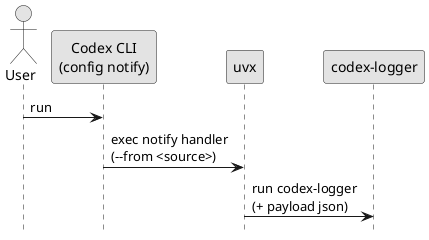

# iss-00006 README and Usage Examples — 要件定義（WHAT / WHY）

## 目的（ユーザーに見える成果 / To-Be） (必須)
- 利用者が README だけで `codex-logger` を **uvx（GitHub/タグ/コミット/ローカルパス）**から実行できる。
- 利用者が README だけで Codex CLI の `notify` へ組み込める（Telegram なし/あり）。

## 背景・現状（As-Is / 調査メモ） (必須)
- 現状の挙動（事実）:
  - README が無く、導入/運用例が spec-dock（仕様）に偏っている。
- 現状の課題（困っていること）:
  - 利用者が「uvx の source 指定（GitHub/タグ/sha/ローカル）」と「notify の設定」の関係を把握しづらい。
  - Telegram（任意）の前提（supergroup + topics、有効化、権限、env）を README で明示したい。
- 観測点（どこを見て確認するか）:
  - `README.md` の記載（コマンド例、設定例、注意点）
- 情報源（ヒアリング/調査の根拠）:
  - Epic 仕様: `spec-dock/initiatives/init-00001-codex-notify-json-logger/epics/epic-00002-packaging-and-cli/requirement.md`
  - ADR: `adr-00006-uvx-ref-pinning-strategy.md`, `adr-00005-dotenv-loading-strategy.md`

## 対象ユーザー / 利用シナリオ (任意)
- 主な利用者（ロール）:
  - Codex CLI の利用者（notify handler を導入する人）
- 代表的なシナリオ:
  - `uvx --from git+...@vX.Y.Z codex-logger ...` を notify に設定する（再現性重視）
  - 開発中は `uvx --from . codex-logger ...` でローカル確認する

### UML（任意） (任意)

## スコープ（暴走防止のガードレール） (必須)
- MUST（必ずやる）:
  - `README.md` を追加/更新する（導入/運用の最小セット）。
  - uvx 実行例（GitHub / `@tag` / `@sha` / ローカルパス）を載せる。
  - Codex CLI `notify` 設定例（Telegram なし/あり）を載せる。
  - Telegram の前提（supergroup + topics、必要 env、bot 権限）と機密注意を載せる。
  - `.env` の扱い（`<cwd>/.env` 自動読込、環境変数優先、`uvx --env-file` は任意）を載せる。
- MUST NOT（絶対にやらない／追加しない）:
  - トークン等の機密値を README に直書きしない（例はプレースホルダのみ）。
  - 仕様詳細を README に全文重複して転記しない（詳細は spec-dock/ADR を参照）。
- OUT OF SCOPE:
  - コード実装（別Issue）

## 境界（Always / Ask / Never） (必須)
- Always（常に守る）:
  - README のコマンド例はコピー&ペースト可能な形にする（ただし機密はプレースホルダ）
- Ask（迷ったら相談）:
  - README に書く範囲（運用監視/高度なトラブルシュートまで踏み込むか）
- Never（絶対にしない）:
  - 機密情報（Token/Chat ID 等）を README に含める

## 非交渉制約（守るべき制約） (必須)
- コマンド名は `codex-logger`（変更しない）。
- uvx の ref 固定運用（tag 基本 + 緊急時 sha）は `adr-00006` に従う。

## 前提（Assumptions） (必須)
- 利用者は `uvx` を利用できる。
- Telegram を使う場合、supergroup（topics 有効）が前提である。

## 判断材料/トレードオフ（Decision / Trade-offs） (任意)
- 論点: ...
  - 選択肢A: ...（Pros/Cons）
  - 選択肢B: ...（Pros/Cons）
  - 決定: ...
  - 理由: ...

## リスク/懸念（Risks） (任意)
- R-001: <リスク>（影響: ... / 対応: ...）
- R-002: ...

## 受け入れ条件（観測可能な振る舞い） (必須)
- AC-001:
  - Actor/Role: 利用者
  - Given: README を読む
  - When: uvx の実行例を探す
  - Then: GitHub / `@tag` / `@sha` / ローカルパスの例が揃っている
  - 観測点: `README.md`
- AC-002:
  - Actor/Role: 利用者
  - Given: README を読む
  - When: notify 設定例を探す
  - Then: Telegram なし/あり（`--telegram`）の設定例がある
  - 観測点: `README.md`
- AC-003:
  - Actor/Role: 利用者
  - Given: README を読む
  - When: Telegram の前提/環境変数/機密注意を探す
  - Then: 必要 env と `.env` の扱いが明記されている
  - 観測点: `README.md`

### 入力→出力例 (任意)
- EX-001:
  - Input: `uvx --from git+https://github.com/chemitaro/codex-agent-logger@v0.1.0 codex-logger --help`
  - Output: help が表示される
- EX-002:
  - Input: notify handler 例（Telegram あり）: `uvx --from git+https://github.com/chemitaro/codex-agent-logger@v0.1.0 codex-logger --telegram`
  - Output: `--telegram` 付きで handler が起動する（payload は末尾に自動付与される）

## 例外・エッジケース（仕様として固定） (必須)
- EC-001:
  - 条件: README の例に機密（token 等）が含まれてしまう
  - 期待: プレースホルダ表記のみとし、実値は載せない（MUST NOT）
  - 観測点: `README.md`
- EC-002:
  - 条件: uvx の ref 指定が曖昧（`main` ブランチ等）
  - 期待: README では tag 固定を推奨し、緊急時のみ sha を案内する（`adr-00006`）
  - 観測点: `README.md`

## 用語（ドメイン語彙） (必須)
- TERM-001: uvx = GitHub/ローカルパス等から Python パッケージを解決して実行する uv のコマンド
- TERM-002: notify = Codex CLI のイベント通知フック（handler に JSON payload を渡す）
- TERM-003: topics = Telegram forum topics（`message_thread_id` で識別されるスレッド）

## 未確定事項（TBD / 要確認） (必須)
- 該当なし

## Definition of Ready（着手可能条件） (必須)
- [ ] 目的が 1〜3行で明確になっている
- [ ] MUST/MUST NOT/OUT OF SCOPE が書けている
- [ ] Always/Ask/Never が書けている
- [ ] AC/EC が観測可能（テスト可能）な形になっている
- [ ] 観測点（UI/HTTP/DB/Log など）または確認方法が明記されている
- [ ] 未確定事項が「質問/選択肢/推奨案/影響範囲」で整理されている

## 完了条件（Definition of Done） (必須)
- すべてのAC/ECが満たされる
- 未確定事項が解消される（残す場合は「残す理由」と「合意」を明記）
- MUST NOT / OUT OF SCOPE を破っていない

## 省略/例外メモ (必須)
- 該当なし
