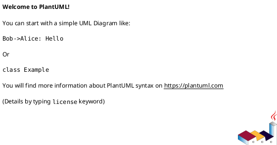

# iss-00007 CI Quality Gates — 設計（HOW）

## 目的・制約（要件から転記・圧縮） (必須)
- 目的: PR/Push でテストを自動実行し、破壊的変更を早期検知する。
- MUST: GitHub Actions で `uv run pytest -q`（+ スモーク）を実行する。
- MUST NOT: 機密値を必須化しない / デプロイしない。
- 非交渉制約: 既存の運用（uv/uvx）を前提にする。
- 前提: `iss-00005` で pyproject + pytest が導入されている。

---

## 既存実装/規約の調査結果（As-Is / 99.9%理解） (必須)
- 参照した規約/実装（根拠）:
  - `spec-dock/.../epic-00002-packaging-and-cli/plan.md`: `uv run pytest` を品質ゲートにする方針
- 観測した現状（事実）:
  - `.github/workflows/` が存在しない。
- 採用するパターン（命名/責務/例外/DI/テストなど）:
  - `astral-sh/setup-uv` で uv を用意し `uv run pytest -q` を実行する。
- 採用しない/変更しない（理由）:
  - secrets を workflow に持たせない（Telegram は任意）。
- 影響範囲（呼び出し元/関連コンポーネント）:
  - GitHub Actions の checks

## 主要フロー（テキスト：AC単位で短く） (任意)
- Flow for AC-001:
  1) ...
  2) ...
  3) ...
- Flow for AC-002:
  1) ...
  2) ...
  3) ...

### UML（任意） (任意)


## データ・バリデーション（必要最小限） (任意)
- MODEL-001: <Entity/DTO/Table名>
  - Fields: ...
  - Constraints/Validation: ...
- ...

### UML（任意） (任意)


## 判断材料/トレードオフ（Decision / Trade-offs） (任意)
- 論点: ...
  - 選択肢A: ...（Pros/Cons）
  - 選択肢B: ...（Pros/Cons）
  - 決定: ...
  - 理由: ...

## インターフェース契約（ここで固定） (任意)
### API（ある場合）
- API-001: `<METHOD> <PATH>`
  - Request: ...
  - Response: ...
  - Errors: ...

### 関数・クラス境界（重要なものだけ）
- IF-001: `<module>::<function/class signature>`
  - Input: ...
  - Output: ...
  - Errors/Exceptions: ...

### UML（任意） (任意)


### クラス/インターフェース詳細設計（主要なもの） (任意)
> この Issue を “単独の作業単位” として完結させるために、必要な範囲だけ詳細化する。

- Class: `<ClassName>`
  - Responsibility（責務）:
    - ...
  - Public methods（公開メソッド）:
    - `method(arg: Type) -> Return`
  - Invariants（不変条件）:
    - ...
  - Collaboration（協調関係）:
    - `<OtherClass>`（理由: ...）
- Interface / Protocol: `<InterfaceName>`
  - Contract（契約）:
    - ...
  - 実装候補:
    - `<ImplClass>`

#### UML（任意） (任意)


### 例外/エラー契約（重要なものだけ） (任意)
- ERR-001: <エラー名/コード>
  - 発生条件:
    - ...
  - 呼び出し元への返し方（例: 例外/戻り値/HTTP）:
    - ...
  - ログ/監視:
    - ...

## 変更計画（ファイルパス単位） (必須)
- 追加（Add）:
  - `.github/workflows/ci.yml`: pytest + smoke を実行する
- 変更（Modify）:
  - なし
- 削除（Delete）:
  - `<path/to/obsolete_file>`: <なぜ削除するか>
- 移動/リネーム（Move/Rename）:
  - `<from>` → `<to>`: <目的>
- 参照（Read only / context）:
  - `<path/to/reference_file>`: <読む理由>

## マッピング（要件 → 設計） (必須)
- AC-001 → `.github/workflows/ci.yml`
- EC-001 → `<path/...>`（エラー処理の場所）
- 非交渉制約 → どの設計で満たすか（例: キャッシュ、冪等、監査ログなど）

## テスト戦略（最低限ここまで具体化） (任意)
- 追加/更新するテスト:
  - Unit: ...
  - Integration: ...
  - Frontend: ...
- どのAC/ECをどのテストで保証するか:
  - AC-001 → `<test_file_path>::<test_name>`
  - EC-001 → ...

### テストマトリクス（AC/EC → テスト） (任意)
- AC-001:
  - Unit: ...
  - Integration: ...
  - E2E: ...
- EC-001:
  - Unit: ...
  - Integration: ...
  - E2E: ...
- 非交渉制約（requirement.md）をどう検証するか:
  - 制約: ...
    - 検証方法（テスト/計測点/ログ/運用確認など）: ...
- 実行コマンド（該当するものを記載）:
  - ...
- 変更後の運用（必要なら）:
  - 移行手順: ...
  - ロールバック: ...
  - Feature flag: ...

## リスク/懸念（Risks） (任意)
- R-001: <リスク>（影響: ... / 対応: ...）
- R-002: ...

## 未確定事項（TBD） (必須)
- 該当なし

---

## ディレクトリ/ファイル構成図（変更点の見取り図） (任意)
```text
<repo-root>/
└── .github/
    └── workflows/
        └── ci.yml                    # Add
```

## 省略/例外メモ (必須)
- 該当なし
