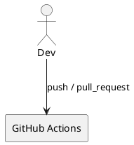

# iss-00007 CI Quality Gates — 要件定義（WHAT / WHY）

## 目的（ユーザーに見える成果 / To-Be） (必須)
- CLI 契約の破壊（`--help` / 引数パース / テスト失敗）を GitHub Actions で早期検知できる。

## 背景・現状（As-Is / 調査メモ） (必須)
- 現状の挙動（事実）:
  - 自動 CI が無い。
- 現状の課題（困っていること）:
  - PR で CLI 契約が壊れても気づきにくい。
- 観測点（どこを見て確認するか）:
  - GitHub Actions の workflow 実行結果（緑/赤）
- 情報源（ヒアリング/調査の根拠）:
  - Epic plan: `spec-dock/.../epic-00002-packaging-and-cli/plan.md`

## 対象ユーザー / 利用シナリオ (任意)
- 主な利用者（ロール）:
  - ...
- 代表的なシナリオ:
  - ...

### UML（任意） (任意)

## スコープ（暴走防止のガードレール） (必須)
- MUST（必ずやる）:
  - GitHub Actions workflow を追加し、`uv run pytest -q` を実行する。
  - （スモーク）`uvx --from . codex-logger --help` を実行する（Telegram 等の env 不要で通ること）。
- MUST NOT（絶対にやらない／追加しない）:
  - リリース/デプロイはしない（CI のみ）。
  - Telegram の機密情報を CI に必須化しない（env 未設定でも CI は通る）。
- OUT OF SCOPE:
  - lint/format の強制（必要なら別Issue）

## 境界（Always / Ask / Never） (必須)
- Always（常に守る）:
  - ...
- Ask（迷ったら相談）:
  - ...
- Never（絶対にしない）:
  - ...

## 非交渉制約（守るべき制約） (必須)
- 例: 既存API互換を維持する
- 例: 依存追加はしない（必要なら要件に明記）
- 例: セキュリティ/プライバシー要件（ログ、マスキング、権限制御など）
- 例: 性能（p95など）やSLO
- ...

## 前提（Assumptions） (必須)
- 例: 対象ユーザーは〜である
- 例: 既存データは〜の状態である
- ...

## 判断材料/トレードオフ（Decision / Trade-offs） (任意)
- 論点: ...
  - 選択肢A: ...（Pros/Cons）
  - 選択肢B: ...（Pros/Cons）
  - 決定: ...
  - 理由: ...

## リスク/懸念（Risks） (任意)
- R-001: <リスク>（影響: ... / 対応: ...）
- R-002: ...

## 受け入れ条件（観測可能な振る舞い） (必須)
- AC-001:
  - Actor/Role: 開発者
  - Given: push または pull_request が発生する
  - When: GitHub Actions workflow（CI）が走る
  - Then: `uv run --frozen pytest -q` が実行され、成功/失敗が可視化される
  - 観測点: Actions の job logs / status
- AC-002:
  - Actor/Role: 開発者
  - Given: push または pull_request が発生する
  - When: GitHub Actions workflow（CI）が走る
  - Then: `uvx --from . codex-logger --help` が実行され exit code 0 で成功する
  - 観測点: Actions の job logs / status
- AC-003:
  - Actor/Role: 開発者
  - Given: Telegram 関連の環境変数が未設定である（`TELEGRAM_BOT_TOKEN`/`TELEGRAM_CHAT_ID` など）
  - When: GitHub Actions workflow（CI）が走る
  - Then: secrets 未設定が原因で job が失敗しない（Telegram を必須化しない）
  - 観測点: Actions の job logs / status

### 入力→出力例 (任意)
- EX-001:
  - Input: ...
  - Output: ...
- EX-002:
  - Input: ...
  - Output: ...

## 例外・エッジケース（仕様として固定） (必須)
- EC-001:
  - 条件: `uv run --frozen pytest -q` が失敗する（テスト失敗）
  - 期待: workflow が失敗として扱われ、PR/push の checks が赤になる
  - 観測点: Actions の job logs / status
- EC-002:
  - 条件: `uvx --from . codex-logger --help` が失敗する（exit code != 0）
  - 期待: workflow が失敗として扱われ、PR/push の checks が赤になる
  - 観測点: Actions の job logs / status

## 用語（ドメイン語彙） (必須)
- TERM-001: CI = GitHub Actions による自動テスト実行
- TERM-002: Quality gate = 仕様逸脱を検知するための必須チェック

## 未確定事項（TBD / 要確認） (必須)
- 該当なし

## Definition of Ready（着手可能条件） (必須)
- [ ] 目的が 1〜3行で明確になっている
- [ ] MUST/MUST NOT/OUT OF SCOPE が書けている
- [ ] Always/Ask/Never が書けている
- [ ] AC/EC が観測可能（テスト可能）な形になっている
- [ ] 観測点（UI/HTTP/DB/Log など）または確認方法が明記されている
- [ ] 未確定事項が「質問/選択肢/推奨案/影響範囲」で整理されている

## 完了条件（Definition of Done） (必須)
- すべてのAC/ECが満たされる
- 未確定事項が解消される（残す場合は「残す理由」と「合意」を明記）
- MUST NOT / OUT OF SCOPE を破っていない

## 省略/例外メモ (必須)
- 該当なし
