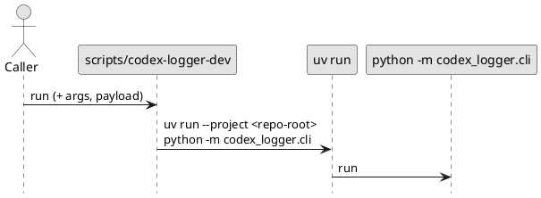

# iss-00013 Local direct runner script — 設計（HOW）

## 目的・制約（要件から転記・圧縮） (必須)
- 目的: ローカル clone から「常に最新ソース」で `codex-logger` を起動できる導線を用意する（uvx のビルド/キャッシュ依存を避ける）。
- MUST:
  - `scripts/codex-logger-dev` を追加し、`--telegram` と payload を透過できる
  - `scripts/codex-logger-dev` は shebang を持ち、実行権限が付与された状態でコミットされる（`notify` から直接起動できる）
  - README に `notify = [...]` のローカル直接実行例を追加する
- MUST NOT:
  - 既存 CLI 契約を変更しない
  - 依存追加しない

---

## 既存実装/規約の調査結果（As-Is） (必須)
- 参照した規約/実装（根拠）:
  - `pyproject.toml`: console script `codex-logger = codex_logger.cli:main`
  - `src/codex_logger/cli.py`: CLI の引数契約（`--telegram` + 末尾 payload）
  - `README.md`: uvx ベースの `notify` 設定例
- 観測した現状（事実）:
  - ローカル clone を uvx で指す運用は、ビルド/キャッシュの影響で「ソース更新が反映されない」切り分けが発生し得る。
- 採用するパターン:
  - スクリプトは repo 内に置き、自己位置から repo root を解決する（実行時 cwd に依存しない）。
  - `uv run` を使い、lock された依存を使いつつ `python -m codex_logger.cli` を実行する（wheel build を避け、ソースを直接実行）。

## 主要フロー（テキスト） (任意)
1) Codex（または手動）から `scripts/codex-logger-dev [--telegram] <payload>` が実行される
2) スクリプトが repo root を解決する
3) `uv run --project <repo-root> python -m codex_logger.cli ...` を exec する

### UML（任意） (任意)


## インターフェース契約（ここで固定） (任意)
- IF-001: `scripts/codex-logger-dev`
  - Input: `codex-logger` と同一（`--telegram` + 末尾 payload JSON）
  - Output: `codex-logger` と同一
  - Exit code: `codex-logger` の exit code を透過
  - 実行条件:
    - `#!/usr/bin/env bash` 等の shebang を持つ
    - 実行権限（`chmod +x`）が付与されている

## 変更計画（ファイルパス単位） (必須)
- 追加（Add）:
  - `scripts/codex-logger-dev`: ローカル clone からソースを直接実行する wrapper
- 変更（Modify）:
  - `README.md`: `notify = [...]` のローカル直接実行例を追記
- 追加（任意・テスト）:
  - `tests/test_dev_runner_script.py`: `--help` が通ることを smoke で確認（環境依存が強ければ見送る）

## マッピング（要件 → 設計） (必須)
- AC-001 → `scripts/codex-logger-dev`（`--help` が通る）
- AC-002 → `scripts/codex-logger-dev`（引数透過）
- AC-003 → `README.md`（notify 設定例）

## テスト戦略（最低限） (任意)
- 基本は README と手動例で担保し、必要なら smoke テストを追加する。
- 実行コマンド:
  - `uv run --frozen pytest -q`

## ディレクトリ/ファイル構成図（変更点の見取り図） (任意)
```text
<repo-root>/
├── scripts/
│   └── codex-logger-dev          # Add
└── README.md                     # Modify
```

## 省略/例外メモ (必須)
- 該当なし
