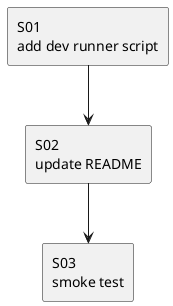

# iss-00013 Local direct runner script — 実装計画（TDD: Red → Green → Refactor）

## この計画で満たす要件ID (必須)
- 対象AC: AC-001, AC-002, AC-003
- 対象EC: EC-001
- 対象制約: 依存追加なし / CLI契約を壊さない

## ステップ一覧（観測可能な振る舞い） (必須)
- [ ] S01: `scripts/codex-logger-dev` が `--help` を通せる
- [ ] S02: README に `notify = [...]` のローカル直接実行例がある
- [ ] S03: script の smoke テストで引数透過を保証する

### UML（任意） (任意)

### 要件 ↔ ステップ対応表 (必須)
- AC-001 → S01, S03
- AC-002 → S01, S03
- AC-003 → S02
- EC-001 → S01（README で前提明記）

---

## 実装ステップ (必須)

### S01 — `scripts/codex-logger-dev` が `--help` を通せる (必須)
- 対象: AC-001, AC-002, EC-001
- 設計参照:
  - 対象IF: `scripts/codex-logger-dev`
- 期待する振る舞い:
  - `scripts/codex-logger-dev --help` が exit 0 で動く
  - `--telegram` と payload がそのまま CLI に渡る

### S02 — README に `notify = [...]` のローカル直接実行例がある (必須)
- 対象: AC-003
- 期待する振る舞い:
  - `notify = [\"/path/to/clone/scripts/codex-logger-dev\", \"--telegram\"]` の例がある

### S03 — script の smoke テストで引数透過を保証する (必須)
- 期待する振る舞い:
  - `scripts/codex-logger-dev --help` が exit 0 で動くことを自動テストで検証できる
  - `scripts/codex-logger-dev --telegram '<payload-json>'` が壊れずに実行され、payload が渡ることを自動テストで検証できる

---

## 未確定事項（TBD） (必須)
- 該当なし

## 完了条件（Definition of Done） (必須)
- AC が満たされる
- README にローカル直接実行例がある

## 省略/例外メモ (必須)
- 該当なし
