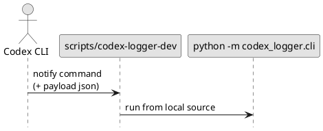

# iss-00013 Local direct runner script — 要件定義（WHAT / WHY）

## 目的（ユーザーに見える成果 / To-Be） (必須)
- ローカル clone 環境で `uvx --from /path/to/clone ...` のビルド/キャッシュに依存せず、**常に最新のソース**で `codex-logger` を実行できる。
- Codex CLI `notify` でも、ローカル clone の **直接実行スクリプト**を指定できる。

## 背景・現状（As-Is / 調査メモ） (必須)
- 現状の挙動（事実）:
  - `uvx --from /path/to/local/clone codex-logger ...` は、環境や状況によってはビルド/キャッシュの影響で古い実装を掴み得る。
- 現状の課題（困っていること）:
  - ローカル開発中の検証で「直したのに挙動が変わらない」状況が起き、原因が uvx 側か実装側か切り分けづらい。
- 再現手順（最小で）:
  1) ローカル clone を更新する（実装を修正）
  2) `uvx --from /path/to/local/clone codex-logger ...` を実行すると、期待どおりに更新が反映されないことがある
- 観測点（どこを見て確認するか）:
  - stdout/stderr: `--help`, `--version` の実行結果
  - README: `notify = [...]` の設定例（ローカル直接実行）
- 情報源（ヒアリング/調査の根拠）:
  - Issue/チケット: #13
  - README: `notify` の設定例

## 対象ユーザー / 利用シナリオ (任意)
- 主な利用者（ロール）:
  - `codex-logger` をローカル clone で開発/検証する開発者
- 代表的なシナリオ:
  - ローカル修正を即反映させて `notify` 統合まで通しで動作確認する

### UML（任意） (任意)


## ディレクトリ/ファイル構成（変更点の見取り図） (必須)
```text
<repo-root>/
├── scripts/
│   └── codex-logger-dev      # 追加（ローカル直接実行）
└── README.md                 # 変更（notify設定例を追記）
```

## スコープ（暴走防止のガードレール） (必須)
- MUST（必ずやる）:
  - ローカル clone から直接実行するためのスクリプトを追加する（`scripts/codex-logger-dev`）。
  - スクリプトは shebang を持ち、実行権限（`chmod +x` 相当）が付与された状態でリポジトリに含まれる（`notify` から直接起動できる）。
  - README に「ローカル clone を `notify` で使う」設定例を追加する（uvx ではなく直接スクリプト）。
  - スクリプトは `--telegram` と payload（末尾 JSON）を正しく透過する。
- MUST NOT（絶対にやらない／追加しない）:
  - 既存の `codex-logger` CLI 契約（引数/exit code）を破壊しない。
  - 依存を増やさない。
- OUT OF SCOPE:
  - Windows 専用スクリプト（必要になったら別Issue）

## 境界（Always / Ask / Never） (必須)
- Always（常に守る）:
  - payload は「末尾引数」（Codex notify の仕様と共存）
- Ask（迷ったら相談）:
  - スクリプト名（`codex-logger-dev` 以外にする等）を変える必要が出た場合
- Never（絶対にしない）:
  - `.codex/` やユーザー環境を勝手に変更する

## 非交渉制約（守るべき制約） (必須)
- 依存追加なし。
- README の例は「ローカル clone 前提」と「GitHub/uvx 前提」を混同しない。

## 前提（Assumptions） (必須)
- ユーザー環境に `uv` がインストールされている（`uvx` を使っている前提）。

## 受け入れ条件（観測可能な振る舞い） (必須)
- AC-001:
  - Actor/Role: 開発者
  - Given: リポジトリをローカル clone 済み
  - When: `scripts/codex-logger-dev --help` を実行する
  - Then: CLI のヘルプが表示され、exit code 0 で終了する
  - 観測点: stdout/exit code
- AC-002:
  - Actor/Role: 開発者
  - Given: `--telegram` と payload（末尾 JSON）を指定する
  - When: `scripts/codex-logger-dev --telegram '<payload-json>'` を実行する
  - Then: `--telegram` が payload と誤認されず、payload が CLI へ渡る
  - 観測点: 自動テスト（CLI引数の既存テスト）/手動
- AC-003:
  - Actor/Role: 開発者
  - Given: Codex CLI `notify` の設定を更新する
  - When: Codex を実行する
  - Then: `notify = [\"/path/to/clone/scripts/codex-logger-dev\", \"--telegram\"]` の形で運用できる
  - 観測点: README 記載

## 例外・エッジケース（仕様として固定） (必須)
- EC-001:
  - 条件: `uv` がインストールされていない
  - 期待: スクリプト実行が失敗する（README に前提として明記する）
  - 観測点: stderr / exit code

## 用語（ドメイン語彙） (必須)
- TERM-001: ローカル直接実行スクリプト = `scripts/codex-logger-dev`（ローカル clone のソースを直接実行するための wrapper）

## 未確定事項（TBD / 要確認） (必須)
- 該当なし

## Definition of Ready（着手可能条件） (必須)
- [ ] 目的が 1〜3行で明確になっている
- [ ] MUST/MUST NOT/OUT OF SCOPE が書けている
- [ ] AC が観測可能な形になっている

## 完了条件（Definition of Done） (必須)
- AC が満たされる
- README の `notify` 設定例が追加される

## 省略/例外メモ (必須)
- 該当なし
