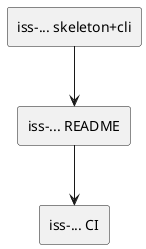

# epic-00002 Packaging and CLI — 計画（Issues / Order）

## Issue 分割（縦切り方針） (必須)
- 価値の縦切り（UI→API→DBまで通す） / 移行の縦切り（expand→...）:
  - 価値の縦切り: 「uvx で `codex-logger` が起動できる」→「CLI 契約（末尾 JSON + フラグ）を固定」→「README/運用例で導入できる」
- 分割方針（原則）:
  - 1 issue = 1 つの観測可能な成果（コマンドが動く/README が揃う/テストが通る）
- 例外（分割方針を破る条件）:
  - なし（まずは最小分割で進める）

## Issue 一覧（順序付き） (必須)
- iss-00005-packaging-skeleton-and-cli-entry（MVP: packaging skeleton + CLI エントリ）:
  - 目的:
    - `uvx --from . codex-logger --help` が通る状態を作る（配布/実行の土台）
  - 成果物（Deliverable）:
    - `pyproject.toml`（PEP 621 + build backend）
    - `src/` レイアウト + `codex_logger/cli.py`（`--help` / `--version` / `--telegram` / 末尾 JSON の引数契約）
    - 最低限の pytest（引数パース）
  - 対応する E-RQ / E-AC:
    - E-RQ-001..004,006 / E-AC-001,002
  - Depends on:
    - なし
- iss-00006-readme-and-usage-examples（MVP: README + 運用例）:
  - 目的:
    - ユーザーが「uvx で実行」「notify に組み込み」できる
  - 成果物:
    - `README.md`（uvx 実行例: GitHub / @tag / @sha / local path）
    - `notify` 設定例（Telegram なし/あり）
    - Telegram 環境変数と注意点（機密）
    - `.env` の自動読込（`<cwd>/.env`、環境変数優先）と `uvx --env-file`（任意）の説明
  - 対応する E-RQ / E-AC:
    - E-RQ-005 /（ドキュメント観測）
  - Depends on:
    - packaging skeleton + CLI エントリ
- iss-00007-ci-quality-gates（SHOULD: CI/品質ゲート整備）:
  - 目的:
    - 仕様逸脱（CLI 契約破壊）を早期に検知する
  - 成果物:
    -（必要なら）GitHub Actions で `uv run pytest` を実行
    - `ruff` 等の静的チェック導入は任意（過剰なら見送る）
  - 対応する E-RQ / E-AC:
    - E-RQ-006
  - Depends on:
    - pytest

### UML（任意） (任意)

## 品質ゲート（Epic） (必須)
- [ ] 各 Issue が AC/EC を満たす自動テストを持つ（例外は理由がある）
- [ ] Epic の統合観点（E-AC）が確認できる（自動/半自動/手順のいずれか）
- [ ] 観測性（ログ/メトリクス/アラート）が入る（該当する場合）
- [ ] 移行手順/ロールバックが文書化される（該当する場合）

## ロールアウト / 移行 (必須)
- Feature flag:
  - N/A（CLI 配布/契約のため）
- 段階公開（カナリア/一部テナント/内部先行など）:
  - `--from .`（ローカル）で検証 → `--from git+...@<ref>` で固定して運用へ
- ロールバック:
  - `--from` の ref を戻す（tag/commit を切り替える）

## Issue Definition of Ready（Issue に求める着手可能条件） (必須)
- [ ] Issue requirement に AC/EC がテスト可能な形で書けている
- [ ] Issue requirement に MUST/MUST NOT/OUT OF SCOPE と Always/Ask/Never がある
- [ ] Issue design に変更計画（パス単位）と要件→設計マッピングがある
- [ ] Issue design にテスト戦略（AC/EC→テスト）がある（該当なしの場合は理由がある）
- [ ] Issue plan が 1ステップ=1つの観測可能な振る舞いになっている
- [ ] 未確定事項が「質問/選択肢/推奨案/影響範囲」で整理されている

## 実行コマンド（必要なら） (任意)
- Test: `uv run pytest -q`
- Smoke: `uvx --from . codex-logger --help`

## 未確定事項（TBD） (必須)
- 該当なし（意思決定済み: `../../adrs/adr-00006-uvx-ref-pinning-strategy.md`）

## 省略/例外メモ (必須)
- 該当なし
