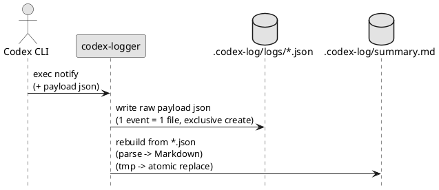
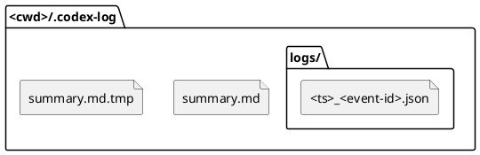

# epic-00003 Local Logging and Summary — 設計（HOW）

## 全体像（Context / Scope） (必須)
- 対象境界（モジュール/責務/データ境界）:
  - 入力: notify payload（JSON 文字列。追加引数がある場合は末尾に付与されるため、`codex-logger` は **末尾引数を JSON** として扱う）
  - 出力: `<cwd>/.codex-log/logs/*.json`（SSOT raw payload）と `<cwd>/.codex-log/summary.md`（派生物）
- 既存フローとの関係:
  - Codex CLI `notify` から呼ばれる前提
- 影響範囲（FE/BE/DB/ジョブ/外部連携）:
  - filesystem のみ

### UML（任意） (任意)


## 契約（API/イベント/データ境界） (必須)
### CLI（本 Epic の契約）
- CLI-001: `codex-logger [--telegram] <payload-json>`
  - 引数:
    - `--telegram`: (optional) Telegram 送信を有効にするフラグ（送信実装は別 Epic）
    - `<payload-json>`: notify payload（JSON）。本ツールは **末尾引数**を JSON として解釈する
  - 出力:
    - `<cwd>/.codex-log/logs/*.json`（SSOT: raw payload）
    - `<cwd>/.codex-log/summary.md`
  - エラー:
    - filesystem 書き込み失敗は非0終了（ローカル保存は必達）

### Event（ある場合）
- EVT-001: `<event_name>`
  - Producer:
    - ...
  - Consumer:
    - ...
  - Payload:
    - ...
  - 発行タイミング:
    - ...

### データ境界（System of Record / 整合性）
- SoR（正のデータ）:
  - `logs/*.json` に保存する raw payload（`adr-00010`）
- 整合性モデル（強整合/結果整合）:
  - `summary.md` は `logs/` から再生成可能な派生物（結果整合で良い）

## データモデル設計 (必須)
> DB ではなくファイル出力だが、破損しないための不変条件を定める。

- 変更点（ファイル/フォーマット）:
  - 1イベント=1JSON（raw payload / SSOT）:
    - ファイル: `.codex-log/logs/<ts>_<event-id>.json`
      - `<ts>`: UTC の `YYYY-MM-DDTHH-MM-SS.mmmZ`（`adr-00001`）
      - 衝突時のみ suffix を付与（例: `...__01.json`, `...__02.json`）
    - `event-id` 形式は `adr-00003` に従う（`thread-id`/`turn-id` を生でファイル名へ入れない）
  - `summary.md` は `logs/` を **ファイル名昇順**で走査し、各 `.json` をパースして Markdown に変換して生成する（決定的）
- バリデーション/不変条件（Invariant）:
  - ファイル名は安全化された値のみ（`thread-id`/`turn-id` を生で含めない）
  - ログファイルは排他的作成で書き込み、衝突時はサフィックス（例: `__01`）で必ず別名保存（上書きしない）
  - `summary.md` は一時ファイル経由で原子的に置換する（旧 summary を壊さない）
  - `summary.md` の再構築区間はロックで排他し、同時実行で古い内容が後勝ちしないようにする
  - `.codex-log/` と `logs/` は 0700、ログファイルは 0600 を意図し、可能な範囲で restrictive に作成する

### UML（任意） (任意)


## 主要フロー（高レベル） (必須)
- Flow A（E-AC-001）:
  1) notify payload（JSON）を parse して `cwd/thread-id/turn-id/...` を抽出（欠損は warn）
     - `cwd` が欠損/不正な場合は `os.getcwd()` へフォールバックし、正規化して採用する
     - `thread-id` / `turn-id` が欠損/空の場合は `event-id` 生成用の複合キーをセンチネル値で補完する（例: `event-key = \"missing-thread-id:missing-turn-id\"`）
  2) `<cwd>/.codex-log/logs/` に raw JSON を 1 件書き出す（排他的作成、権限は restrictive）
  3) lock → `logs/` を **ファイル名昇順**で結合して `summary.md` をフル再構築し、原子的に置換する
- Flow B（E-AC-002）:
  - Flow A の 3) を繰り返し実行しても、常に壊れない summary が得られる

### UML（任意） (任意)
```plantuml
@startuml
skinparam monochrome true
hide footbox

participant "codex-logger" as Handler
database "logs/" as Logs
file "summary.md.tmp" as Tmp
file "summary.md" as Summary

Handler -> Logs: list *.json (sorted)
Handler -> Tmp: write Markdown summary\n(parse each json)
Handler -> Summary: rename(tmp -> summary)\n(atomic)
@enduml
```

## 失敗設計（Error handling / Retry / Idempotency） (必須)
- 想定故障モード:
  - JSON parse 失敗 / 必須キー欠損
  - `.codex-log/` 作成失敗 / ファイル書き込み失敗 / ディスクフル
  - lock 取得失敗（同時実行制御のための前提が崩れる）
- リトライ方針:
  - notify はイベントごとに実行されるため、ツール側で無限リトライはしない（失敗は stderr + 非0）
- 冪等性/重複排除:
  - ファイル名に `<ts>` を含むため、同一イベントの再実行は別ファイルになり得る（重複排除は OUT OF SCOPE）
- 部分失敗の扱い（補償/再実行/整合性）:
  - `summary.md` は派生物なので、再実行で復旧可能
  - ただし「更新失敗を見逃さない」ため、個別ログ保存に成功していても summary の原子置換に失敗したら非0で終了する（ログ自体は残す）
  - 互換性のため、`logs/*.json` の**個々のパース失敗**は原則 warn とし、summary 生成自体は継続する（summary 内に「パース失敗」エントリを残す）

## 移行戦略（Migration / Rollout） (必須)
- 戦略:
  - 新規導入（既存データ移行なし）
- ロールバック方針:
  - handler を外してログ生成を停止（既存ログは残る）

## 観測性（Observability） (必須)
- ログ（必須キー）:
  - `event_type`, `thread_id`, `turn_id`, `cwd`, `log_path`
  - 失敗時は `error_type`, `error_message`
- メトリクス:
  - MVP では不要（必要になったら追加）
- アラート:
  - MVP では不要（stderr/exit code で検知）

## セキュリティ / 権限 / 監査 (必須)
- PII/機微情報の扱い:
  - payload には入力が含まれる可能性があるため、ログファイルは取り扱い注意
  - `.codex-log/` 配下は機密が含まれ得るため、権限は可能な範囲で restrictive にする（例: dir 0700 / file 0600）

## テスト戦略（Epic） (必須)
- Unit:
  - ファイル名の安全化（ID→safe id）
  - 同名衝突時のリトライ（サフィックス付与）
  - summary の再生成（順序、JSON→Markdown、パース失敗の表現）
- Integration:
  - temp dir 上で `logs/` と `summary.md` の生成を検証
- E2E:
  - `codex-logger '<payload-json>'` で 1 イベント保存 + summary 再生成まで通す
- 回帰/負荷:
  - MVP では不要

### E-AC → テスト対応 (必須)
- E-AC-001 → `tests/test_storage.py::test_writes_one_log_file`
- E-AC-002 → `tests/test_storage.py::test_rebuilds_summary_atomically`
- E-AC-003 → `tests/test_storage.py::test_does_not_overwrite_on_collision`
- E-AC-004 → `tests/test_storage.py::test_summary_lock_prevents_last_write_wins_race`

## ADR index（重要な決定は ADR に寄せる） (必須)
- adr-00001-notify-logger-output-and-telegram: `.codex-log` 構成、原子置換、Telegram 分離
- adr-00003-filename-safe-id-format: safe id（短縮ハッシュ）
- adr-00010-event-log-format-json-files: 個別ログは JSON、summary は Markdown

## 未確定事項（TBD） (必須)
- 該当なし（意思決定済み: `adr-00003`）

## 省略/例外メモ (必須)
- 該当なし
