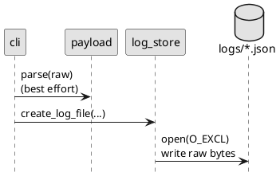
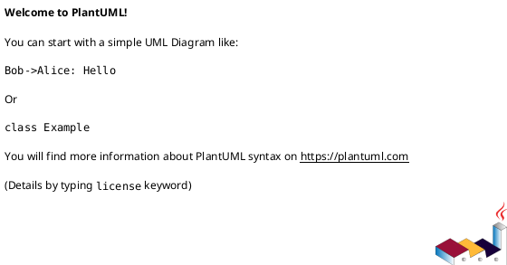

# iss-00008 Raw Payload Logging Files — 設計（HOW）

## 目的・制約（要件から転記・圧縮） (必須)
- 目的: raw payload を `.codex-log/logs/*.json` に安全に保存する（SSOT）。
- MUST:
  - `.codex-log/` + `logs/` を作成し、1イベント=1ファイルで raw を保存
  - ファイル名は `<ts>_<event-id>.json`（`adr-00003`）
- MUST NOT:
  - payload を parse → dump して改変しない
- 非交渉制約:
  - `.codex-log` 名固定、event-id 方式固定（`adr-00003`）
- 前提:
  - `iss-00005` で CLI が起動できる

---

## 既存実装/規約の調査結果（As-Is / 99.9%理解） (必須)
- 参照した規約/実装（根拠）:
  - `adr-00003-filename-safe-id-format.md`: event-id の生成
  - `init-00001/requirement.md`: `.codex-log/logs/*.json` が SSOT
- 観測した現状（事実）:
  - まだ `.codex-log` 保存処理は存在しない。
- 採用するパターン（命名/責務/例外/DI/テストなど）:
  - 生成系（timestamp/event-id）は純粋関数として切り出し、テスト可能にする
  - 書き込みは `O_EXCL` 相当の排他作成 + 衝突時 suffix
- 採用しない/変更しない（理由）:
  - グローバル連番の採用（ユーザー要望により禁止）
- 影響範囲（呼び出し元/関連コンポーネント）:
  - `codex_logger.cli`（payload の受け渡し）
  - 次Issue `iss-00009`（summary が `logs/*.json` を走査）

## 主要フロー（テキスト：AC単位で短く） (任意)
- Flow for AC-001:
  1) payload JSON 文字列を受け取る
  2) 可能なら JSON として parse して `cwd/thread-id/turn-id` を抽出（失敗は warn + fallback）
  3) `<cwd>/.codex-log/logs/` を作成
  4) `<ts>_<event-id>[__NN].json` を排他作成し、raw payload をそのまま保存
- Flow for AC-002:
  1) ...
  2) ...
  3) ...

### UML（任意） (任意)


## データ・バリデーション（必要最小限） (任意)
- MODEL-001: <Entity/DTO/Table名>
  - Fields: ...
  - Constraints/Validation: ...
- ...

### UML（任意） (任意)


## 判断材料/トレードオフ（Decision / Trade-offs） (任意)
- 論点: ...
  - 選択肢A: ...（Pros/Cons）
  - 選択肢B: ...（Pros/Cons）
  - 決定: ...
  - 理由: ...

## インターフェース契約（ここで固定） (任意)
### API（ある場合）
- API-001: `<METHOD> <PATH>`
  - Request: ...
  - Response: ...
  - Errors: ...

### 関数・クラス境界（重要なものだけ）
- IF-LOG-001: `codex_logger.log_store::save_raw_payload(raw: str, payload_cwd: str | None, thread_id: str | None, turn_id: str | None, now_utc: Callable[[], datetime] | None = None) -> Path`
  - Input: raw JSON 文字列 + 必要最小のメタ（best effort）
  - Output: 作成したログファイルのパス
  - Errors: 書き込み不可/権限不可などは例外（この Issue では exit non-zero に繋げる）
- IF-ID-001: `codex_logger.ids::event_id(thread_id: str | None, turn_id: str | None) -> str`
  - Input: thread/turn（欠損可）
  - Output: `ev-<sha[:12]>`

### UML（任意） (任意)


### クラス/インターフェース詳細設計（主要なもの） (任意)
> この Issue を “単独の作業単位” として完結させるために、必要な範囲だけ詳細化する。

- Class: `<ClassName>`
  - Responsibility（責務）:
    - ...
  - Public methods（公開メソッド）:
    - `method(arg: Type) -> Return`
  - Invariants（不変条件）:
    - ...
  - Collaboration（協調関係）:
    - `<OtherClass>`（理由: ...）
- Interface / Protocol: `<InterfaceName>`
  - Contract（契約）:
    - ...
  - 実装候補:
    - `<ImplClass>`

#### UML（任意） (任意)


### 例外/エラー契約（重要なものだけ） (任意)
- ERR-001: <エラー名/コード>
  - 発生条件:
    - ...
  - 呼び出し元への返し方（例: 例外/戻り値/HTTP）:
    - ...
  - ログ/監視:
    - ...

## 変更計画（ファイルパス単位） (必須)
- 追加（Add）:
  - `src/codex_logger/ids.py`: `event_id`（`adr-00003`）
  - `src/codex_logger/timefmt.py`: UTC+ms の `<ts>` 生成
  - `src/codex_logger/payload.py`: payload JSON の best-effort parse（cwd/thread/turn）
  - `src/codex_logger/log_store.py`: `.codex-log/logs/*.json` 保存
  - `tests/test_log_store.py`: 保存/衝突/命名のテスト（tmpdir）
- 変更（Modify）:
  - `src/codex_logger/cli.py`: payload を受け取り `log_store.save_raw_payload(...)` を呼ぶ
- 削除（Delete）:
  - `<path/to/obsolete_file>`: <なぜ削除するか>
- 移動/リネーム（Move/Rename）:
  - `<from>` → `<to>`: <目的>
- 参照（Read only / context）:
  - `<path/to/reference_file>`: <読む理由>

## マッピング（要件 → 設計） (必須)
- AC-001 → `log_store.save_raw_payload` + `tests/test_log_store.py`
- AC-002 → `ids.event_id` + `timefmt.ts_utc_ms`（テスト）
- AC-003 → `log_store.ensure_dirs`（テスト）
- EC-001/EC-002 → `payload.parse_best_effort`（warn + fallback）
- 非交渉制約（raw保持）→ `log_store` は raw 文字列を書き込む（parse→dump禁止）

## テスト戦略（最低限ここまで具体化） (任意)
- 追加/更新するテスト:
  - Unit:
    - event-id と timestamp の生成（純粋関数）
    - log ファイル保存（tmpdir、衝突時 suffix）
  - Integration（簡易）:
    - `cli.main([...payload...])` で `logs/*.json` ができる（tmpdir で cwd を指定）
- どのAC/ECをどのテストで保証するか:
  - AC-001 → `tests/test_log_store.py::test_save_raw_payload_creates_file`
  - AC-002 → `tests/test_log_store.py::test_event_id_and_filename_pattern`
  - EC-001 → `tests/test_log_store.py::test_missing_fields_warns_and_saves`
  - EC-002 → `tests/test_log_store.py::test_invalid_json_warns_and_saves`

### テストマトリクス（AC/EC → テスト） (任意)
- AC-001:
  - Unit: ...
  - Integration: ...
  - E2E: ...
- EC-001:
  - Unit: ...
  - Integration: ...
  - E2E: ...
- 非交渉制約（requirement.md）をどう検証するか:
  - 制約: ...
    - 検証方法（テスト/計測点/ログ/運用確認など）: ...
- 実行コマンド（該当するものを記載）:
  - ...
- 変更後の運用（必要なら）:
  - 移行手順: ...
  - ロールバック: ...
  - Feature flag: ...

## リスク/懸念（Risks） (任意)
- R-001: <リスク>（影響: ... / 対応: ...）
- R-002: ...

## 未確定事項（TBD） (必須)
- 該当なし

---

## ディレクトリ/ファイル構成図（変更点の見取り図） (任意)
```text
<repo-root>/
├── src/codex_logger/
│   ├── cli.py                        # Modify
│   ├── ids.py                        # Add
│   ├── log_store.py                  # Add
│   ├── payload.py                    # Add
│   └── timefmt.py                    # Add
└── tests/
    └── test_log_store.py             # Add
```

## 省略/例外メモ (必須)
- 該当なし
