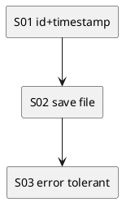

# iss-00008 Raw Payload Logging Files — 実装計画（TDD: Red → Green → Refactor）

## この計画で満たす要件ID (必須)
- 対象AC: AC-001, AC-002, AC-003
- 対象EC: EC-001, EC-002
- 対象制約:
  - raw payload は改変しない
  - event-id 方式（`adr-00003`）

## ステップ一覧（観測可能な振る舞い） (必須)
- [ ] S01: event-id と `<ts>` で安全なログファイル名を生成できる
- [ ] S02: `.codex-log/logs/` に raw payload を排他作成で保存できる
- [ ] S03: 欠損/不正 JSON でも warn + 保存継続できる（best-effort）

### UML（任意） (任意)

### 要件 ↔ ステップ対応表 (必須)
- AC-002 → S01
- AC-001 → S02
- AC-003 → S02
- EC-001 → S03
- EC-002 → S03
- 非交渉制約（raw保持）→ S02

---

## 実装ステップ（各ステップは“観測可能な振る舞い”を1つ） (必須)

### S01 — event-id と `<ts>` で安全なログファイル名を生成できる (必須)
- 対象: AC-002
- 設計参照:
  - 対象IF: IF-ID-001
  - 対象テスト: `tests/test_log_store.py::test_event_id_and_filename_pattern`
- このステップで「追加しないこと（スコープ固定）」:
  - ファイル書き込み自体（S02で実施）

#### update_plan（着手時に登録） (必須)
- [ ] `update_plan` に、このステップの作業ステップ（調査/Red/Green/Refactor/品質ゲート/報告/コミット）を登録した
- 登録例:
  - （調査）既存挙動/影響範囲の確認、設計参照の確認
  - （Red）失敗するテストの追加/修正
  - （Green）最小実装
  - （Refactor）整理
  - （品質ゲート）format/lint/test
  - （報告）`./spec-dock/active/issue/report.md` 更新
  - （コミット）このステップの区切りでコミット

#### 期待する振る舞い（テストケース） (必須)
- Given: `thread-id="t1"`, `turn-id="u1"`
- When: `event_id(thread_id, turn_id)` を呼ぶ
- Then: `ev-` プレフィックス + 12桁の hex を返す
- 観測点: unit test
- 追加/更新するテスト: `tests/test_log_store.py::test_event_id_and_filename_pattern`

#### Red（失敗するテストを先に書く） (任意)
- 期待する失敗:
  - ...

#### Green（最小実装） (任意)
- 変更予定ファイル:
  - Add: `<path/...>`
  - Modify: `<path/...>`
- 追加する概念（このステップで導入する最小単位）:
  - ...
- 実装方針（最小で。余計な最適化は禁止）:
  - ...

#### Refactor（振る舞い不変で整理） (任意)
- 目的:
  - ...
- 変更対象:
  - ...

#### ステップ末尾（省略しない） (必須)
- [ ] 期待するテスト（必要ならフォーマット/リンタ）を実行し、成功した
- [ ] `./spec-dock/active/issue/report.md` に実行コマンド/結果/変更ファイルを記録した
- [ ] `update_plan` を更新し、このステップの作業ステップを完了にした
- [ ] コミットした（エージェント）

---

### S02 — `.codex-log/logs/` に raw payload を排他作成で保存できる (必須)
- 対象: AC-001, AC-003
- 設計参照:
  - 対象IF: IF-LOG-001
  - 対象テスト: `tests/test_log_store.py::test_save_raw_payload_creates_file`
- 期待する振る舞い:
  - `.codex-log/logs/<ts>_<event-id>.json` が作られ、内容が raw と一致する

### S03 — 欠損/不正 JSON でも warn + 保存継続できる (必須)
- 対象: EC-001, EC-002
- 設計参照:
  - `codex_logger.payload::parse_best_effort`
  - 対象テスト:
    - `tests/test_log_store.py::test_missing_fields_warns_and_saves`
    - `tests/test_log_store.py::test_invalid_json_warns_and_saves`

---

## 未確定事項（TBD） (必須)
- 該当なし

## 完了条件（Definition of Done） (必須)
- 対象AC/ECがすべて満たされ、テストで保証されている
- MUST NOT / OUT OF SCOPE を破っていない
- 品質ゲート（フォーマット/リント/テストのうち該当するもの）が満たされている

## 省略/例外メモ (必須)
- 該当なし
