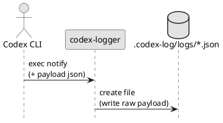

# iss-00008 Raw Payload Logging Files — 要件定義（WHAT / WHY）

## 目的（ユーザーに見える成果 / To-Be） (必須)
- Codex CLI `notify` の payload（JSON文字列）を **raw のまま** `<cwd>/.codex-log/logs/*.json` に 1イベント=1ファイルで保存できる。

## 背景・現状（As-Is / 調査メモ） (必須)
- 現状の挙動（事実）:
  - ログ保存は未実装。
- 現状の課題（困っていること）:
  - notify payload は仕様変更の可能性があり、Markdown 化より先に **raw JSON を SSOT として残す**必要がある。
- 観測点（どこを見て確認するか）:
  - FS: `<cwd>/.codex-log/logs/*.json` の作成
  - 内容: 保存されたファイルが「入力文字列と同一」であること
- 情報源（ヒアリング/調査の根拠）:
  - Initiative requirement: `.codex-log/logs/*.json` を raw 保存（SSOT）
  - ADR: `adr-00003-filename-safe-id-format.md`（event-id 命名）

## 対象ユーザー / 利用シナリオ (任意)
- 主な利用者（ロール）:
  - ...
- 代表的なシナリオ:
  - ...

### UML（任意） (任意)

## スコープ（暴走防止のガードレール） (必須)
- MUST（必ずやる）:
  - 出力先は `<cwd>/.codex-log/`（`cwd` は payload 由来、欠損時は実行時 cwd を fallback）。
  - `.codex-log/logs/` を作成し、raw payload を 1イベント=1ファイルで保存する。
  - ファイル名は `<ts>_<event-id>.json`（UTC+ミリ秒）とし、`event-id` は `adr-00003` に従う。
  - 同名衝突時のみ `__01`, `__02`... を付与して上書きを回避する（連番を持たない）。
  - 可能な範囲で restrictive permissions（dir 0700 / file 0600）。
    - 設定できない場合は warn + 継続（保存内容が成功していれば exit code には影響させない: `adr-00008`）
- MUST NOT（絶対にやらない／追加しない）:
  - payload を parse して再 dump しない（raw を保持する）。
  - OS 通知を出さない（本プロジェクトの対象外）。
- OUT OF SCOPE:
  - summary の再生成（`iss-00009`）
  - Telegram 送信（`iss-00010`）

## 境界（Always / Ask / Never） (必須)
- Always（常に守る）:
  - `.codex-log` ディレクトリ名（ハイフン含む）を固定する
  - SSOT は raw JSON（`logs/*.json`）
- Ask（迷ったら相談）:
  - permissions が設定できない環境の扱い（best-effort で良いか）
- Never（絶対にしない）:
  - `.codex/` 配下の設定変更

## 非交渉制約（守るべき制約） (必須)
- raw payload は入力文字列と同一（改変しない）。
- ファイル名は危険文字を含めない（thread-id/turn-id を生で埋め込まない）。

## 前提（Assumptions） (必須)
- `iss-00005` により `codex-logger` が起動できる。
- payload は JSON 文字列として 1引数で渡される（公式 docs 調査メモ: `artifacts/notify-payload.md`）。

## 判断材料/トレードオフ（Decision / Trade-offs） (任意)
- 論点: ...
  - 選択肢A: ...（Pros/Cons）
  - 選択肢B: ...（Pros/Cons）
  - 決定: ...
  - 理由: ...

## リスク/懸念（Risks） (任意)
- R-001: <リスク>（影響: ... / 対応: ...）
- R-002: ...

## 受け入れ条件（観測可能な振る舞い） (必須)
- AC-001:
  - Actor/Role: 開発者
  - Given: payload JSON（文字列）を与える
  - When: `codex-logger '<payload-json>'` を実行する
  - Then: `<cwd>/.codex-log/logs/*.json` が作成され、内容は raw payload と一致する
  - 観測点: FS / ファイル内容
- AC-002:
  - Actor/Role: 開発者
  - Given: `thread-id`, `turn-id` がある
  - When: ログファイル名を生成する
  - Then: `<ts>_<event-id>.json`（`event-id` は `adr-00003`）になっている
  - 観測点: ファイル名
- AC-003:
  - Actor/Role: 開発者
  - Given: `.codex-log/` が存在しない
  - When: `codex-logger '<payload-json>'` を実行する
  - Then: `.codex-log/` と `.codex-log/logs/` が自動作成される
  - 観測点: FS

### 入力→出力例 (任意)
- EX-001:
  - Input: ...
  - Output: ...
- EX-002:
  - Input: ...
  - Output: ...

## 例外・エッジケース（仕様として固定） (必須)
- EC-001:
  - 条件: `thread-id` / `turn-id` / `cwd` が欠損している
  - 期待: warn を出しつつ、センチネル値（`"<missing-thread-id>"` / `"<missing-turn-id>"`）で event-id を生成して raw 保存は継続する（`adr-00003`）
  - 観測点: stderr / FS
- EC-002:
  - 条件: payload が不正 JSON
  - 期待: warn を出しつつ raw 保存は継続する（cwd は実行時 cwd を fallback、event-id はセンチネル値で生成: `adr-00003`）
  - 観測点: stderr / FS

## 用語（ドメイン語彙） (必須)
- TERM-001: SSOT = 正のデータ源（raw JSON の個別ログ）
- TERM-002: event-id = `thread-id` と `turn-id` の複合キーを短縮ハッシュ化した識別子（`adr-00003`）

## 未確定事項（TBD / 要確認） (必須)
- 該当なし

## Definition of Ready（着手可能条件） (必須)
- [ ] 目的が 1〜3行で明確になっている
- [ ] MUST/MUST NOT/OUT OF SCOPE が書けている
- [ ] Always/Ask/Never が書けている
- [ ] AC/EC が観測可能（テスト可能）な形になっている
- [ ] 観測点（UI/HTTP/DB/Log など）または確認方法が明記されている
- [ ] 未確定事項が「質問/選択肢/推奨案/影響範囲」で整理されている

## 完了条件（Definition of Done） (必須)
- すべてのAC/ECが満たされる
- 未確定事項が解消される（残す場合は「残す理由」と「合意」を明記）
- MUST NOT / OUT OF SCOPE を破っていない

## 省略/例外メモ (必須)
- 該当なし
