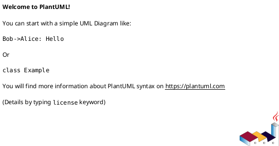

# iss-00009 Summary Rebuild from Logs — 設計（HOW）

## 目的・制約（要件から転記・圧縮） (必須)
- 目的: `logs/*.json` を読みやすい Markdown に変換し、`summary.md` を毎回フル再生成する。
- MUST:
  - lock + tmp + atomic replace
  - JSON 不正が混ざっても生成継続
- MUST NOT:
  - `logs/*.json` を書き換えない
- 非交渉制約:
  - append しない（毎回フル再生成）
- 前提:
  - `iss-00008` が完了している

---

## 既存実装/規約の調査結果（As-Is / 99.9%理解） (必須)
- 参照した規約/実装（根拠）:
  - Initiative requirement/design: summary は毎回フレッシュ生成
  - Epic `epic-00003` design/plan: lock + atomic replace
- 観測した現状（事実）:
  - summary 生成処理はまだ存在しない。
- 採用するパターン（命名/責務/例外/DI/テストなど）:
  - `render_summary(log_files) -> str` を純粋にしテストしやすくする
  - `write_atomic(path, content)` を共通化する
- 採用しない/変更しない（理由）:
  - インクリメンタル更新（append）: 競合/重複リスクが高い
- 影響範囲（呼び出し元/関連コンポーネント）:
  - `codex_logger.cli`（実行時に summary を生成）

## 主要フロー（テキスト：AC単位で短く） (任意)
- Flow for AC-001:
  1) `.codex-log/.lock` を取得
  2) `logs/*.json` をファイル名でソートして読み取る
  3) 各 JSON を parse（失敗は entry に error を残す）
  4) Markdown を render
  5) `summary.md.tmp` へ書き込み、`os.replace` で原子置換
- Flow for AC-002:
  1) ...
  2) ...
  3) ...

### UML（任意） (任意)
```plantuml
@startuml
skinparam monochrome true
hide footbox

participant "summary" as S
database "logs/*.json" as Logs
file "summary.md" as Sum

S -> Logs: read sorted
S -> S: render markdown
S -> Sum: write tmp
S -> Sum: atomic replace
@enduml
```

## データ・バリデーション（必要最小限） (任意)
- MODEL-001: <Entity/DTO/Table名>
  - Fields: ...
  - Constraints/Validation: ...
- ...

### UML（任意） (任意)


## 判断材料/トレードオフ（Decision / Trade-offs） (任意)
- 論点: ...
  - 選択肢A: ...（Pros/Cons）
  - 選択肢B: ...（Pros/Cons）
  - 決定: ...
  - 理由: ...

## インターフェース契約（ここで固定） (任意)
### API（ある場合）
- API-001: `<METHOD> <PATH>`
  - Request: ...
  - Response: ...
  - Errors: ...

### 関数・クラス境界（重要なものだけ）
- IF-SUM-001: `codex_logger.summary::rebuild_summary(base_dir: Path) -> Path`
  - Input: `<cwd>/.codex-log/`（base_dir）
  - Output: 作成した `summary.md` のパス
  - Errors: 書き込み不可などは例外（exit non-zero）
- IF-SUM-002: `codex_logger.summary::render_summary(entries: list[SummaryEntry]) -> str`
  - Input: ログの読み取り結果（成功/失敗を含む）
  - Output: Markdown 文字列
- IF-LOCK-001: `codex_logger.locks::file_lock(path: Path) -> ContextManager[None]`
  - Input: lockfile path
  - Output: 排他 lock の context manager

### UML（任意） (任意)


### クラス/インターフェース詳細設計（主要なもの） (任意)
> この Issue を “単独の作業単位” として完結させるために、必要な範囲だけ詳細化する。

- Class: `<ClassName>`
  - Responsibility（責務）:
    - ...
  - Public methods（公開メソッド）:
    - `method(arg: Type) -> Return`
  - Invariants（不変条件）:
    - ...
  - Collaboration（協調関係）:
    - `<OtherClass>`（理由: ...）
- Interface / Protocol: `<InterfaceName>`
  - Contract（契約）:
    - ...
  - 実装候補:
    - `<ImplClass>`

#### UML（任意） (任意)


### 例外/エラー契約（重要なものだけ） (任意)
- ERR-001: <エラー名/コード>
  - 発生条件:
    - ...
  - 呼び出し元への返し方（例: 例外/戻り値/HTTP）:
    - ...
  - ログ/監視:
    - ...

## 変更計画（ファイルパス単位） (必須)
- 追加（Add）:
  - `src/codex_logger/locks.py`: ファイルロック（summary/telegram 共通）
  - `src/codex_logger/atomic.py`: tmp + `os.replace` の原子書き込み
  - `src/codex_logger/summary.py`: `logs/*.json` → Markdown
  - `tests/test_summary.py`: summary の並び/原子置換/不正 JSON のテスト
- 変更（Modify）:
  - `src/codex_logger/cli.py`: `iss-00008` の後に `summary.rebuild_summary(...)` を呼ぶ
- 削除（Delete）:
  - `<path/to/obsolete_file>`: <なぜ削除するか>
- 移動/リネーム（Move/Rename）:
  - `<from>` → `<to>`: <目的>
- 参照（Read only / context）:
  - `<path/to/reference_file>`: <読む理由>

## マッピング（要件 → 設計） (必須)
- AC-001 → `summary.rebuild_summary` / `tests/test_summary.py`
- AC-002 → `atomic.write_text_atomic`（失敗時の保持をテスト）
- AC-003/EC-001 → `summary.render_summary`（parse error を entry 化）
- EC-002 → `locks.file_lock`

## テスト戦略（最低限ここまで具体化） (任意)
- 追加/更新するテスト:
  - Unit:
    - render（順序/見出し/エラー表示）
    - atomic write（tmp→replace、失敗時保持）
  - Integration:
    - tmpdir に logs を用意して `rebuild_summary` を実行
- どのAC/ECをどのテストで保証するか:
  - AC-001 → `tests/test_summary.py::test_rebuild_summary_from_logs`
  - AC-002 → `tests/test_summary.py::test_atomic_replace_keeps_old_on_failure`
  - AC-003/EC-001 → `tests/test_summary.py::test_invalid_json_is_recorded`
  - EC-002 → `tests/test_summary.py::test_lock_prevents_corruption`（簡易）

### テストマトリクス（AC/EC → テスト） (任意)
- AC-001:
  - Unit: ...
  - Integration: ...
  - E2E: ...
- EC-001:
  - Unit: ...
  - Integration: ...
  - E2E: ...
- 非交渉制約（requirement.md）をどう検証するか:
  - 制約: ...
    - 検証方法（テスト/計測点/ログ/運用確認など）: ...
- 実行コマンド（該当するものを記載）:
  - ...
- 変更後の運用（必要なら）:
  - 移行手順: ...
  - ロールバック: ...
  - Feature flag: ...

## リスク/懸念（Risks） (任意)
- R-001: <リスク>（影響: ... / 対応: ...）
- R-002: ...

## 未確定事項（TBD） (必須)
- 該当なし

---

## ディレクトリ/ファイル構成図（変更点の見取り図） (任意)
```text
<repo-root>/
├── src/codex_logger/
│   ├── atomic.py                     # Add
│   ├── cli.py                        # Modify
│   ├── locks.py                      # Add
│   └── summary.py                    # Add
└── tests/
    └── test_summary.py               # Add
```

## 省略/例外メモ (必須)
- 該当なし
