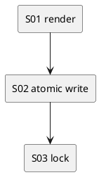

# iss-00009 Summary Rebuild from Logs — 実装計画（TDD: Red → Green → Refactor）

## この計画で満たす要件ID (必須)
- 対象AC: AC-001, AC-002, AC-003
- 対象EC: EC-001, EC-002
- 対象制約: 毎回フル再生成 / tmp + atomic replace / lock

## ステップ一覧（観測可能な振る舞い） (必須)
- [ ] S01: `logs/*.json` から Markdown を render できる（不正 JSON も記録）
- [ ] S02: `summary.md` を tmp + atomic replace で更新できる
- [ ] S03: lock により同時実行でも破損しない

### UML（任意） (任意)

### 要件 ↔ ステップ対応表 (必須)
- AC-001 → S01
- AC-001 → S02
- AC-002 → S02
- AC-003 → S01
- EC-001 → S01
- EC-002 → S03

---

## 実装ステップ（各ステップは“観測可能な振る舞い”を1つ） (必須)

### S01 — `logs/*.json` から Markdown を render できる (必須)
- 対象: AC-001, AC-003 / EC-001
- 設計参照:
  - 対象IF: IF-SUM-002
  - 対象テスト: `tests/test_summary.py::test_rebuild_summary_from_logs`
- このステップで「追加しないこと（スコープ固定）」:
  - Telegram 連携（別Issue）

#### update_plan（着手時に登録） (必須)
- [ ] `update_plan` に、このステップの作業ステップ（調査/Red/Green/Refactor/品質ゲート/報告/コミット）を登録した
- 登録例:
  - （調査）既存挙動/影響範囲の確認、設計参照の確認
  - （Red）失敗するテストの追加/修正
  - （Green）最小実装
  - （Refactor）整理
  - （品質ゲート）format/lint/test
  - （報告）`./spec-dock/active/issue/report.md` 更新
  - （コミット）このステップの区切りでコミット

#### 期待する振る舞い（テストケース） (必須)
- Given: tmpdir に複数の `logs/*.json`（正常/不正）を置く
- When: `rebuild_summary` を実行する
- Then: summary に時系列順の見出しが並び、不正 JSON はエラーとして記録される
- 観測点: `summary.md` 内容
- 追加/更新するテスト:
  - `tests/test_summary.py::test_rebuild_summary_from_logs`
  - `tests/test_summary.py::test_invalid_json_is_recorded`

#### Red（失敗するテストを先に書く） (任意)
- 期待する失敗:
  - ...

#### Green（最小実装） (任意)
- 変更予定ファイル:
  - Add: `<path/...>`
  - Modify: `<path/...>`
- 追加する概念（このステップで導入する最小単位）:
  - ...
- 実装方針（最小で。余計な最適化は禁止）:
  - ...

#### Refactor（振る舞い不変で整理） (任意)
- 目的:
  - ...
- 変更対象:
  - ...

#### ステップ末尾（省略しない） (必須)
- [ ] 期待するテスト（必要ならフォーマット/リンタ）を実行し、成功した
- [ ] `./spec-dock/active/issue/report.md` に実行コマンド/結果/変更ファイルを記録した
- [ ] `update_plan` を更新し、このステップの作業ステップを完了にした
- [ ] コミットした（エージェント）

---

### S02 — `summary.md` を tmp + atomic replace で更新できる (必須)
- 対象: AC-002
- 設計参照:
  - `atomic.write_text_atomic`
  - `tests/test_summary.py::test_atomic_replace_keeps_old_on_failure`
- 期待する振る舞い:
  - `summary.md.tmp` への書き出し/`os.replace` に失敗しても、既存 `summary.md` は保持される
  - この失敗は検知できるよう handler は **非0** で終了する（`adr-00008`）
- 追加/更新するテスト:
  - `tests/test_summary.py::test_atomic_replace_keeps_old_on_failure`
  - `tests/test_cli_exit_codes.py::test_cli_nonzero_when_summary_rebuild_fails`

### S03 — lock により同時実行でも破損しない (必須)
- 対象: EC-002
- 設計参照:
  - `locks.file_lock`
- 期待する振る舞い:
  - lock により再構築区間が排他され、同時実行でも `summary.md` が破損しない
- 追加/更新するテスト:
  - `tests/test_summary.py::test_lock_prevents_corruption`（簡易）

---

## 未確定事項（TBD） (必須)
- 該当なし

## 完了条件（Definition of Done） (必須)
- 対象AC/ECがすべて満たされ、テストで保証されている
- MUST NOT / OUT OF SCOPE を破っていない
- 品質ゲート（フォーマット/リント/テストのうち該当するもの）が満たされている

## 省略/例外メモ (必須)
- 該当なし
