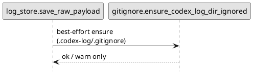

# iss-00011 Gitignore codex log output — 設計（HOW）

## 目的・制約（要件から転記・圧縮） (必須)
- 目的: `.codex-log/` の誤コミットを防ぐため、`codex-logger` 実行時に **`.codex-log/.gitignore` を生成**し、`.codex-log/` 配下を ignore する（`.codex-log/` 内で完結させる）。
- MUST:
  - `<cwd>/.codex-log/.gitignore` を作成/更新し、`.codex-log/` 配下の全ディレクトリ/全ファイルを ignore する。
  - `.codex-log/.gitignore` 更新失敗でもローカルログ保存は継続する（warning のみ）。
- MUST NOT:
  - `<cwd>/.gitignore`（プロジェクト直下）を更新しない
  - `.codex-log/` の外に `.gitignore` を作成しない
- 非交渉制約:
  - 依存追加なし
  - ローカル保存は必達（`.codex-log/.gitignore` 失敗で exit non-zero にしない）
- 前提:
  - `.codex-log/` は `save_raw_payload` で作成される（epic-00003）

---

## 既存実装/規約の調査結果（As-Is / 99.9%理解） (必須)
- 参照した規約/実装（根拠）:
  - `AGENTS.md`: 出力先が `<cwd>/.codex-log/` であること、ローカル保存優先の方針
  - `src/codex_logger/log_store.py::save_raw_payload`: `.codex-log/` を作成して raw payload を保存する
  - `src/codex_logger/atomic.py::write_text_atomic`: 原子的ファイル置換ユーティリティ
- 観測した現状（事実）:
  - 現状は `<cwd>/.gitignore` を自動更新するため、利用者のリポジトリを汚染し得る（想定外の差分）。
- 採用するパターン（命名/責務/例外/DI/テストなど）:
  - `.codex-log/.gitignore` 生成は専用モジュールに切り出し、`log_store.save_raw_payload` から呼ぶ。
  - `.codex-log/.gitignore` は標準内容（ignore-all）を best-effort で書き込む（tmp → replace）。
  - 失敗は warning に留め、例外は握りつぶす（ローカル保存優先）。
  - `.codex-log/` が symlink の場合は、意図せず外部ファイル（例: `<cwd>/.gitignore`）を上書きし得るため、`.codex-log/.gitignore` の生成/更新をスキップして warning-only で継続する。
- `.codex-log/.gitignore` の標準内容:
  - `*`（`.codex-log/` 配下の全ファイル/全ディレクトリを ignore）
- 採用しない/変更しない（理由）:
  - `.git/info/exclude` や global gitignore は扱わない（OUT OF SCOPE）
- 影響範囲（呼び出し元/関連コンポーネント）:
  - `save_raw_payload` の実行時副作用（`.codex-log/.gitignore` 生成）

## 主要フロー（テキスト：AC単位で短く） (任意)
- Flow for AC-001:
  1) `.codex-log/` を作成する
  2) `.codex-log/.gitignore` を作成し、`.codex-log/` 配下を ignore する
- Flow for AC-002:
  1) `.codex-log/.gitignore` を標準内容に更新する（原子的に置換）

### UML（任意） (任意)


## データ・バリデーション（必要最小限） (任意)
- 該当なし（テキストファイルの追記のみ）

## 判断材料/トレードオフ（Decision / Trade-offs） (任意)
- 論点: `.gitignore` を更新失敗した場合の扱い
  - 決定: warning を出して継続（exit 0）
  - 理由: ローカルログ保存を最優先するため

## インターフェース契約（ここで固定） (任意)
### 関数・クラス境界（重要なものだけ）
- IF-001: `codex_logger.gitignore.ensure_codex_log_dir_ignored(codex_log_dir: Path) -> bool`
  - Input: `<cwd>/.codex-log/`
  - Output: 変更があれば True、変更無しなら False
  - Errors: 例外は投げず、warning を出して False を返す

## 変更計画（ファイルパス単位） (必須)
- 追加（Add）:
  - なし（既存ファイルを更新する）
- 変更（Modify）:
  - `src/codex_logger/gitignore.py`: `.codex-log/.gitignore` を生成し、`.codex-log/` 配下を ignore する
  - `src/codex_logger/log_store.py`: raw 保存前後に `.codex-log/.gitignore` を best-effort 生成する
  - `tests/test_gitignore.py`: `.codex-log/.gitignore` 生成のユニットテスト
  - `tests/test_log_store.py`: `save_raw_payload` 経路での `.codex-log/.gitignore` 生成/失敗時継続を検証する
  - `README.md`: `.codex-log/.gitignore` の自動生成について補足する
- 削除（Delete）:
  - なし
- 移動/リネーム（Move/Rename）:
  - なし
- 参照（Read only / context）:
  - `src/codex_logger/atomic.py`: 原子的書き込みの再利用
  - `src/codex_logger/console.py`: warning 出力の整合

## マッピング（要件 → 設計） (必須)
- AC-001 → `gitignore.ensure_codex_log_dir_ignored`（`.codex-log/.gitignore` を作成）
- AC-002 → `gitignore.ensure_codex_log_dir_ignored`（標準内容へ更新）
- AC-003 → `log_store.save_raw_payload`（`<cwd>/.gitignore` を変更しない）
- AC-006 → `log_store.save_raw_payload`（`<cwd>/.gitignore` を作成しない）
- AC-004 → `gitignore.ensure_codex_log_dir_ignored`（warning のみ、例外を投げない）
- AC-005 → `log_store._resolve_base_cwd` + `gitignore.ensure_codex_log_dir_ignored`（payload の `cwd` を優先）
- EC-001/EC-002 → `gitignore.ensure_codex_log_dir_ignored`（書けない場合/既存内容の差し替え）
- EC-003 → `gitignore.ensure_codex_log_dir_ignored`（`.codex-log` が symlink の場合はスキップ）
- 非交渉制約 → `log_store.save_raw_payload`（`.codex-log/.gitignore` 失敗で処理を落とさない）

## テスト戦略（最低限ここまで具体化） (任意)
- 追加/更新するテスト:
  - Unit: `.codex-log/.gitignore` の作成/標準化/失敗時の扱い
- どのAC/ECをどのテストで保証するか:
- AC-001 → `tests/test_gitignore.py::test_ensure_creates_codex_log_gitignore`
- AC-002 → `tests/test_gitignore.py::test_ensure_overwrites_nonstandard_codex_log_gitignore`
- AC-003 → `tests/test_log_store.py::test_save_raw_payload_does_not_modify_root_gitignore`
- AC-006 → `tests/test_log_store.py::test_save_raw_payload_does_not_create_root_gitignore`
- AC-004 → `tests/test_log_store.py::test_save_raw_payload_warns_on_codex_log_gitignore_failure_but_saves`
- AC-005 → `tests/test_log_store.py::test_save_raw_payload_creates_gitignore_in_payload_cwd_not_process_cwd`
- EC-001 → `tests/test_log_store.py::test_save_raw_payload_warns_on_codex_log_gitignore_failure_but_saves`
- EC-002 → `tests/test_gitignore.py::test_ensure_overwrites_nonstandard_codex_log_gitignore`
- EC-003 → `tests/test_gitignore.py::test_ensure_skips_when_codex_log_dir_is_symlink`
- 実行コマンド:
  - `uv run --frozen pytest -q`

## リスク/懸念（Risks） (任意)
- R-001: <リスク>（影響: ... / 対応: ...）
- R-002: ...

## 未確定事項（TBD） (必須)
- 該当なし

---

## ディレクトリ/ファイル構成図（変更点の見取り図） (任意)
```text
<repo-root>/
├── README.md                          # Modify
├── src/
│   └── codex_logger/
│       ├── gitignore.py               # Modify
│       └── log_store.py               # Modify
└── tests/
    ├── test_gitignore.py              # Modify
    └── test_log_store.py              # Modify
```

## 省略/例外メモ (必須)
- 該当なし
