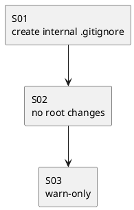

# iss-00011 Gitignore codex log output — 実装計画（TDD: Red → Green → Refactor）

## この計画で満たす要件ID (必須)
- 対象AC: AC-001, AC-002, AC-003, AC-004, AC-005, AC-006
- 対象EC: EC-001, EC-002, EC-003
- 対象制約: 依存追加なし / ローカル保存は必達（`.codex-log/.gitignore` 失敗で exit non-zero にしない）

## ステップ一覧（観測可能な振る舞い） (必須)
- [ ] S01: `.codex-log/.gitignore` が自動生成され、`.codex-log/` 配下が ignore される
- [ ] S02: `<cwd>/.gitignore` は変更されない（リポジトリを汚染しない）
- [ ] S03: `.codex-log/.gitignore` 更新失敗は warning のみでログ保存を継続する

### UML（任意） (任意)

### 要件 ↔ ステップ対応表 (必須)
- AC-001 → S01
- AC-002 → S01
- AC-003 → S02
- AC-006 → S02
- AC-004 → S03
- AC-005 → S01
- EC-001 → S03
- EC-002 → S01
- EC-003 → S03
- 非交渉制約（ローカル保存優先/依存追加なし）→ S03

---

## 実装ステップ（各ステップは“観測可能な振る舞い”を1つ） (必須)

### S01 — `.codex-log/.gitignore` が自動生成され、`.codex-log/` 配下が ignore される (必須)
- 対象: AC-001, AC-002, AC-005, EC-002
- 設計参照:
  - 対象IF: `codex_logger.gitignore.ensure_codex_log_dir_ignored`
  - 対象テスト: `tests/test_gitignore.py::test_ensure_creates_codex_log_gitignore`
- このステップで「追加しないこと（スコープ固定）」:
  - `.git/info/exclude` や global gitignore への対応

#### update_plan（着手時に登録） (必須)
- [ ] `update_plan` に、このステップの作業ステップ（調査/Red/Green/Refactor/品質ゲート/報告/コミット）を登録した
- 登録例:
  - （調査）既存挙動/影響範囲の確認、設計参照の確認
  - （Red）失敗するテストの追加/修正
  - （Green）最小実装
  - （Refactor）整理
  - （品質ゲート）`uv run --frozen pytest -q`
  - （報告）`./spec-dock/active/issue/report.md` 更新
  - （コミット）このステップの区切りでコミット

#### 期待する振る舞い（テストケース） (必須)
- Given: `<cwd>/.codex-log/.gitignore` が存在しない、または内容が標準と異なる
- When: `.codex-log/` 保存処理が走る
- Then: `<cwd>/.codex-log/.gitignore` が作成/更新され、`.codex-log/` 配下を ignore する
- 観測点: filesystem
- 追加/更新するテスト: `tests/test_gitignore.py`, `tests/test_log_store.py`

#### Red（失敗するテストを先に書く） (任意)
- 期待する失敗:
  - ...

#### Green（最小実装） (任意)
- 変更予定ファイル:
  - Add: `<path/...>`
  - Modify: `<path/...>`
- 追加する概念（このステップで導入する最小単位）:
  - ...
- 実装方針（最小で。余計な最適化は禁止）:
  - ...

#### Refactor（振る舞い不変で整理） (任意)
- 目的:
  - ...
- 変更対象:
  - ...

#### ステップ末尾（省略しない） (必須)
- [ ] 期待するテスト（必要ならフォーマット/リンタ）を実行し、成功した
- [ ] `./spec-dock/active/issue/report.md` に実行コマンド/結果/変更ファイルを記録した
- [ ] `update_plan` を更新し、このステップの作業ステップを完了にした
- [ ] コミットした（エージェント）

---

### S02 — `<cwd>/.gitignore` は変更されない（リポジトリを汚染しない） (必須)
- 対象: AC-003
- 設計参照:
  - 対象テスト: `tests/test_log_store.py::test_save_raw_payload_does_not_modify_root_gitignore`
- 期待する振る舞い:
  - `<cwd>/.gitignore` は変更しない（差分が出ない）

---

### S03 — `.codex-log/.gitignore` 更新失敗は warning のみでログ保存を継続する (必須)
- 対象: AC-004
- 設計参照:
  - 対象IF: `codex_logger.gitignore.ensure_codex_log_dir_ignored`
  - 対象テスト: `tests/test_log_store.py::test_save_raw_payload_warns_on_codex_log_gitignore_failure_but_saves`
  - 対象テスト: `tests/test_gitignore.py::test_ensure_skips_when_codex_log_dir_is_symlink`
  - 対象テスト: `tests/test_log_store.py::test_save_raw_payload_skips_chmod_for_symlink_codex_log_dir`
- 期待する振る舞い:
  - `.codex-log/.gitignore` 更新に失敗しても例外を投げず、warning を出して継続する

---

## 未確定事項（TBD） (必須)
- 該当なし

## 完了条件（Definition of Done） (必須)
- 対象AC/ECがすべて満たされ、テストで保証されている
- MUST NOT / OUT OF SCOPE を破っていない
- 品質ゲート（フォーマット/リント/テストのうち該当するもの）が満たされている

## 省略/例外メモ (必須)
- 該当なし
