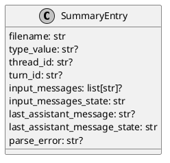
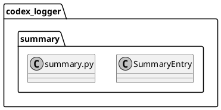

# iss-00014 Summary chat transcript — 設計（HOW）

## 目的・制約（要件から転記・圧縮） (必須)
- 目的:
  - `summary.md` を「入力→出力の本文が読める」チャット形式にする（Markdown preview で読みやすく）。
- MUST:
  - `type` / `thread-id` / `turn-id` は表示する。
  - `input-messages` / `last-assistant-message` を本文として表示する（欠損/型不正でも生成継続）。
  - 本文は blockquote で囲って summary 構造を壊しにくくする。
  - 既存のロック/原子置換/決定的順序（ファイル名昇順）を維持する。
- MUST NOT:
  - `logs/*.json`（SSOT）を変更しない。
  - Telegram の仕様は変更しない。
- 非交渉制約:
  - 依存追加なし。
- 前提:
  - `logs/*.json` は raw payload を 1イベント=1ファイルで保存済み（epic-00003）。

---

## 既存実装/規約の調査結果（As-Is / 99.9%理解） (必須)
- 参照した規約/実装（根拠）:
  - `spec-dock/active/initiative/requirement.md`: summary は毎回フレッシュ生成、raw JSON が SSOT
  - `spec-dock/initiatives/init-00001-codex-notify-json-logger/artifacts/notify-payload.md`: `input-messages` / `last-assistant-message` のキー
  - `src/codex_logger/summary.py`: `render_summary` が metadata のみ出力し、`cwd` を含む
- 観測した現状（事実）:
  - `SummaryEntry` は `cwd` を保持/出力しているが、本文（`input-messages` / `last-assistant-message`）は扱っていない。
- 採用するパターン（命名/責務/例外/DI/テストなど）:
  - `render_summary(entries) -> str` を純粋関数として維持し、出力フォーマットをテストで固定する。
  - 既存の「不正 JSON は parse_error として表示しつつ生成継続」の方針を維持する。
- 採用しない/変更しない（理由）:
  - `summary.md` の append 更新: 競合/重複/破損リスクがあるため採用しない。
- 影響範囲（呼び出し元/関連コンポーネント）:
  - `codex_logger.summary` のみ（CLI からの呼び出し点は変更不要）。

## 主要フロー（テキスト：AC単位で短く） (任意)
- Flow for AC-001:
  1) `logs/*.json` をファイル名昇順で読む（既存）
  2) 各 JSON から `type` / `thread-id` / `turn-id` / `input-messages` / `last-assistant-message` を best-effort で抽出する
  3) Markdown をレンダリングする（本文は blockquote）
- Flow for AC-002:
  1) `input-messages` / `last-assistant-message` が欠損/型不正の場合は placeholder（`<missing>` / `<invalid>`）を出す
  2) 生成処理自体は継続する（例外にしない）

### UML（任意） (任意)
```plantuml
@startuml
skinparam monochrome true
hide footbox

participant "summary.rebuild_summary" as Rebuild
database "logs/*.json" as Logs
participant "summary.render_summary" as Render
file "summary.md" as Summary

Rebuild -> Logs: list + read (sorted by filename)
Rebuild -> Rebuild: parse JSON\n(best-effort)
Rebuild -> Render: entries (meta + messages)
Render --> Rebuild: markdown text
Rebuild -> Summary: write tmp + atomic replace\n(locked)
@enduml
```

## データ・バリデーション（必要最小限） (任意)
- MODEL-001: `SummaryEntry`（render 用 DTO）
  - Fields:
    - `filename: str`
    - `type_value: str | None`
    - `thread_id: str | None`
    - `turn_id: str | None`
    - `input_messages: list[str] | None`
    - `input_messages_state: "present" | "missing" | "invalid"`
    - `last_assistant_message: str | None`
    - `last_assistant_message_state: "present" | "missing" | "invalid"`
    - `parse_error: str | None`
  - Validation（best-effort）:
    - `input_messages`:
      - 欠損/空配列 → state=`missing`
      - `list[str]` → state=`present`（要素が空文字の扱いは render 側で `<missing>` に正規化）
      - それ以外（型不正/要素が文字列でない等） → state=`invalid`
    - `last_assistant_message`:
      - 欠損/空文字 → state=`missing`
      - `str`（非空） → state=`present`
      - それ以外（型不正） → state=`invalid`

### UML（任意） (任意)


## 判断材料/トレードオフ（Decision / Trade-offs） (任意)
- 論点: 本文の埋め込み方式
  - 決定: blockquote（要件どおり）
  - 理由: summary の見出し構造を壊しにくく、Markdown preview の安定性が高い

## インターフェース契約（ここで固定） (任意)
### 関数・クラス境界（重要なものだけ）
- IF-SUM-001: `codex_logger.summary::rebuild_summary(base_dir: Path) -> Path`（既存）
  - Behavior: 生成ロジックは維持し、`render_summary` の出力を変更する
- IF-SUM-002: `codex_logger.summary::render_summary(entries: list[SummaryEntry]) -> str`（変更）
  - Output: 各 entry に本文ブロック（User/Assistant）を追加し、`cwd` は出力しない
- IF-SUM-003: `codex_logger.summary::_load_summary_entry(log_path: Path) -> SummaryEntry`（変更）
  - Behavior: JSON からメタ + 本文を best-effort 抽出し、欠損/型不正を state で区別する
- IF-SUM-004: `codex_logger.summary::_blockquote(text: str) -> list[str]`（追加想定）
  - Behavior: 改行を保持しつつ、各行を `> ` で prefix して Markdown blockquote を生成する

### UML（任意） (任意)


## 変更計画（ファイルパス単位） (必須)
- 変更（Modify）:
  - `src/codex_logger/summary.py`: 本文（User/Assistant）を出力、`cwd` を非表示化、best-effort 抽出の拡張
  - `tests/test_summary.py`: 新フォーマットに追随（本文/placeholder/順序/parse error）
  - `spec-dock/.../iss-00014-.../report.md`: 実行ログ/結果を記録（都度追記）
  - （必要なら）`README.md`: summary の見え方の説明（本 Issue では必須にしない）

## マッピング（要件 → 設計） (必須)
- AC-001 → `summary._load_summary_entry`（本文抽出）/ `summary.render_summary`（本文レンダ）
- AC-002 → `summary._load_summary_entry`（placeholder）/ `summary.render_summary`（`<missing>`/`<invalid>`）
- EC-002 → `summary.render_summary`（複数行の `> ` prefix を保証）
- AC-003 → `summary.render_summary`（`cwd` の非表示化）
- EC-001 → `summary._load_summary_entry`（parse error entry）/ `summary.render_summary`（parse error 出力）
- 非交渉制約（原子置換/ロック） → `summary.rebuild_summary`（既存を維持）

## テスト戦略（最低限ここまで具体化） (任意)
- 追加/更新するテスト:
  - Integration（tmpdir）:
    - `rebuild_summary` が本文（User/Assistant）を含む summary を生成する
    - 欠損/型不正は placeholder として出る
    - `cwd` が出力されない
- どのAC/ECをどのテストで保証するか:
  - AC-001/AC-003 → `tests/test_summary.py::test_rebuild_summary_from_logs`
  - AC-002 → `tests/test_summary.py::test_missing_or_invalid_messages_are_rendered_best_effort`（追加）
  - EC-002 → `tests/test_summary.py::test_multiline_messages_are_blockquoted`（追加）
  - EC-001 → `tests/test_summary.py::test_invalid_json_is_recorded`

### テストマトリクス（AC/EC → テスト） (任意)
- 実行コマンド:
  - `uv run --frozen pytest -q`

## リスク/懸念（Risks） (任意)
- R-001: 本文が巨大な場合、summary が長大になる（影響: 閲覧性低下）
  - 対応: 本 Issue では「省略」はしない（将来の改善で検討）

## 未確定事項（TBD） (必須)
- 該当なし

---

## ディレクトリ/ファイル構成図（変更点の見取り図） (任意)
```text
<repo-root>/
├── src/codex_logger/
│   └── summary.py                    # Modify
└── tests/
    └── test_summary.py               # Modify
```

## 省略/例外メモ (必須)
- 該当なし
