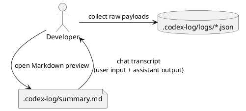

# iss-00014 Summary chat transcript — 要件定義（WHAT / WHY）

## 目的（ユーザーに見える成果 / To-Be） (必須)
- `.codex-log/summary.md` が「チャットログ」として読める（入力→出力の本文が追える）。
- `input-messages` と `last-assistant-message` が **Markdown として** summary に含まれ、VS Code の Markdown preview で破綻なく表示できる。

## 背景・現状（As-Is / 調査メモ） (必須)
- 現状の挙動（事実）:
  - `summary.md` は各ログの `type` / `thread-id` / `turn-id` / `cwd` のみを列挙し、メッセージ本文は表示しない。
- 現状の課題（困っていること）:
  - 「どんな入力に対して、どんな出力だったか」が把握できず、運用上の価値が薄い。
  - `cwd` は summary 生成先と同一のため、summary の表示項目としては冗長。
- 再現手順（最小で）:
  1) `.codex-log/logs/*.json` を作成する（`input-messages` と `last-assistant-message` を含む）
  2) `codex-logger` を実行して `summary.md` を生成する
- 観測点（どこを見て確認するか）:
  - filesystem: `.codex-log/summary.md` の本文（Markdown preview での見え方）
- 情報源（ヒアリング/調査の根拠）:
  - Issue/チケット: #14
  - コード: `src/codex_logger/summary.py`（現状 summary が本文を出していない）

## 対象ユーザー / 利用シナリオ (任意)
- 主な利用者（ロール）:
  - Codex CLI の実行ログを後から追いたい開発者
- 代表的なシナリオ:
  - `summary.md` を 1 枚だけ見て、入力→出力の流れを時系列に把握する

### UML（任意） (任意)


## ディレクトリ/ファイル構成（変更点の見取り図） (必須)
```text
<repo-root>/
├── src/codex_logger/
│   └── summary.py            # Modify（本文表示 + cwd非表示）
└── tests/
    └── test_summary.py       # Modify（本文表示のテスト追加/更新）
```

## スコープ（暴走防止のガードレール） (必須)
- MUST（必ずやる）:
  - `summary.md` は `logs/*.json` をファイル名昇順で読み取り、時系列順に出力する（既存仕様維持）。
  - `type` / `thread-id` / `turn-id` を表示する（ID可視性の維持）。
  - `input-messages` と `last-assistant-message` の本文を `summary.md` に含める。
    - `input-messages` は複数要素を取り得るため、要素ごとに「User」ブロックとして出力する。
    - 本文は blockquote として埋め込み、summary の構造が壊れにくい形にする。
  - 欠損/型不正/空文字が混在しても `summary.md` の生成は継続する（best-effort）。
    - `input-messages`:
      - 欠損/空配列 → `<missing>`
      - 型不正（list 以外 / 要素が文字列でない等） → `<invalid>`
      - 要素が空文字（`""`） → その User ブロックは `<missing>`（本文なし扱い）
    - `last-assistant-message`:
      - 欠損/空文字 → `<missing>`
      - 型不正（文字列以外） → `<invalid>`
  - `cwd` は `summary.md` に表示しない。
- MUST NOT（絶対にやらない／追加しない）:
  - `logs/*.json`（raw payload / SSOT）を変更・整形しない。
  - Telegram 送信の仕様を変更しない（本 Issue の対象外）。
- OUT OF SCOPE:
  - HTML/CSS による見た目の作り込み
  - `summary.md` のインクリメンタル更新（append）

## 境界（Always / Ask / Never） (必須)
- Always（常に守る）:
  - `summary.md` は毎回フル再構築 + 原子的置換（既存仕様維持）
- Ask（迷ったら相談）:
  - 出力フォーマット（見出しレベル/ラベル文言）の大幅な変更が必要になった場合
- Never（絶対にしない）:
  - `.codex-log/` 以外へのログ出力を追加する

## 非交渉制約（守るべき制約） (必須)
- 既存のロック/原子置換の安全性を維持する（壊れないこと優先）。
- 依存追加なし。

## 前提（Assumptions） (必須)
- `logs/*.json` は raw JSON（notify payload）である（SSOT）。
- 現行の主要キー（参考: `init-00001` の調査メモ）:
  - `input-messages: string[]`（任意）
  - `last-assistant-message: string`（任意）

## 判断材料/トレードオフ（Decision / Trade-offs） (任意)
- 論点: 本文を「そのまま埋め込む」か「引用（blockquote）で囲う」か
  - 選択肢A: そのまま埋め込む（Pros: 元の Markdown がそのまま render / Cons: 見出し等で summary 構造が崩れ得る）
  - 選択肢B: 引用（blockquote）で囲う（Pros: summary 構造を守りやすい / Cons: 表示が少しインデントされる）
  - 決定: B（blockquote）
  - 理由: 「壊れにくさ」と VS Code preview での安定性を優先する

## リスク/懸念（Risks） (任意)
- R-001: 本文に未閉じコードフェンス等の不正 Markdown が含まれる（影響: preview が崩れ得る）
  - 対応: 本 Issue では raw 互換を優先し、ツール側での「修復」はしない

## 受け入れ条件（観測可能な振る舞い） (必須)
- AC-001:
  - Actor/Role: 開発者
  - Given: `logs/*.json` に `input-messages` と `last-assistant-message` を含むログが存在する
  - When: `summary.md` を再生成する
  - Then: `summary.md` に「User → Assistant」の順で本文が含まれ、Markdown として表示される
  - 観測点: filesystem（`summary.md`）
- AC-002:
  - Actor/Role: 開発者
  - Given: `logs/*.json` に `input-messages` / `last-assistant-message` の欠損または型不正のログが混在する
  - When: `summary.md` を再生成する
  - Then: 生成が失敗せず、欠損/空配列（および要素空文字）は `<missing>`、型不正は `<invalid>` として表示される（best-effort）
  - 観測点: filesystem（`summary.md`）
- AC-003:
  - Actor/Role: 開発者
  - Given: `logs/*.json` が複数存在する
  - When: `summary.md` を再生成する
  - Then: 各ターンに `type` / `thread-id` / `turn-id` は表示されるが、`cwd` は表示されない
  - 観測点: filesystem（`summary.md`）

### 入力→出力例 (任意)
- EX-001:
  - Input（log JSON）:
    - `input-messages`: `["Hello", "Show me code"]`
    - `last-assistant-message`: `"Here is the code..."`（Markdown）
  - Output（summary）:
    - `### User (1/2)` / `### User (2/2)` / `### Assistant` の各ブロックが生成され、本文が blockquote として埋め込まれる

## 例外・エッジケース（仕様として固定） (必須)
- EC-001:
  - 条件: `logs/*.json` に JSON として壊れているファイルが混在する
  - 期待: 該当 entry は parse error として表示され、他の entry は生成される
  - 観測点: `summary.md`
- EC-002:
  - 条件: 本文が複数行（改行を含む）
  - 期待: 改行を保持したまま blockquote として出力される

## 用語（ドメイン語彙） (必須)
- TERM-001: Chat transcript = User/Assistant の本文を時系列に並べて読める summary 表現
- TERM-002: User message = `input-messages` の各要素（文字列）
- TERM-003: Assistant message = `last-assistant-message`（最終アウトプット）

## 未確定事項（TBD / 要確認） (必須)
- 該当なし

## Definition of Ready（着手可能条件） (必須)
- [ ] 目的が 1〜3行で明確になっている
- [ ] MUST/MUST NOT/OUT OF SCOPE が書けている
- [ ] Always/Ask/Never が書けている
- [ ] AC/EC が観測可能（テスト可能）な形になっている
- [ ] 観測点（UI/HTTP/DB/Log など）または確認方法が明記されている
- [ ] 未確定事項が「質問/選択肢/推奨案/影響範囲」で整理されている

## 完了条件（Definition of Done） (必須)
- すべてのAC/ECが満たされる
- 未確定事項が解消される（残す場合は「残す理由」と「合意」を明記）
- MUST NOT / OUT OF SCOPE を破っていない
- `uv run --frozen pytest -q` が通る

## 省略/例外メモ (必須)
- 該当なし
