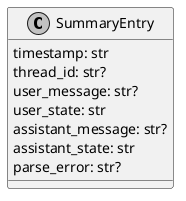
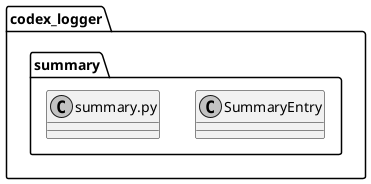

# iss-00015 Summary transcript v2 — 設計（HOW）

## 目的・制約（要件から転記・圧縮） (必須)
- 目的:
  - `summary.md` を「会話履歴として読める」形式に寄せ、各ターンは「最後の User + Assistant」に絞って表示する。
- MUST:
  - 表示対象: timestamp / User(last) / Assistant(last) / （Assistant のみ thread-id を括弧付与）
  - 非表示: type / thread-id（単独メタ行）/ turn-id / cwd / ファイル名（event-id）
  - 本文は blockquote（Markdown 構造の破綻を避ける）
  - lock + tmp + atomic replace（既存）
  - 欠損/型不正/空は `<missing>` / `<invalid>` を best-effort 表示（生成継続）
- MUST NOT:
  - raw logs（`logs/*.json`）を書き換えない
  - Telegram の仕様を変えない
- 非交渉制約:
  - 依存追加なし
- 前提:
  - `logs/*.json` は `<timestamp>_<event-id>.json` 命名（`ts_utc_ms`）

---

## 既存実装/規約の調査結果（As-Is / 99.9%理解） (必須)
- 参照した規約/実装（根拠）:
  - `spec-dock/active/initiative/requirement.md`: summary は毎回フレッシュ生成（raw が SSOT）
  - `src/codex_logger/summary.py`: v1 の chat transcript 形式（User/Assistant を複数要素まで出力）
  - `src/codex_logger/timefmt.py`: timestamp 文字列（ファイル名プレフィックス）
- 観測した現状（事実）:
  - v1 は `input-messages` をすべて出力するため、User が連続表示されやすい。
  - v1 は `type/thread-id/turn-id` 等のメタ情報も表示している。
- 採用するパターン（命名/責務/例外/DI/テストなど）:
  - `render_summary(entries) -> str` を純粋関数として維持し、出力をテストで固定する。
  - 本文は blockquote（既存方針を維持）。
- 採用しない/変更しない（理由）:
  - summary の append 更新: 競合/破損リスクがあるため採用しない。
- 影響範囲（呼び出し元/関連コンポーネント）:
  - `codex_logger.summary` の表示ロジックとテストのみ（`rebuild_summary` の責務は維持）。

## 主要フロー（テキスト：AC単位で短く） (任意)
- Flow for AC-001:
  1) `logs/*.json` をファイル名昇順で読む（既存）
  2) ファイル名プレフィックスから timestamp を抽出し、人間向けに整形する
  3) JSON から `thread-id` / `input-messages(last)` / `last-assistant-message` を best-effort 抽出する
  4) Markdown を render（timestamp + 2メッセージのみ）
- Flow for AC-002:
  1) `thread-id` があれば `Assistant (<thread-id>)` を出す
  2) 無ければ `Assistant` のみ（括弧無し）

### UML（任意） (任意)
```plantuml
@startuml
skinparam monochrome true
hide footbox

participant "summary.rebuild_summary" as Rebuild
database "logs/*.json" as Logs
participant "summary.render_summary" as Render
file "summary.md" as Summary

Rebuild -> Logs: list + read (sorted)
Rebuild -> Rebuild: parse JSON (best-effort)
Rebuild -> Render: entries (timestamp + last messages)
Render --> Rebuild: markdown
Rebuild -> Summary: write tmp + atomic replace\n(locked)
@enduml
```

## データ・バリデーション（必要最小限） (任意)
- MODEL-001: `SummaryEntry`（render 用 DTO）
  - Fields:
    - `timestamp: str`（表示用。`<timestamp>_<event-id>.json` の prefix から抽出）
    - `thread_id: str | None`
    - `user_message: str | None`
    - `user_state: "present" | "missing" | "invalid"`
    - `assistant_message: str | None`
    - `assistant_state: "present" | "missing" | "invalid"`
    - `parse_error: str | None`
  - Validation（best-effort）:
    - `input-messages`: list[str] のみ許可。欠損/空配列/last空文字は missing、型不正は invalid。
    - `last-assistant-message`: str のみ許可。欠損/空文字は missing、型不正は invalid。

### UML（任意） (任意)


## 判断材料/トレードオフ（Decision / Trade-offs） (任意)
- 論点: timestamp の表現
  - 決定: ファイル名プレフィックスの `YYYY-MM-DDTHH-MM-SS.mmmZ` を `YYYY-MM-DD HH:MM:SS.mmmZ` に整形して表示
  - 理由: ファイル名依存の安全性を維持しつつ、人間が読みやすい

## インターフェース契約（ここで固定） (任意)
### 関数・クラス境界（重要なものだけ）
- IF-SUM-001: `codex_logger.summary::rebuild_summary(base_dir: Path) -> Path`（既存）
- IF-SUM-002: `codex_logger.summary::render_summary(entries: list[SummaryEntry]) -> str`（変更）
  - Output: 各 entry は「timestamp + User(last) + Assistant(last)」のみ
- IF-SUM-003: `codex_logger.summary::_load_summary_entry(log_path: Path) -> SummaryEntry`（変更）
  - Behavior: ファイル名から timestamp 抽出 + payload から last message 抽出
- IF-SUM-004: `codex_logger.summary::_format_timestamp(raw: str) -> str`（追加想定）
- IF-SUM-005: `codex_logger.summary::_blockquote_lines(text: str) -> list[str]`（既存）

### UML（任意） (任意)


## 変更計画（ファイルパス単位） (必須)
- 変更（Modify）:
  - `src/codex_logger/summary.py`: v2 表示（timestamp + last messages）へ更新
  - `tests/test_summary.py`: v2 出力に追随（最後の User のみ / メタ非表示 / timestamp 表示）

## マッピング（要件 → 設計） (必須)
- AC-001 → `_load_summary_entry`（last user 抽出）/ `render_summary`
- AC-002 → `render_summary`（Assistant ラベルに thread-id を付与）
- AC-003 → `render_summary`（type/thread-id（単独メタ行）/turn-id/cwd/filename を出力しない）
- AC-004 → `_format_timestamp` / `_load_summary_entry`
- EC-001 → `_load_summary_entry`（parse error entry）/ `render_summary`
- EC-002 → `_blockquote_lines`（複数行 prefix）
- 非交渉制約（lock + atomic replace） → `rebuild_summary`（既存維持 + 回帰テスト）

## テスト戦略（最低限ここまで具体化） (任意)
- 追加/更新するテスト:
  - Integration（tmpdir）:
    - last user のみ表示され、他要素が出ない
    - Assistant ラベルに thread-id が入る（thread-id 無しは括弧無し）
    - type/turn-id/cwd/filename を出力しない
    - timestamp が表示される
- どのAC/ECをどのテストで保証するか:
  - AC-001/AC-002/AC-003/AC-004 → `tests/test_summary.py::test_rebuild_summary_from_logs`（更新）
  - AC-003 → `tests/test_summary.py::test_summary_does_not_include_noise_fields`（追加 or 既存へ統合）
  - EC-002 → `tests/test_summary.py::test_multiline_messages_are_blockquoted`（更新）
  - EC-001 → `tests/test_summary.py::test_invalid_json_is_recorded`（更新）

### テストマトリクス（AC/EC → テスト） (任意)
- 実行コマンド:
  - `uv run --frozen pytest -q`

## リスク/懸念（Risks） (任意)
- R-001: summary から情報量が減る（影響: 詳細調査では raw JSON が必要）
  - 対応: `logs/*.json` が SSOT で残る

## 未確定事項（TBD） (必須)
- 該当なし

---

## ディレクトリ/ファイル構成図（変更点の見取り図） (任意)
```text
<repo-root>/
├── src/codex_logger/
│   └── summary.py                    # Modify
└── tests/
    └── test_summary.py               # Modify
```

## 省略/例外メモ (必須)
- 該当なし
