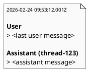

# iss-00015 Summary transcript v2 — 実装計画（TDD: Red → Green → Refactor）

## この計画で満たす要件ID (必須)
- 対象AC: AC-001, AC-002, AC-003, AC-004
- 対象EC: EC-001, EC-002
- 対象制約:
  - 依存追加なし
  - lock + tmp + atomic replace 維持（`rebuild_summary` の責務は変えない）

## ステップ一覧（観測可能な振る舞い） (必須)
- [ ] S01: v2 フォーマット（timestamp + last user + assistant）で出力し、ノイズ項目を排除する
- [ ] S02: 欠損/型不正/空と parse error を v2 形式で best-effort 表示し、複数行 blockquote を保証する
- [ ] S03: リファクタ + 全テスト + validate + report 更新（品質ゲート）

### UML（任意） (任意)

### 要件 ↔ ステップ対応表 (必須)
- AC-001 → S01
- AC-002 → S01
- AC-003 → S01
- AC-004 → S01
- EC-001 → S02
- EC-002 → S02
- 非交渉制約（atomic/lock） → S03

---

## 実装ステップ（各ステップは“観測可能な振る舞い”を1つ） (必須)

### S01 — v2 フォーマット（timestamp + last user + assistant）で出力する (必須)
- 対象: AC-001, AC-002, AC-003, AC-004
- 設計参照:
  - 対象IF: IF-SUM-002 / IF-SUM-003 / IF-SUM-004
  - 対象テスト: `tests/test_summary.py::test_rebuild_summary_from_logs`（更新）
- このステップで「追加しないこと（スコープ固定）」:
  - parse error の表示変更（S02 で扱う）

#### 期待する振る舞い（テストケース） (必須)
- Given: `input-messages` が複数要素のログが存在する
- When: `rebuild_summary(base_dir)` を実行する
- Then:
  - User は `input-messages` の最後の 1 要素のみ出力される
  - Assistant は `last-assistant-message` のみ出力される
  - Assistant ラベルは `Assistant (<thread-id>)` 形式（thread-id が無ければ括弧無し）
  - type/thread-id（単独メタ行）/turn-id/cwd/filename（event-id）を出力しない
  - timestamp が `YYYY-MM-DD HH:MM:SS.mmmZ` 形式で表示される（例: `2026-02-24 09:53:12.001Z`）
- 観測点: `summary.md`
- 追加/更新するテスト: `tests/test_summary.py::test_rebuild_summary_from_logs`

#### Red（失敗するテストを先に書く） (任意)
- 期待する失敗: 既存は `input-messages` を全出力し、メタ情報も表示しているためテストが落ちる

#### Green（最小実装） (任意)
- 変更予定ファイル:
  - Modify: `src/codex_logger/summary.py`
  - Modify: `tests/test_summary.py`
- 追加する概念（このステップで導入する最小単位）:
  - timestamp 抽出/整形 helper
  - last user 抽出 helper
- 実装方針（最小で。余計な最適化は禁止）:
  - v2 出力を `render_summary` に実装し、旧フォーマットのメタ出力/ファイル名出力を削除する

#### Refactor（振る舞い不変で整理） (任意)
- 目的:
  - v2 出力の可読性を維持しつつ、テストでフォーマットを固定する
- 変更対象:
  - `src/codex_logger/summary.py`

#### ステップ末尾（省略しない） (必須)
- [ ] 期待するテスト（必要ならフォーマット/リンタ）を実行し、成功した
- [ ] コミットした（エージェント）

---

### S02 — v2 形式で best-effort（missing/invalid/parse error）を保証する (必須)
- 対象: EC-001, EC-002
- 設計参照:
  - 対象IF: IF-SUM-003 / IF-SUM-005
  - 対象テスト:
    - `tests/test_summary.py::test_invalid_json_is_recorded`（更新）
    - `tests/test_summary.py::test_missing_or_invalid_messages_are_rendered_best_effort`（更新）
    - `tests/test_summary.py::test_multiline_messages_are_blockquoted`（更新）
- コマンド:
  - `uv run --frozen pytest -q tests/test_summary.py`
- ステップ末尾:
  - [ ] テストが通る
  - [ ] コミットした（エージェント）

---

### S03 — 仕上げ（全テスト/validate/report） (必須)
- 対象: 非交渉制約（安全性/回帰）
- コマンド:
  - `uv run --frozen pytest -q`
  - `./spec validate`
- ステップ末尾:
  - [ ] 全テストが通る
  - [ ] `spec-dock/active/issue/report.md` を更新した
  - [ ] コミットした（エージェント）

---

## 未確定事項（TBD） (必須)
- 該当なし

## 完了条件（Definition of Done） (必須)
- 対象AC/ECがすべて満たされ、テストで保証されている
- MUST NOT / OUT OF SCOPE を破っていない
- 品質ゲート（フォーマット/リント/テストのうち該当するもの）が満たされている

## 省略/例外メモ (必須)
- 該当なし
