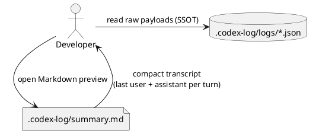

# iss-00015 Summary transcript v2 — 要件定義（WHAT / WHY）

## 目的（ユーザーに見える成果 / To-Be） (必須)
- `.codex-log/summary.md` を「チャット画面のように」より簡潔にし、各ターンの **最後の User 入力 + Assistant 出力**だけを追えるようにする。
- ノイズ（type / turn-id / ファイル名等）を減らし、Markdown preview で会話履歴として読みやすくする。

## 背景・現状（As-Is / 調査メモ） (必須)
- 現状の挙動（事実）:
  - `summary.md` は `input-messages` をすべて列挙するため、1ターン内で User のメッセージが連続しやすい。
  - 各ターンに `type` / `turn-id` / ファイル名（`logs/*.json`）などのメタ情報が多く、会話履歴としては冗長。
- 現状の課題（困っていること）:
  - 「このターンの最後の入力→出力」を追いたいだけなのに、余計な情報が多く視認性が落ちる。
- 再現手順（最小で）:
  1) `logs/*.json` に `input-messages`（複数要素）を含むログを用意する
  2) `codex-logger` 実行で `.codex-log/summary.md` を生成する
- 観測点（どこを見て確認するか）:
  - filesystem: `.codex-log/summary.md` の内容（VS Code Markdown preview）
- 情報源（ヒアリング/調査の根拠）:
  - Issue/チケット: #15
  - コード: `src/codex_logger/summary.py`（summary のレンダリング）
  - 既存 Issue: `iss-00014`（chat transcript v1）

## 対象ユーザー / 利用シナリオ (任意)
- 主な利用者（ロール）:
  - Codex CLI の作業ログを後から追う開発者
- 代表的なシナリオ:
  - `summary.md` を 1 枚だけ開き、ターン単位で「最後の入力→出力」を時系列で把握する

### UML（任意） (任意)


## ディレクトリ/ファイル構成（変更点の見取り図） (必須)
```text
<repo-root>/
├── src/codex_logger/
│   └── summary.py            # Modify（表示フォーマットの簡素化）
└── tests/
    └── test_summary.py       # Modify（新フォーマットへ追随）
```

## スコープ（暴走防止のガードレール） (必須)
- MUST（必ずやる）:
  - `summary.md` は `logs/*.json` をファイル名昇順で読み取り、時系列順に出力する（既存仕様維持）。
  - 各ターンで表示する本文は次の 2 つのみ:
    - User: `input-messages` の **最後の要素**（1つだけ）
    - Assistant: `last-assistant-message`（1つだけ）
  - `thread-id` は `Assistant` ラベルの直後に括弧で付与する（例: `**Assistant (thread-123)**`）。`thread-id` が無い場合は括弧を省略してよい。
  - 次の項目は summary に表示しない:
    - `type`（例: `agent-turn-complete`）
    - `thread-id`（※Assistant 見出し内の括弧付与を除く）
    - `turn-id`
    - `cwd`
    - `logs/*.json` のファイル名（event-id を含むため）
  - 各ターンには **日時（timestamp）** を表示する（ファイル名プレフィックスの timestamp を利用し、表示は人間向けに整形する）。
    - 例: `2026-02-24T09-53-12.001Z_...` → `2026-02-24 09:53:12.001Z`
  - 本文は blockquote として出力し、Markdown の構造が壊れにくい形式にする（既存方針維持）。
  - 欠損/型不正/空（空配列・空文字）が混在しても `summary.md` の生成は継続する（best-effort）。
    - `input-messages`:
      - 欠損/空配列 → `<missing>`
      - 型不正（list 以外 / 要素が文字列でない等） → `<invalid>`
      - 最後の要素が空文字（`""`） → `<missing>`
    - `last-assistant-message`:
      - 欠損/空文字 → `<missing>`
      - 型不正（文字列以外） → `<invalid>`
- MUST NOT（絶対にやらない／追加しない）:
  - `logs/*.json`（raw payload / SSOT）を変更・整形しない。
  - Telegram 送信の仕様を変更しない（本 Issue の対象外）。
- OUT OF SCOPE:
  - summary を HTML/CSS でリッチ表示する
  - full transcript（全 `input-messages`）の表示

## 境界（Always / Ask / Never） (必須)
- Always（常に守る）:
  - `summary.md` は毎回フル再構築 + 原子的置換（既存仕様維持）
- Ask（迷ったら相談）:
  - timestamp 表示形式を大きく変更したくなった場合
- Never（絶対にしない）:
  - `.codex-log/` 以外へのログ出力を追加する

## 非交渉制約（守るべき制約） (必須)
- 依存追加なし。
- `summary.md` のロック/原子置換の安全性を維持する（壊れないこと優先）。

## 前提（Assumptions） (必須)
- `logs/*.json` は `ts_utc_ms()` 由来のファイル名（`<timestamp>_<event-id>.json`）で生成されている（本ツールの SSOT）。
- payload の既知フィールド（現行）:
  - `thread-id: string`
  - `input-messages: string[]`（任意）
  - `last-assistant-message: string`（任意）

## 判断材料/トレードオフ（Decision / Trade-offs） (任意)
- 論点: `input-messages` を「すべて」出すか「最後だけ」出すか
  - 選択肢A: すべて（Pros: 情報量最大 / Cons: チャットとして読みにくい）
  - 選択肢B: 最後だけ（Pros: 1ターン=1往復になり読みやすい / Cons: ターン内の中間入力は追えない）
  - 決定: B（最後だけ）
  - 理由: summary の目的は「視認性と追跡コスト低減」なので、最小情報に絞る

## リスク/懸念（Risks） (任意)
- R-001: 中間の `input-messages` が summary から消える（影響: 詳細調査は raw JSON を見る必要）
  - 対応: SSOT の raw JSON は常に残る（`logs/*.json`）

## 受け入れ条件（観測可能な振る舞い） (必須)
- AC-001:
  - Actor/Role: 開発者
  - Given: `input-messages` が複数要素のログが存在する
  - When: `summary.md` を再生成する
  - Then: User 本文は `input-messages` の最後の 1 要素のみが出力される（それ以前の要素は出力されない）
  - 観測点: `summary.md`
- AC-002:
  - Actor/Role: 開発者
  - Given: ログに `thread-id` が含まれる
  - When: `summary.md` を再生成する
  - Then: Assistant ラベルは `**Assistant (<thread-id>)**` 形式で出力される
  - 観測点: `summary.md`
- AC-003:
  - Actor/Role: 開発者
  - Given: ログが複数存在する
  - When: `summary.md` を再生成する
  - Then: `type` / `thread-id`（単独メタ行）/ `turn-id` / `cwd` / ファイル名（event-id）を summary に出力しない
  - 観測点: `summary.md`
- AC-004:
  - Actor/Role: 開発者
  - Given: `logs/*.json` のファイル名が `<timestamp>_<event-id>.json` である
  - When: `summary.md` を再生成する
  - Then: summary の各ターンに timestamp が表示され、表示形式は `YYYY-MM-DD HH:MM:SS.mmmZ` である（例: `2026-02-24 09:53:12.001Z`）
  - 観測点: `summary.md`

### 入力→出力例 (任意)
- EX-001:
  - Input（log JSON）:
    - `input-messages`: `["first", "last"]`
    - `last-assistant-message`: `"answer"`
    - `thread-id`: `"thread-1"`
  - Output（summary）:
    - `User` は `last` のみ
    - `Assistant (thread-1)` は `answer`

## 例外・エッジケース（仕様として固定） (必須)
- EC-001:
  - 条件: `logs/*.json` に JSON として壊れているファイルが混在する
  - 期待: 当該 entry は parse error として表示され、他の entry は生成される
  - 観測点: `summary.md`
- EC-002:
  - 条件: User/Assistant 本文が複数行（改行を含む）
  - 期待: 改行を保持したまま blockquote として出力される

## 用語（ドメイン語彙） (必須)
- TERM-001: transcript v2 = 1ターンにつき「最後の User + Assistant」だけを表示する summary 形式
- TERM-002: timestamp = `logs/*.json` のファイル名プレフィックス（`ts_utc_ms` 由来）

## 未確定事項（TBD / 要確認） (必須)
- 該当なし

## Definition of Ready（着手可能条件） (必須)
- [ ] 目的が 1〜3行で明確になっている
- [ ] MUST/MUST NOT/OUT OF SCOPE が書けている
- [ ] Always/Ask/Never が書けている
- [ ] AC/EC が観測可能（テスト可能）な形になっている
- [ ] 観測点（UI/HTTP/DB/Log など）または確認方法が明記されている
- [ ] 未確定事項が「質問/選択肢/推奨案/影響範囲」で整理されている

## 完了条件（Definition of Done） (必須)
- すべてのAC/ECが満たされる
- 未確定事項が解消される（残す場合は「残す理由」と「合意」を明記）
- MUST NOT / OUT OF SCOPE を破っていない
- `uv run --frozen pytest -q` が通る

## 省略/例外メモ (必須)
- 該当なし
