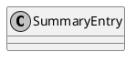
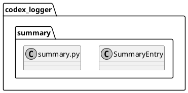

# iss-00016 Summary assistant unquoted — 設計（HOW）

## 目的・制約（要件から転記・圧縮） (必須)
- 目的:
  - transcript v2 の表示を維持したまま、Assistant 本文だけ blockquote を外して視認性を改善する。
- MUST:
  - User 本文は blockquote（`> `）のまま
  - Assistant 本文は blockquote を付けない（プレーンな Markdown）
  - lock + tmp + atomic replace は維持（`rebuild_summary` は変更しない）
- MUST NOT:
  - raw logs（`logs/*.json`）を書き換えない
  - transcript v2 の他の仕様（metadata 非表示など）を変えない
- 非交渉制約:
  - 依存追加なし
- 前提:
  - `iss-00015` の transcript v2 が導入済み

---

## 既存実装/規約の調査結果（As-Is / 99.9%理解） (必須)
- 参照した規約/実装（根拠）:
  - `spec-dock/active/initiative/requirement.md`: summary はフル再構築 + 原子的置換
  - `spec-dock/initiatives/.../iss-00015-summary-transcript-v2/requirement.md`: transcript v2 の仕様
  - `src/codex_logger/summary.py`: `_blockquote_lines` で User/Assistant 両方を blockquote 出力している
- 観測した現状（事実）:
  - Assistant 側の空行も `> ` として出力されるため、Markdown preview で `>` が並んで見える。
- 採用するパターン（命名/責務/例外/DI/テストなど）:
  - `render_summary` を純粋関数として維持し、フォーマットをテストで固定する。
  - blockquote の生成（User）は既存 helper を再利用する。
- 採用しない/変更しない（理由）:
  - transcript v2 の構造自体の変更（timestamp/ラベル/抽出ルール）: 本 Issue の対象外。
- 影響範囲（呼び出し元/関連コンポーネント）:
  - `codex_logger.summary.render_summary` の出力形式とテストのみ。

## 主要フロー（テキスト：AC単位で短く） (任意)
- Flow for AC-001:
  1) `render_summary` が User 本文を `> ` で prefix して出力する（既存）
- Flow for AC-002:
  1) `render_summary` が Assistant 本文を `> ` で prefix せずに出力する（新）
  2) 空行は `>` の行ではなく、空行として残る

### UML（任意） (任意)


```plantuml
@startuml
skinparam monochrome true

note as N
**User**
> quoted

**Assistant**
plain
end note
@enduml
```

## データ・バリデーション（必要最小限） (任意)
- MODEL-001: `SummaryEntry`
  - 変更なし（transcript v2 の DTO を流用）

### UML（任意） (任意)


## 判断材料/トレードオフ（Decision / Trade-offs） (任意)
- 論点: Assistant を blockquote のままにするか
  - 決定: Assistant はプレーン表示
  - 理由: ユーザー要望（網かけを外す）を満たすため

## インターフェース契約（ここで固定） (任意)
### 関数・クラス境界（重要なものだけ）
- IF-SUM-001: `codex_logger.summary::render_summary(entries: list[SummaryEntry]) -> str`（変更）
  - Output: User は blockquote、Assistant は非 blockquote
- IF-SUM-002: `codex_logger.summary::_blockquote_lines(text: str) -> list[str]`（既存）
  - 役割: User blockquote 用
- IF-SUM-003: `codex_logger.summary::_plain_lines(text: str) -> list[str]`（追加想定）
  - 役割: Assistant 本文の改行保持（prefix 無し）

### UML（任意） (任意)


## 変更計画（ファイルパス単位） (必須)
- 変更（Modify）:
  - `src/codex_logger/summary.py`: Assistant 本文の出力から blockquote を外す
  - `tests/test_summary.py`: User は blockquote、Assistant は非 blockquote を固定する

## マッピング（要件 → 設計） (必須)
- AC-001 → `summary.render_summary`（User: `_blockquote_lines`）
- AC-002 → `summary.render_summary`（Assistant: `_plain_lines`）
- EC-001 → `summary.render_summary`（Assistant の空行が `>` にならないことを保証）
- EC-002 → `summary.render_summary`（missing/invalid は Assistant 非 blockquote、parse error は継続表示）
- 非交渉制約 → `rebuild_summary`（既存を変更しない）

## テスト戦略（最低限ここまで具体化） (任意)
- 追加/更新するテスト:
  - Integration（既存）:
    - User のみ `> ` が付く
    - Assistant のメッセージ本文が `> ` で始まらない（今回のケースでは `> <text>` が含まれない）
- どのAC/ECをどのテストで保証するか:
  - AC-001/AC-002/EC-001 → `tests/test_summary.py::test_rebuild_summary_from_logs`（更新）
  - EC-001（空行） → `tests/test_summary.py::test_multiline_messages_are_blockquoted`（Assistant 部分の期待値更新）
  - EC-002（missing/invalid） → `tests/test_summary.py::test_missing_or_invalid_messages_are_rendered_best_effort`（Assistant 部分の期待値更新）
  - EC-002（parse error） → `tests/test_summary.py::test_invalid_json_is_recorded`（Assistant 部分の期待値更新）

### テストマトリクス（AC/EC → テスト） (任意)
- 実行コマンド:
  - `uv run --frozen pytest -q`

## リスク/懸念（Risks） (任意)
- R-001: Assistant の Markdown が summary 構造を壊し得る（既知リスク）
  - 対応: 本 Issue では方針維持

## 未確定事項（TBD） (必須)
- 該当なし

---

## ディレクトリ/ファイル構成図（変更点の見取り図） (任意)
```text
<repo-root>/
├── src/codex_logger/
│   └── summary.py            # Modify
└── tests/
    └── test_summary.py       # Modify
```

## 省略/例外メモ (必須)
- 該当なし
