# iss-00016 Summary assistant unquoted — 実装計画（TDD: Red → Green → Refactor）

## この計画で満たす要件ID (必須)
- 対象AC: AC-001, AC-002
- 対象EC: EC-001, EC-002
- 対象制約:
  - transcript v2 の他要件は変更しない
  - 依存追加なし

## ステップ一覧（観測可能な振る舞い） (必須)
- [ ] S01: テストで「User は blockquote / Assistant は非 blockquote」を固定する（Red）
- [ ] S02: `summary.py` を最小変更で追随しテストを通す（Green）
- [ ] S03: リファクタ + 全テスト + validate + report 更新（Refactor/品質ゲート）

### UML（任意） (任意)

```plantuml
@startuml
skinparam monochrome true

note as N
**User**
> quoted

**Assistant**
plain
end note
@enduml
```

### 要件 ↔ ステップ対応表 (必須)
- AC-001 → S01
- AC-002 → S01
- EC-001 → S01
- EC-002 → S01
- 非交渉制約（依存追加なし/原子置換維持） → S03

---

## 実装ステップ（各ステップは“観測可能な振る舞い”を1つ） (必須)

### S01 — テストで blockquote の差（Userのみ）を固定する (必須)
- 対象: AC-001, AC-002, EC-001, EC-002
- 設計参照:
  - 対象IF: IF-SUM-001 / IF-SUM-002 / IF-SUM-003
  - 対象テスト:
    - `tests/test_summary.py::test_rebuild_summary_from_logs`
    - `tests/test_summary.py::test_multiline_messages_are_blockquoted`
    - `tests/test_summary.py::test_missing_or_invalid_messages_are_rendered_best_effort`
    - `tests/test_summary.py::test_invalid_json_is_recorded`
- このステップで「追加しないこと（スコープ固定）」:
  - transcript v2 の抽出ルール（last user 等）の変更はしない

#### 期待する振る舞い（テストケース） (必須)
- Given: transcript v2 の `summary.md` を生成する
- When: `summary.md` を検証する
- Then:
  - User 本文は `> ` を含む
  - Assistant 本文は `> ` を付与しない（今回の fixture では `> <assistant-text>` が含まれない）
  - Assistant 本文の空行が `>` 行にならない
  - best-effort（missing/invalid/parse error）が既存どおり観測できる
    - missing/invalid: Assistant 側の `<missing>` / `<invalid>` は `> ` ではじまらない
    - parse error: `- parse error:` が出力される（生成継続）
- 観測点: `summary.md`
- 追加/更新するテスト:
  - `tests/test_summary.py::test_rebuild_summary_from_logs`
  - `tests/test_summary.py::test_multiline_messages_are_blockquoted`
  - `tests/test_summary.py::test_missing_or_invalid_messages_are_rendered_best_effort`
  - `tests/test_summary.py::test_invalid_json_is_recorded`

#### Red（失敗するテストを先に書く） (任意)
- 期待する失敗: 現状は Assistant も blockquote のため、期待値が不一致となる

#### Green（最小実装） (任意)
- 変更予定ファイル:
  - Modify: `tests/test_summary.py`
- 追加する概念（このステップで導入する最小単位）:
  - なし（期待値更新のみ）
- 実装方針（最小で。余計な最適化は禁止）:
  - Assistant 期待値から `>` を外し、User は維持する

#### Refactor（振る舞い不変で整理） (任意)
- 目的:
  - テストの意図が読み取れるように、最小限の assertion で固定する
- 変更対象:
  - `tests/test_summary.py`

#### ステップ末尾（省略しない） (必須)
- [ ] 期待するテスト（必要ならフォーマット/リンタ）を実行し、成功した
- [ ] コミットした（エージェント）

---

### S02 — Assistant 本文の出力から blockquote を外す (必須)
- 対象: AC-002
- 設計参照:
  - 対象IF: IF-SUM-001 / IF-SUM-003
  - 対象テスト: `tests/test_summary.py`（更新済み）
- コマンド:
  - `uv run --frozen pytest -q`
- ステップ末尾:
  - [ ] テストが通る
  - [ ] コミットした（エージェント）

---

### S03 — 仕上げ（全テスト/validate/report） (必須)
- 対象: 非交渉制約（回帰防止）
- コマンド:
  - `uv run --frozen pytest -q`
  - `./spec validate`
- ステップ末尾:
  - [ ] 全テストが通る
  - [ ] `spec-dock/active/issue/report.md` を更新した
  - [ ] コミットした（エージェント）

---

## 未確定事項（TBD） (必須)
- 該当なし

## 完了条件（Definition of Done） (必須)
- 対象AC/ECがすべて満たされ、テストで保証されている
- MUST NOT / OUT OF SCOPE を破っていない
- 品質ゲート（フォーマット/リント/テストのうち該当するもの）が満たされている

## 省略/例外メモ (必須)
- 該当なし
