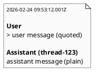

# iss-00016 Summary assistant unquoted — 要件定義（WHAT / WHY）

## 目的（ユーザーに見える成果 / To-Be） (必須)
- `summary.md` の transcript v2 で、**User は blockquote（網かけ）**, **Assistant は blockquote なし（網かけ無し）**で表示できる。
- VS Code の Markdown preview で、Assistant 側の「`>` だけが並ぶ網かけ」を解消し、読みやすくする。

## 背景・現状（As-Is / 調査メモ） (必須)
- 現状の挙動（事実）:
  - transcript v2 では User/Assistant ともに本文が blockquote（`> `）で出力される。
- 現状の課題（困っていること）:
  - Assistant 側が blockquote のため、空行が多い出力では `>` が連なって見え、視認性が落ちる。
- 再現手順（最小で）:
  1) `logs/*.json` に `last-assistant-message` が複数行（空行を含む）なログを用意する
  2) `summary.md` を生成し、Assistant 側が `>` で網かけになることを確認する
- 観測点（どこを見て確認するか）:
  - filesystem: `.codex-log/summary.md` の内容（VS Code Markdown preview）
- 情報源（ヒアリング/調査の根拠）:
  - Issue/チケット: #16
  - 既存仕様: `iss-00015`（Summary transcript v2）
  - コード: `src/codex_logger/summary.py`（Assistant を blockquote で出している箇所）

## 対象ユーザー / 利用シナリオ (任意)
- 主な利用者（ロール）:
  - `summary.md` を会話履歴として読みたい開発者
- 代表的なシナリオ:
  - User 側は引用表示（blockquote）で入力として区別し、Assistant 側は通常本文として読みたい

### UML（任意） (任意)

## スコープ（暴走防止のガードレール） (必須)
- MUST（必ずやる）:
  - transcript v2 の仕様（timestamp / last user / assistant / metadata 非表示）は維持する（`iss-00015` で確定済み）。
  - User 本文は blockquote（`> `）で出力する（現状維持）。
  - Assistant 本文は blockquote を付けず、そのままの Markdown として出力する（新仕様）。
- MUST NOT（絶対にやらない／追加しない）:
  - raw logs（`logs/*.json`）を変更しない。
  - Telegram 送信仕様を変更しない。
- OUT OF SCOPE:
  - transcript v1/v2 切替などの大きなフォーマット変更

## 境界（Always / Ask / Never） (必須)
- Always（常に守る）:
  - lock + tmp + atomic replace を維持する（summary の破損防止）
- Ask（迷ったら相談）:
  - Assistant の Markdown が summary 構造を壊す場合のエスケープ方針（本 Issue では扱わない）
- Never（絶対にしない）:
  - `.codex-log/` 以外への出力追加

## 非交渉制約（守るべき制約） (必須)
- 依存追加なし。
- `uv run --frozen pytest -q` が通ること。

## 前提（Assumptions） (必須)
- `summary.md` は transcript v2（`iss-00015`）として実装済みである。

## 判断材料/トレードオフ（Decision / Trade-offs） (任意)
- 論点: Assistant を blockquote のままにするか
  - 選択肢A: 両方 blockquote（Pros: 構造が壊れにくい / Cons: 視認性が悪い）
  - 選択肢B: User のみ blockquote（Pros: 入力/出力の見分けがつきつつ、出力が読みやすい / Cons: Assistant Markdown が summary 構造を壊し得る）
  - 決定: B（User のみ blockquote）
  - 理由: ユーザー要望（網かけ除去）を優先する

## リスク/懸念（Risks） (任意)
- R-001: Assistant 出力の Markdown が summary 全体の構造を崩す（影響: preview が崩れる）
  - 対応: 本 Issue ではエスケープは行わず、要望を優先（将来の改善で扱う）

## 受け入れ条件（観測可能な振る舞い） (必須)
- AC-001:
  - Actor/Role: 開発者
  - Given: transcript v2 の summary を生成する
  - When: `summary.md` を確認する
  - Then: User 本文は `> ` で始まる blockquote として表示される
  - 観測点: `summary.md`
- AC-002:
  - Actor/Role: 開発者
  - Given: transcript v2 の summary を生成する
  - When: `summary.md` を確認する
  - Then: Assistant 本文は blockquote（`> `）として出力されない
  - 観測点: `summary.md`

### 入力→出力例 (任意)
- EX-001:
  - Input（log JSON）:
    - `input-messages`: `["u1"]`
    - `last-assistant-message`: `"a1\n\n a3"`
  - Output（summary）:
    - User 側のみ `> u1`
    - Assistant 側は `a1` / 空行 / `a3` が `>` 無しで出る

## 例外・エッジケース（仕様として固定） (必須)
- EC-001:
  - 条件: Assistant 本文が複数行で空行を含む
  - 期待: 空行は `>` を伴わず、そのまま空行として表示される
  - 観測点: `summary.md`
- EC-002:
  - 条件: transcript v2 の best-effort（missing/invalid/parse error）
  - 期待:
    - parse error: 既存どおり `- parse error:` を表示し、生成は継続する
    - missing/invalid:
      - User: 既存どおり blockquote（例: `> <missing>` / `> <invalid>`）
      - Assistant: 本 Issue の方針どおり非 blockquote（例: `<missing>` / `<invalid>`）

## 用語（ドメイン語彙） (必須)
- TERM-001: blockquote（網かけ） = Markdown の `> ` で始まる引用ブロック
- TERM-002: transcript v2 = `iss-00015` で確定した summary 形式

## 未確定事項（TBD / 要確認） (必須)
- 該当なし

## Definition of Ready（着手可能条件） (必須)
- [ ] 目的が 1〜3行で明確になっている
- [ ] MUST/MUST NOT/OUT OF SCOPE が書けている
- [ ] Always/Ask/Never が書けている
- [ ] AC/EC が観測可能（テスト可能）な形になっている
- [ ] 観測点（UI/HTTP/DB/Log など）または確認方法が明記されている
- [ ] 未確定事項が「質問/選択肢/推奨案/影響範囲」で整理されている

## 完了条件（Definition of Done） (必須)
- すべてのAC/ECが満たされる
- 未確定事項が解消される（残す場合は「残す理由」と「合意」を明記）
- MUST NOT / OUT OF SCOPE を破っていない
- `uv run --frozen pytest -q` が通る

## 省略/例外メモ (必須)
- 該当なし
