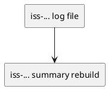

# epic-00003 Local Logging and Summary — 計画（Issues / Order）

## Issue 分割（縦切り方針） (必須)
- 価値の縦切り（UI→API→DBまで通す） / 移行の縦切り（expand→...）:
  - 価値の縦切り: 「ログ 1 件を確実に保存できる」→「summary を原子的に生成できる」
- 分割方針（原則）:
  - 1 issue = 1 つの観測可能な振る舞い（E2E）
- 例外（分割方針を破る条件）:
  - なし（まずは最小分割で進める）

## Issue 一覧（順序付き） (必須)
- iss-00008-raw-payload-logging-files (MVP: 1イベント=1ファイルのログ保存):
  - 目的:
    - notify payload を `.codex-log/` に 1イベント=1ファイルで保存する（raw payload をそのまま保存）
  - 成果物（Deliverable）:
    - `.codex-log/logs/*.json` の生成（raw payload / SSOT）
    - ファイル名の安全化（ID 正規化）
    - 排他的作成 + 衝突時サフィックスで上書き回避
    - 可能な範囲で restrictive な権限（例: dir 0700 / file 0600）
    - 末尾引数 JSON の解釈（`--telegram` 等のフラグと共存できる）
  - 対応する E-RQ / E-AC:
    - E-RQ-001..005 / E-AC-001
  - Depends on:
    - epic-00002（Packaging and CLI）の CLI 土台（pyproject/entrypoint/テスト基盤）
- iss-00009-summary-rebuild-from-logs (MVP: summary のフル再構築 + 原子置換):
  - 目的:
    - `.codex-log/summary.md` を `logs/*.json` から時系列に走査し、JSON→Markdown へ変換して再生成する
  - 成果物（Deliverable）:
    - summary 再構築区間のロック（同時実行でも破綻しない）
    - `summary.md.tmp` → rename の原子置換
    - 失敗時に旧 `summary.md` が保持される
  - 対応する E-RQ / E-AC:
    - E-RQ-002,006 / E-AC-002
  - Depends on:
    - 1イベント=1ファイルのログ保存

### UML（任意） (任意)

## 品質ゲート（Epic） (必須)
- [ ] 各 Issue が AC/EC を満たす自動テストを持つ（例外は理由がある）
- [ ] Epic の統合観点（E-AC）が確認できる（自動/半自動/手順のいずれか）
- [ ] 観測性（ログ/メトリクス/アラート）が入る（該当する場合）
- [ ] 移行手順/ロールバックが文書化される（該当する場合）

## ロールアウト / 移行 (必須)
- Feature flag:
  - なし（常時有効）
- 段階公開（カナリア/一部テナント/内部先行など）:
  - なし（ローカル運用）
- ロールバック:
  - `notify` から handler を外す

## Issue Definition of Ready（Issue に求める着手可能条件） (必須)
- [ ] Issue requirement に AC/EC がテスト可能な形で書けている
- [ ] Issue requirement に MUST/MUST NOT/OUT OF SCOPE と Always/Ask/Never がある
- [ ] Issue design に変更計画（パス単位）と要件→設計マッピングがある
- [ ] Issue design にテスト戦略（AC/EC→テスト）がある（該当なしの場合は理由がある）
- [ ] Issue plan が 1ステップ=1つの観測可能な振る舞いになっている
- [ ] 未確定事項が「質問/選択肢/推奨案/影響範囲」で整理されている

## 実行コマンド（必要なら） (任意)
- Test: `pytest -q`
- Lint/Format: `<command>`
- Typecheck: `<command>`

## 未確定事項（TBD） (必須)
- 該当なし（意思決定済み: `adr-00003-filename-safe-id-format`）

## 省略/例外メモ (必須)
- 該当なし
