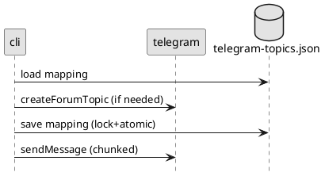
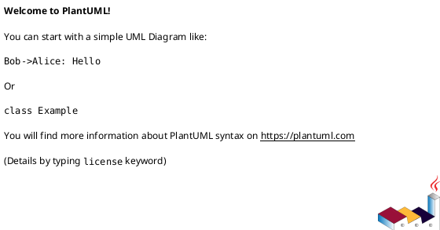

# iss-00010 Telegram Topic Mapping and Send — 設計（HOW）

## 目的・制約（要件から転記・圧縮） (必須)
- 目的: `--telegram` 指定時のみ最終アウトプットを Telegram topic へ送信する。
- MUST:
  - topic 作成/再利用（`thread-id` 単位）+ mapping 永続化
  - chunked send（4096制限、改行優先、`(i/n)` prefix: `adr-00007`）
- MUST NOT:
  - `--telegram` 無しで送信しない
  - 入力/トークン等を送らない（最終アウトプットのみ）
- 非交渉制約:
  - topic 命名: `adr-00002`
  - exit code: `adr-00008`
  - `.env` 方針: `adr-00005`
- 前提:
  - ローカル保存（`iss-00008`/`iss-00009`）が SSOT

---

## 既存実装/規約の調査結果（As-Is / 99.9%理解） (必須)
- 参照した規約/実装（根拠）:
  - `adr-00002-telegram-topic-naming.md`: topic 名生成
  - `adr-00007-telegram-chunk-numbering.md`: chunk prefix
  - `adr-00008-telegram-failure-exit-codes.md`: warn + exit code
  - `adr-00005-dotenv-loading-strategy.md`: `.env` 自動読込（env優先）
- 観測した現状（事実）:
  - Telegram 連携は未実装。
- 採用するパターン（命名/責務/例外/DI/テストなど）:
  - HTTP は標準ライブラリ（`urllib.request`）で実装し依存を増やさない
  - 送信は best-effort（失敗は warn、exit code はローカル保存に従う）
  - mapping は lock + tmp + atomic replace
- 採用しない/変更しない（理由）:
  - Telegram の topic 検索（mapping が SSOT のため）
- 影響範囲（呼び出し元/関連コンポーネント）:
  - `.codex-log/telegram-topics.json`
  - `codex_logger.cli`（`--telegram` 時のみ送信）

## 主要フロー（テキスト：AC単位で短く） (任意)
- Flow for AC-001:
  1) `--telegram` が無ければ即 skip
  2) env をロード（env > `<cwd>/.env`）。不足なら warn + skip
  3) payload を parse（best effort）し、必須項目を検証
     - `thread-id`（非空） or `last-assistant-message`（非空）が無ければ warn + **送信フロー全体を skip**
  4) mapping を lock 下でロード
  5) `thread-id` の topic が無ければ `createForumTopic` で作成し mapping を保存（lock + atomic replace）
  6) `last-assistant-message` を chunk 分割（`adr-00007`）し `sendMessage` を複数回
  7) Telegram 失敗は例外を握りつぶさず warn として扱う（exit code は `adr-00008`）
- Flow for AC-002:
  1) 本文を改行境界優先で分割（行単位で詰める）
  2) 行が長すぎて入らない場合のみ強制分割
  3) chunk 数 `n` を確定し、各 chunk 先頭に `(i/n)\\n` を付与
     - prefix を含めて `len(text) <= 4096` を満たすようにする

### UML（任意） (任意)


## データ・バリデーション（必要最小限） (任意)
- MODEL-001: <Entity/DTO/Table名>
  - Fields: ...
  - Constraints/Validation: ...
- ...

### UML（任意） (任意)


## 判断材料/トレードオフ（Decision / Trade-offs） (任意)
- 論点: ...
  - 選択肢A: ...（Pros/Cons）
  - 選択肢B: ...（Pros/Cons）
  - 決定: ...
  - 理由: ...

## インターフェース契約（ここで固定） (任意)
### API（ある場合）
- API-001: `<METHOD> <PATH>`
  - Request: ...
  - Response: ...
  - Errors: ...

### 関数・クラス境界（重要なものだけ）
- IF-ENV-001: `codex_logger.env::load_env_from_dotenv(cwd: Path) -> dict[str, str]`
  - Input: payload の `cwd`
  - Output: `.env` 由来のキー（環境変数が優先されるので「補完」用）
- IF-TG-001: `codex_logger.telegram::ensure_topic(thread_id: str, cwd: Path) -> int`
  - Output: `message_thread_id`
- IF-TG-002: `codex_logger.telegram::send_last_message(thread_id: str, cwd: Path, text: str) -> None`
  - Behavior: chunked send（`adr-00007`）
- IF-CHUNK-001: `codex_logger.chunking::split_for_telegram(text: str, limit: int = 4096) -> list[str]`
  - Output: prefix込みで limit を超えない chunk 列

### UML（任意） (任意)


### クラス/インターフェース詳細設計（主要なもの） (任意)
> この Issue を “単独の作業単位” として完結させるために、必要な範囲だけ詳細化する。

- Class: `<ClassName>`
  - Responsibility（責務）:
    - ...
  - Public methods（公開メソッド）:
    - `method(arg: Type) -> Return`
  - Invariants（不変条件）:
    - ...
  - Collaboration（協調関係）:
    - `<OtherClass>`（理由: ...）
- Interface / Protocol: `<InterfaceName>`
  - Contract（契約）:
    - ...
  - 実装候補:
    - `<ImplClass>`

#### UML（任意） (任意)


### 例外/エラー契約（重要なものだけ） (任意)
- ERR-001: <エラー名/コード>
  - 発生条件:
    - ...
  - 呼び出し元への返し方（例: 例外/戻り値/HTTP）:
    - ...
  - ログ/監視:
    - ...

## 変更計画（ファイルパス単位） (必須)
- 追加（Add）:
  - `src/codex_logger/env.py`: `.env` 自動読込（env優先）
  - `src/codex_logger/chunking.py`: 改行優先の分割 + `(i/n)` prefix
  - `src/codex_logger/telegram.py`: Telegram Bot API 呼び出し（topic + send）
  - `src/codex_logger/telegram_topics.py`: mapping（read-modify-write を lock + atomic replace）
  - `tests/test_chunking.py`: chunking のテスト
  - `tests/test_telegram_topic_name.py`: topic 名生成（128 bytes 制約）
  - `tests/test_telegram_api_mock.py`: HTTP 呼び出しのモックテスト（create/send）
- 変更（Modify）:
  - `src/codex_logger/cli.py`: `--telegram` 時に送信処理を呼ぶ（失敗は warn）
  - `pyproject.toml`: `python-dotenv`（`adr-00005`）を依存に追加
- 削除（Delete）:
  - なし
- 移動/リネーム（Move/Rename）:
  - なし
- 参照（Read only / context）:
  - `spec-dock/.../adrs/adr-00002-telegram-topic-naming.md`: topic 名仕様
  - `spec-dock/.../adrs/adr-00007-telegram-chunk-numbering.md`: chunk prefix
  - `spec-dock/.../adrs/adr-00008-telegram-failure-exit-codes.md`: exit code 方針

## マッピング（要件 → 設計） (必須)
- AC-001 → `telegram.ensure_topic` / `telegram.send_last_message`
- AC-002 → `chunking.split_for_telegram`
- AC-003 → `cli`（フラグ無しで送信しない）
- AC-004 → `cli`（例外捕捉 + warn、exit code 方針）
- EC-001/EC-002 → `env` と payload 検証（不足時 warn + skip）

## テスト戦略（最低限ここまで具体化） (任意)
- 追加/更新するテスト:
  - Unit:
    - chunking（改行優先 + 強制分割 + prefix）
    - topic name（`adr-00002` の短縮ルール）
    - mapping read/write（atomic）
    - Telegram API（HTTP をモック）
- どのAC/ECをどのテストで保証するか:
  - AC-002 → `tests/test_chunking.py`
  - EC-001/EC-002 → `tests/test_telegram_api_mock.py`（不足時 skip/warn を含む）

### テストマトリクス（AC/EC → テスト） (任意)
- AC-001:
  - Unit: ...
  - Integration: ...
  - E2E: ...
- EC-001:
  - Unit: ...
  - Integration: ...
  - E2E: ...
- 非交渉制約（requirement.md）をどう検証するか:
  - 制約: ...
    - 検証方法（テスト/計測点/ログ/運用確認など）: ...
- 実行コマンド（該当するものを記載）:
  - ...
- 変更後の運用（必要なら）:
  - 移行手順: ...
  - ロールバック: ...
  - Feature flag: ...

## リスク/懸念（Risks） (任意)
- R-001: <リスク>（影響: ... / 対応: ...）
- R-002: ...

## 未確定事項（TBD） (必須)
- 該当なし

---

## ディレクトリ/ファイル構成図（変更点の見取り図） (任意)
```text
<repo-root>/
├── src/codex_logger/
│   ├── chunking.py                   # Add
│   ├── cli.py                        # Modify
│   ├── env.py                        # Add
│   ├── telegram.py                   # Add
│   └── telegram_topics.py            # Add
└── tests/
    ├── test_chunking.py              # Add
    ├── test_telegram_api_mock.py     # Add
    └── test_telegram_topic_name.py   # Add
```

## 省略/例外メモ (必須)
- 該当なし
