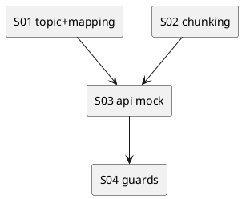

# iss-00010 Telegram Topic Mapping and Send — 実装計画（TDD: Red → Green → Refactor）

## この計画で満たす要件ID (必須)
- 対象AC: AC-001, AC-002, AC-003, AC-004
- 対象EC: EC-001, EC-002
- 対象制約:
  - topic 命名（`adr-00002`）
  - chunk prefix（`adr-00007`）
  - exit code（`adr-00008`）
  - `.env`（`adr-00005`）

## ステップ一覧（観測可能な振る舞い） (必須)
- [ ] S01: topic 名生成と mapping 永続化ができる
- [ ] S02: 4096 制限に収まる chunk 分割（改行優先 + `(i/n)`）ができる
- [ ] S03: Telegram API（create/send）をモックで検証できる
- [ ] S04: `--telegram` 無し/不足/失敗時の挙動が要件どおり（skip/warn/exit code）

### UML（任意） (任意)

### 要件 ↔ ステップ対応表 (必須)
- AC-001 → S01
- AC-002 → S02
- AC-003 → S04
- AC-004 → S04
- EC-001 → S04
- EC-002 → S04
- 非交渉制約（ADR群）→ S01..S04

---

## 実装ステップ（各ステップは“観測可能な振る舞い”を1つ） (必須)

### S01 — topic 名生成と mapping 永続化ができる (必須)
- 対象: AC-001
- 設計参照:
  - 対象IF: IF-TG-001
  - 対象テスト: `tests/test_telegram_topic_name.py`
- このステップで「追加しないこと（スコープ固定）」:
  - 実際の Telegram 送信（S03でモック検証、実送信は E2E 手順）

#### update_plan（着手時に登録） (必須)
- [ ] `update_plan` に、このステップの作業ステップ（調査/Red/Green/Refactor/品質ゲート/報告/コミット）を登録した
- 登録例:
  - （調査）既存挙動/影響範囲の確認、設計参照の確認
  - （Red）失敗するテストの追加/修正
  - （Green）最小実装
  - （Refactor）整理
  - （品質ゲート）format/lint/test
  - （報告）`./spec-dock/active/issue/report.md` 更新
  - （コミット）このステップの区切りでコミット

#### 期待する振る舞い（テストケース） (必須)
- Given: `cwd="/path/to/project"`, `thread-id="abc"`
- When: topic 名を生成する
- Then:
  - 通常: `project (abc)` 形式で、`len(name.encode("utf-8")) <= 128`
  - 128 bytes を超過する場合:
    - `project (<sha256(thread-id)[:8]>)` に短縮される（`adr-00002`）
    - それでも超過する場合は `cwd_basename` を UTF-8 bytes 基準で切り詰め、同形式を維持する
  - 多バイト文字（例: 日本語）を含んでも bytes 計算が崩れない
- 観測点: unit test
- 追加/更新するテスト: `tests/test_telegram_topic_name.py`

#### Red（失敗するテストを先に書く） (任意)
- 期待する失敗:
  - ...

#### Green（最小実装） (任意)
- 変更予定ファイル:
  - Add: `<path/...>`
  - Modify: `<path/...>`
- 追加する概念（このステップで導入する最小単位）:
  - ...
- 実装方針（最小で。余計な最適化は禁止）:
  - ...

#### Refactor（振る舞い不変で整理） (任意)
- 目的:
  - ...
- 変更対象:
  - ...

#### ステップ末尾（省略しない） (必須)
- [ ] 期待するテスト（必要ならフォーマット/リンタ）を実行し、成功した
- [ ] `./spec-dock/active/issue/report.md` に実行コマンド/結果/変更ファイルを記録した
- [ ] `update_plan` を更新し、このステップの作業ステップを完了にした
- [ ] コミットした（エージェント）

---

### S02 — 4096 制限に収まる chunk 分割ができる (必須)
- 対象: AC-002
- 設計参照:
  - IF-CHUNK-001
  - `tests/test_chunking.py`
- 期待する振る舞い（最低限の観測ケース）:
  - prefix を含めて `len(text) <= 4096` を満たす
  - 改行境界優先で分割される（行の途中で切らない）
  - 1行が長すぎて入らない場合のみ強制分割する
  - `n >= 10` でも prefix 長が変わることを考慮して成立する（limit を小さくした unit test で検証）

### S03 — Telegram API（create/send）をモックで検証できる (必須)
- 対象: AC-001
- 設計参照:
  - `tests/test_telegram_api_mock.py`

### S04 — `--telegram` 無し/不足/失敗時の挙動が要件どおり (必須)
- 対象: AC-003, AC-004 / EC-001, EC-002
- 設計参照:
  - `cli`（フラグ判定、例外捕捉、warn、exit code）
- 追加/更新するテスト（ADR-00008の優先順位を固定）:
  - `tests/test_cli_exit_codes.py::test_cli_zero_when_telegram_send_fails`
  - `tests/test_cli_exit_codes.py::test_cli_zero_when_telegram_prereq_missing`
  - `tests/test_cli_exit_codes.py::test_cli_nonzero_when_local_save_fails_with_telegram`

---

## 未確定事項（TBD） (必須)
- 該当なし

## 完了条件（Definition of Done） (必須)
- 対象AC/ECがすべて満たされ、テストで保証されている
- MUST NOT / OUT OF SCOPE を破っていない
- 品質ゲート（フォーマット/リント/テストのうち該当するもの）が満たされている

## 省略/例外メモ (必須)
- 該当なし
