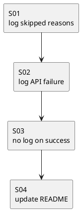

# iss-00012 Telegram delivery diagnostics — 実装計画（TDD: Red → Green → Refactor）

## この計画で満たす要件ID (必須)
- 対象AC: AC-001, AC-002, AC-003, AC-004
- 対象EC: EC-001, EC-002, EC-003
- 対象制約: 依存追加なし / ローカル保存は必達（診断ログ失敗で exit non-zero にしない）

## ステップ一覧（観測可能な振る舞い） (必須)
- [ ] S01: スキップ理由（env不足/invalid JSON/欠損）を診断ログに保存できる
- [ ] S02: Telegram API 失敗を診断ログに保存できる（chunk index を含む）
- [ ] S03: 成功時は診断ログを生成しない
- [ ] S04: README に `telegram-errors/` を追記する（必要なら）

### UML（任意） (任意)

### 要件 ↔ ステップ対応表 (必須)
- AC-001 → S01
- AC-002 → S02
- AC-003 → S03
- AC-004 → S01, S02
- EC-001 → S01
- EC-002 → S02（出力失敗は warning-only）
- EC-003 → S02

---

## 実装ステップ（各ステップは“観測可能な振る舞い”を1つ） (必須)

### S01 — スキップ理由（env不足/invalid JSON/欠損）を診断ログに保存できる (必須)
- 対象: AC-001, EC-001
- 設計参照:
  - 対象IF: `codex_logger.telegram.send_last_message_best_effort(..., event_stem=...)`
  - 対象テスト: `tests/test_telegram_diagnostics.py::test_writes_diagnostics_when_env_missing`
- 期待する振る舞い:
  - env不足/invalid JSON/必須フィールド欠損のとき、`telegram-errors/<event>.md` が生成され、理由が書かれている
  - env不足のとき、Telegram API が呼ばれていない（テストでは `urlopen` 呼び出し回数 0）
  - 診断ログ本文に機密値（token 値）や raw payload 全文が含まれない
- ステップ末尾:
  - `uv run --frozen pytest -q` が通る
  - `spec-dock/active/issue/report.md` を更新
  - コミットする

### S02 — Telegram API 失敗を診断ログに保存できる（chunk index を含む） (必須)
- 対象: AC-002, EC-002, EC-003
- 設計参照:
  - 対象IF: `codex_logger.telegram.send_last_message_best_effort`
  - 対象テスト: `tests/test_telegram_diagnostics.py::test_writes_diagnostics_when_api_fails`
- 期待する振る舞い:
  - API 失敗時に `telegram-errors/<event>.md` が生成され、失敗要約が書かれている
  - 複数chunk送信の途中で失敗した場合、`i/n` が分かる範囲で書かれている
  - 診断ログ本文に機密値（token 値）や raw payload 全文が含まれない
- ステップ末尾:
  - `uv run --frozen pytest -q` が通る
  - `spec-dock/active/issue/report.md` を更新
  - コミットする

### S03 — 成功時は診断ログを生成しない (必須)
- 対象: AC-003
- 設計参照:
  - 対象テスト: `tests/test_telegram_diagnostics.py::test_does_not_write_diagnostics_on_success`
- 期待する振る舞い:
  - 成功時は `telegram-errors/<event>.md` が生成されない

### S04 — README に `telegram-errors/` を追記する (任意)
- 対象: 運用性
- 期待する振る舞い:
  - ディレクトリ構成図に `telegram-errors/` が記載される

---

## 未確定事項（TBD） (必須)
- 該当なし

## 完了条件（Definition of Done） (必須)
- AC/EC がテストで保証されている
- MUST NOT / OUT OF SCOPE を破っていない
- 機密値が診断ログへ出力されない

## 省略/例外メモ (必須)
- 該当なし
