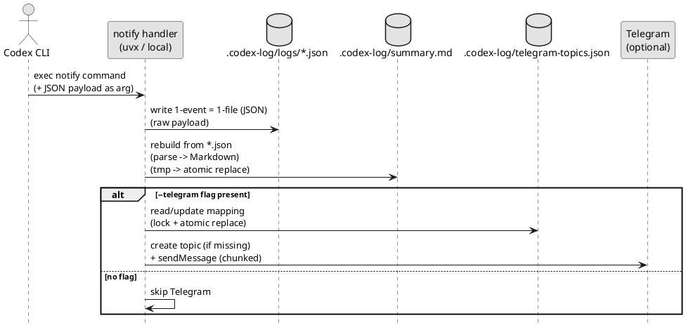
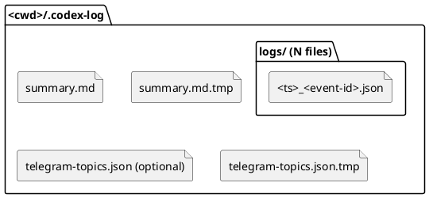

# init-00001 Codex Notify Json Logger — 要件定義（WHAT / WHY）

## 目的（Outcome / To-Be） (必須)
- Primary（必達）:
  - Codex CLI の `notify` で受け取る JSON payload を、OS 通知ではなく **ファイルとして永続化**できる。
  - `<cwd>/.codex-log/logs/` に「1イベント=1ファイル」の **JSON（raw payload）** を保存できる。
  - `<cwd>/.codex-log/summary.md` に、個別ログ（JSON）を都度解析して Markdown に変換した **読みやすい 1 枚の Markdown** を毎回フレッシュ生成できる。
  - Telegram へは `last-assistant-message`（最終アウトプット）のみを、セッション（`thread-id`）単位の topic に送信できる。
- Secondary（できれば達成）:
  - （将来）token 使用量を扱う場合に備え、raw JSON を SSOT として保存しておく（MVP では token 取得はしない）。
  - Telegram の文字数制限を考慮し、改行境界で分割して全文を送れる。

## 背景・現状（As-Is / 調査メモ） (必須)
- 現状の課題（事実）:
  - Codex CLI の `notify` は JSON payload を外部コマンドへ渡せるが、標準では「ログ保管/集約/共有」の運用が整っていない。
- 影響（ユーザー/運用/コスト/品質）:
  - 後から会話/実行結果を追えない、もしくは追うのに手間がかかる（調査コスト増）。
  - チーム共有（Telegram 等）をしたいが、全文/機密を流したくない。
- なぜ今やるか（トリガー/期限/機会損失）:
  - `notify` の payload を「収集→保存→集約→（必要なら）配信」する仕組みがあれば、運用の事故を減らせる。
- 観測点（どこを見て確認するか）:
  - `.codex-log/logs/` にログが作られること
  - `.codex-log/summary.md` が毎回再生成され、時系列に並ぶこと
  - Telegram topic がセッション単位で作成/再利用され、最終アウトプットのみが届くこと
- 情報源（ヒアリング/ログ/コード/ドキュメント等の根拠）:
  - Codex CLI docs: `notify`（JSON はコマンド引数として渡される。追加引数がある場合は末尾になる）
  - ADR: `adrs/adr-00001-notify-logger-output-and-telegram.md`

### UML（任意） (任意)


## 成功指標（Success metrics） (必須)
- Metric 1:
  - Baseline（現状値）: 0（仕組み無し）
  - Target（目標値）: `agent-turn-complete` 受信のたびに 100% ログ生成（少なくともローカル保存は失敗しない）
  - 計測方法（どこで/どう測るか）: `.codex-log/logs/` と `.codex-log/summary.md` の生成を確認（E2E テスト + 手動確認）
  - 計測期間（いつからいつまでで判断するか）: 実装後の運用初期（例: 1 週間）
- Metric 2:
  - Baseline（現状値）: 0（仕組み無し）
  - Target（目標値）: Telegram 送信が有効な場合、最終アウトプットが topic へ到達（失敗時はローカル保存を優先しつつリトライ/エラーが追える）
  - 計測方法: Bot API 応答 + テスト（文字数分割を含む）
  - 計測期間: 実装後の運用初期（例: 1 週間）

## スコープ（暴走防止のガードレール） (必須)
- MUST:
  - ログ保存のルートは `<cwd>/.codex-log/` とし、`.codex` は汚染しない。
  - 個別ログを `logs/` に保存し、`summary.md` は受信のたびに **フル再構築**して出力する。
    - 出力は `summary.md.tmp` を生成してから原子的に置換する（失敗時は旧 `summary.md` を保持する）。
  - ファイル名は日時プレフィックス + `thread-id`/`turn-id` に基づく `event-id`（短縮ハッシュ）で、日時順ソートと衝突回避ができる。
    - `thread-id`/`turn-id` を **生でファイル名へ埋め込まない**（危険文字/長さ/パストラバーサル対策）。safe id（`event-id`）を使い、生値は raw JSON（`.json`）に残す。
    - suffix の数字は **衝突時のみ**付与する（通常は suffix 無し）。同名ファイルが発生しても上書きしない（排他的作成 + サフィックスで必ず別名保存する）。
  - Telegram 送信は `last-assistant-message` のみ（入力/トークン等は送らない）。
  - Telegram 送信はフラグ `--telegram` 指定時のみ行う（フラグ無しなら送信しない）。
  - ツールは uvx で実行できる（GitHub リポジトリ指定/ローカルパス指定に対応し、必要に応じてタグ/コミットを指定できる）。
    - CLI コマンド名は `codex-logger` とする。
- MUST NOT:
  - OS 通知としてユーザーへポップアップ表示しない（notify の payload は保存/配信に使う）。
  - `.git/` やリポジトリ設定を変更しない（ブランチ操作や破壊的操作をしない）。
- OUT OF SCOPE:
  - ログの自動削除/ローテーション（まずは保存と集約を優先）
  - 機密情報の自動マスキング（方針確定後に追加）

## ディレクトリ構成（出力: `.codex-log/`） (必須)
> 可読性と事故防止のため、出力は **2段構成**（個別ログ + フレッシュ生成サマリ）にする。

### ツリー（概形）
```text
<cwd>/
    └── .codex-log/                                (dir)
        ├── logs/                                 (dir)  # ファイル数 = notify 受信回数
        │   ├── <ts>_<event-id>.json               (file) x N  # 衝突時のみ suffix: __01, __02...
        │   └── ...
        ├── summary.md                             (file) # 常に 1（再生成される派生物）
        ├── summary.md.tmp                         (file) # 一時ファイル（原子置換用）
        ├── telegram-topics.json                   (file) # 0..1（`--telegram` 運用時）
        └── telegram-topics.json.tmp               (file) # 一時ファイル（原子置換用）
```

### ファイル構成数（目安）
- `.codex-log/logs/*.json`: N（1イベント=1）
- `.codex-log/summary.md`: 1
- `.codex-log/telegram-topics.json`: 0..1（Telegram を使う場合のみ）

### UML（任意） (任意)


## 非交渉制約（NFR/運用/セキュリティ） (必須)
- 互換性:
  - `notify` payload は「未知フィールドが増える」前提で raw JSON を保存する（パーサは壊れにくく）。
- 信頼性:
  - ローカル保存を最優先（Telegram 失敗でもログ保存は成功させる）。
  - `summary.md` は都度再生成（インクリメンタル更新による破損リスクを避ける）。
- セキュリティ:
  - ログは入力を含む可能性があるため、取り扱い注意（共有先は最終アウトプットのみに制限）。
  - `.codex-log/` 配下は機密を含み得るため、可能な範囲で restrictive な権限（例: dir 0700 / file 0600）で作成する。
- 運用性:
  - 設定は環境変数で注入する。加えて `.env` があれば自動読込できる（環境変数が優先）。

## 境界（Always / Ask / Never） (必須)
- Always（常に守る）:
  - 出力先は `<cwd>/.codex-log/` に閉じる。
  - 1イベント=1ファイル + フレッシュ生成の `summary.md` を維持する。
- Ask（迷ったら相談）:
  - ログ/Telegram に含める内容のマスキング・省略方針（機密/PII）
- Never（絶対にしない）:
  - 入力メッセージ全文（`input-messages`）を Telegram に送らない。
  - git 履歴の書き換え等の破壊的操作をしない。

## ステークホルダー / 影響範囲 (必須)
- 利用者（ロール/部署）:
  - Codex CLI を使う開発者
- 運用者（SRE/CS/監視）:
  - （必要に応じて）開発者自身
- 開発者（担当領域）:
  - Codex CLI 利用者 / 自動化担当
- 影響範囲（システム/モジュール/外部連携）:
  - ローカルファイル（`.codex-log/`）
  - Telegram Bot API（任意）

## 制約・前提（Constraints / Assumptions） (必須)
- 技術制約:
  - `notify` は JSON をコマンド引数として付与する（追加引数がある場合、JSON は末尾になり得る）。
  - ツールは JSON を **最後の引数**として解釈できるように実装する（`--telegram` 等のフラグと共存させるため）。
  - ツールは uvx 実行を前提に配布する（GitHub リポジトリから直接実行でき、ローカル clone のパス指定でも実行できる Python パッケージ + console script）。
    - GitHub 指定ではタグ/コミット（例: `@v0.1.0` / `@<sha>`）を指定できる。
- ビジネス制約:
  - まずは個人/小規模チーム運用を想定（厳密な監査要件は後回し）。
- 法務/セキュリティ:
  - Telegram 送信は外部流出の可能性があるため、送信内容を限定する。
- 不確実な前提（崩れた場合の影響）:
  - token 使用量は現行の `notify` payload には含まれない（必要なら別経路で扱う）。
  - `<cwd>` は payload の `cwd` を正とする（保存先の分断を避けるため、正規化して採用する）。取得できない場合のみ実行時の cwd にフォールバックする。

## Initiative-level requirements（能力/成果の要求） (任意)
> “機能詳細” ではなく「この取り組みで得たい成果/能力」を列挙する。実装方法はここに書かない。

- I-RQ-001: `notify` payload を受信し、raw を失わず保存できる
- I-RQ-002: 1イベント=1ファイルのログが追える
- I-RQ-003: summary（時系列結合）を毎回フレッシュ生成できる
- I-RQ-004: Telegram に最終アウトプットのみ配信できる（topic をセッション単位で作る）
- I-RQ-005: uvx で GitHub リポジトリ指定からツールを実行できる
- I-RQ-006: uvx でローカルパス指定からツールを実行できる
- I-RQ-007: uvx の GitHub 指定でタグ/コミットを指定できる

## リスク/依存（Risks / Dependencies） (必須)
- R-001: ログに機密が混入（影響: 情報漏洩 / 対応: 送信は最終アウトプットのみ + マスキング方針を後続で定義）
- R-002: Telegram topics の運用前提（影響: 送信不可 / 対応: Bot 権限・forum 有効化を前提化、無効時はローカル保存のみ）

## 未確定事項（TBD / 要確認） (必須)
- 該当なし（意思決定済み）
  - token 使用量: `adrs/adr-00009-token-usage-logging.md`（MVPでは扱わない）
  - topic 命名: `adrs/adr-00002-telegram-topic-naming.md`（`<cwd_basename> (<thread-id>)`）

## Definition of Ready（着手可能条件） (必須)
- [ ] 目的（Primary/Secondary）が明記されている
- [ ] 成功指標（Baseline/Target/計測方法/計測期間）が決まっている
- [ ] MUST/MUST NOT/OUT OF SCOPE が書けている
- [ ] Always/Ask/Never が書けている
- [ ] リスク/依存が列挙され、最低限の対応方針がある
- [ ] 未確定事項が「質問/選択肢/推奨案/影響範囲」の形で整理されている

## Definition of Done（完了条件） (必須)
- 成功指標が計測され、目標達成/未達が判断できる
- （必要なら）ロールアウト完了（段階公開/移行完了）
- （必要なら）運用（監視/アラート/手順）が整備されている
- フォローアップが Epic/Issue として切られている（必要な分）

## 省略/例外メモ (必須)
- 該当なし
