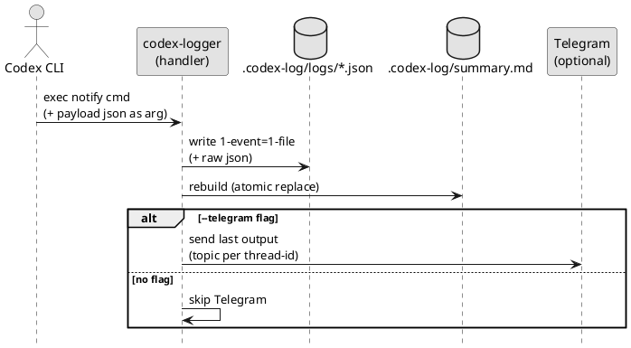
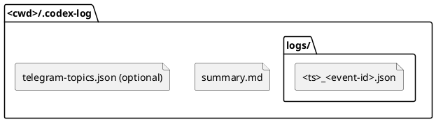
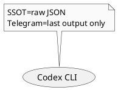
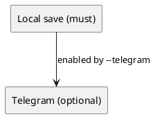
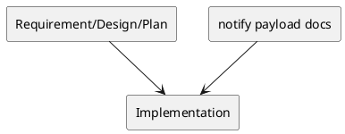

# adr-00001 Notify Logger Output and Telegram

## 結論（Decision） (必須)
- 結論:
  - Codex CLI の `notify` で受け取る JSON payload を、通知（OS側）には使わず **ローカルファイルへ保存**する。
  - ローカル保存は `<cwd>/.codex-log/` 配下に行い、`logs/` に「1イベント=1ファイル」を残し、`summary.md` は毎回フレッシュ生成する。
  - Telegram には token 情報等は送らず、`last-assistant-message`（最終アウトプット）だけを **セッション単位 topic**へ送信する。
- ログ保存先/構成:
  - ルート: `<cwd>/.codex-log/`
    - ここでの `<cwd>` は payload の `cwd` を正とし、正規化（realpath 相当）して採用する。
  - 個別ログ: `<cwd>/.codex-log/logs/<ts>_<event-id>.json`
    - 個別ログのフォーマット（raw JSON / SSOT）は `adr-00010` に従う。
    - safe id（`event-id`）の形式は `adr-00003` に従う（`thread-id`/`turn-id` を生でファイル名に入れない）。
    - ファイル名衝突時のみ suffix を付与する（例: `...__01.json`）。
  - 結合サマリ: `<cwd>/.codex-log/summary.md`
    - 更新方法: 受信のたびに `logs/*.json` を時系列（ファイル名ソート）で走査し、JSON をパースして Markdown に変換して **フル再構築**する。
      - `summary.md` の再構築は同時実行で壊れないよう、再構築区間をロックする（例: `.codex-log/summary.lock` を用いた OS レベルの排他）。
      - 出力は `summary.md.tmp` に書き出してから原子的に置換する（失敗時は旧 `summary.md` を保持する）。
- ファイル命名:
  - `<ts>` は UTC の日時プレフィックスで固定する（例: `2026-02-24T09-53-12.345Z`）。
    - 形式: `YYYY-MM-DDTHH-MM-SS.mmmZ`（ファイル名安全のため `:` は `-` に置換）
    - ソート: 文字列の辞書順 = 時系列順
  - `event-id` は `thread-id` と `turn-id` の複合IDを短縮ハッシュ化した safe id を使う（`adr-00003`）。生値は raw JSON 内に残す。
  - 衝突回避:
    - 通常は suffix 無しで保存する（例: `..._<event-id>.json`）
    - 既存ファイルと衝突した場合のみ suffix を付与する（例: `..._<event-id>__01.json`, `...__02.json`）
    - 実装: **排他的作成**（例: `O_EXCL` 相当）で書き込み、存在したら suffix を増やして再試行する（上書きしない）。
- 保存フォーマット（方針）:
  - 個別ログ（SSOT）: `.codex-log/logs/*.json` に notify payload を raw で保存する（詳細は `adr-00010`）。
  - サマリ（派生物）: `summary.md` は JSON をパースして Markdown を生成する（raw JSON は summary に含めない）。
  - 補足: 現行の `notify` payload には token 使用量は含まれないため、必要なら別経路（tokenizer 推定/OTel 等）で扱う（`adr-00009`）。
  - セキュリティ（権限）: `.codex-log/` と `logs/` は 0700、ログファイルは 0600 を意図し、可能な範囲で restrictive に作成する（OS/FS が非対応の場合はベストエフォート）。
- Telegram 送信:
  - 前提: Telegram supergroup で topics（forum）を有効化し、Bot に topic 作成権限を付与する。
  - 送信先は環境変数で与える（例: `TELEGRAM_BOT_TOKEN`, `TELEGRAM_CHAT_ID`）。
  - 送信するかどうかは CLI フラグで切り替える。
    - `--telegram` 指定時のみ Telegram 送信を行う（環境変数が揃っていても、フラグ無しなら送信しない）。
    - `--telegram` 指定があるのに環境変数が不足している場合は、送信せず **警告を stderr に出す**（ローカル保存は継続）。
  - topic は `thread-id`（=セッションID）単位で 1 つ作り、以後は再利用する。
    - そのために `<cwd>/.codex-log/telegram-topics.json` に `thread-id -> message_thread_id` の mapping を保存する。
    - mapping の更新は同時実行で破損しないよう、ロック + 一時ファイル経由の原子的置換で行う。
  - 文字数制限（4096 文字）超過時は **改行境界を優先**して分割し、複数投稿で全文を送る。
    - 改行が無い等で分割できない場合は、上限文字数で強制分割する（送信失敗を避ける）。
  - 失敗時ポリシー:
    - ローカル保存失敗: 非0終了（必達）
      - ローカル保存には「個別ログ」だけでなく「summary 再構築」も含む（個別ログ保存に成功していても summary 更新失敗は非0で検知可能にする）。
    - Telegram 送信失敗: stderr warn（ローカル保存優先、原則は 0 終了）
  - 未知イベント:
    - 未知の `type` でもローカル保存は行う（raw JSON は残す）。
    - Telegram 送信は行わない（未知イベントのため）。

## 背景（Context） (必須)
- 背景/制約（なぜ今決める必要があるか）:
  - Codex CLI の `notify` は、イベント発生時に任意コマンドを実行し、JSON payload を **コマンド引数として付与**する（追加引数がある場合は末尾になる）。
  - 今回は OS 通知を出すのではなく、この JSON payload を「1イベント=1ファイル」で保存し、必要に応じて Telegram へ最終アウトプットのみ配信したい。
- 前提:
  - `notify` の対象イベントは現時点で `agent-turn-complete` を想定する。
  - payload の共通フィールド例: `type`, `thread-id`, `turn-id`, `cwd`, `input-messages`, `last-assistant-message`。

### UML（任意） (任意)

## 選択肢（Options considered） (必須)
- Option A: `<cwd>/.codex-log/` へ保存（採用）
  - 概要:
    - payload 内の `cwd` を基点に、隠しディレクトリ `.codex-log/` を作成してログを保存する。
    - 1イベント=1JSON（raw payload）を `logs/` に保存し、`summary.md` は JSON から毎回フレッシュ生成する。
    - Telegram は supergroup の topics（forum）を前提に、`thread-id`（=セッション相当）ごとに topic を作成/再利用して送信する。
  - Pros:
    - 利用ディレクトリ直下を汚しにくい（開発中のノイズを抑制）
    - 収集対象（notify payload）を raw で保持しつつ、人間向けの Markdown も得られる
    - Telegram は「セッション単位」に整理できる
  - Cons:
    - topics を作るには bot 権限（`can_manage_topics` 等）や forum 有効化が必要
    - payload を raw で保存するため、機密/個人情報が含まれる場合の取り扱いが課題
- Option B: `<cwd>/codex-logs/` へ保存（非推奨）
  - 概要:
    - `codex-logs/` のような見えるディレクトリへログを保存する。
    - Telegram は topic を使わず単一スレッド/単一チャットへ送る。
  - Pros:
    - 目につきやすく運用が単純
  - Cons:
    - 作業ディレクトリ直下が散らかりやすい
    - topic を使わないとセッション単位で追いにくい
  - 棄却理由（棄却する場合）:
    - 「日時でソートしやすい 1メッセージ=1ファイル」の運用は Option A の方が相性が良い。

### UML（任意） (任意)

## 判断理由（Rationale） (必須)
- 要件（1イベント=1ファイル、日時ソート、raw JSON 保持、Telegram は最終アウトプットのみ）との整合を優先する。
- ログは利用ディレクトリごとに閉じたい（`cwd` を基点にする）。

### UML（任意） (任意)

## 影響（Consequences） (必須)
- Positive（良い点）:
  - notify payload を失わずに保存でき、後から再解析/再送が可能になる
  - Telegram を「セッション別 topic」に整理できる
- Negative / Debt（悪い点 / 将来負債）:
  - Telegram 送信は外部流出リスクがある（送る内容の制御・マスキングの判断が必要）
  - Bot API の制約により「既存 topic の検索」が難しく、ローカルの mapping 保存が必要になる可能性が高い
- 影響範囲（コード/テスト/運用/データ）:
  - notify handler（CLI から呼ばれるスクリプト/バイナリ）
  - ログ保存ディレクトリとファイル形式（後方互換の考慮が必要）
- 移行/ロールバック:
  - 初期は新規導入のみ。失敗時は Telegram を無効化してファイル保存のみで継続可能にする。
- Follow-ups（追加の Epic/Issue/ADR）:
  - （必要なら）機密情報マスキング方針の ADR 分離

### UML（任意） (任意)

## 参考（References） (任意)
- 関連仕様（requirement/design/plan/report）:
  - `spec-dock/initiatives/init-local-00001-codex-notify-json-logger/requirement.md`
  - `spec-dock/initiatives/init-local-00001-codex-notify-json-logger/design.md`
  - `spec-dock/initiatives/init-local-00001-codex-notify-json-logger/plan.md`
- PR/実装:
  - ...
- 外部資料:
  - https://developers.openai.com/codex/config-advanced#notify

### UML（任意） (任意)

