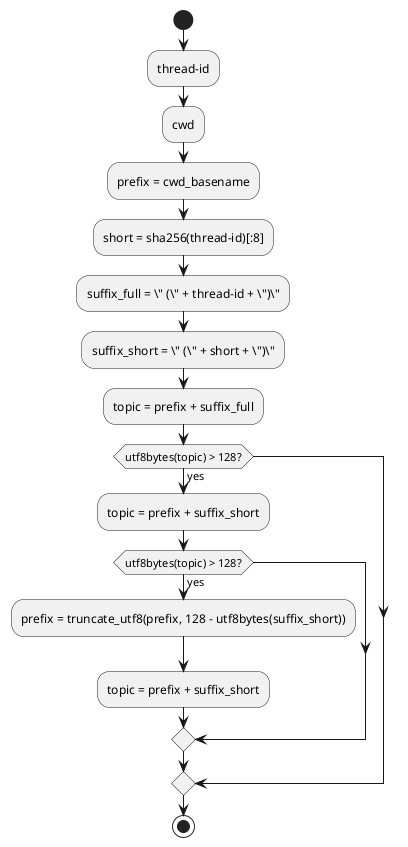

# adr-00002 Telegram topic naming（topic 名の命名規則）

## 結論（Decision） (必須)
- 決定: topic 名は次の形式にする。
  - **`<cwd_basename> (<thread-id>)`**
    - `<cwd_basename>`: payload の `cwd` の basename（フルパスは使わない）
    - `<thread-id>`: payload の `thread-id`
- 例外（長すぎる場合）:
  - Telegram の制約（topic 名は **UTF-8 で 128 bytes 以下**）に収まらない場合は、次の順で短縮する。
    1) `thread-id` を短縮して **`<cwd_basename> (<sha256(thread-id)[:8]>)`** にする（可読性より衝突回避を優先）
    2) それでも 128 bytes を超える場合は、`cwd_basename` を **収まる長さまで切り詰め**て同形式を維持する
       - 判定は `len(name.encode(\"utf-8\")) <= 128` とする

## 背景（Context） (必須)
- 背景/制約（なぜ今決める必要があるか）:
  - `--telegram` 有効時、`thread-id` 単位で topic を作成/再利用するため、topic 名が運用上の「探しやすさ」を左右する。
  - topic の実体は `message_thread_id`（整数）で識別し、`thread-id -> message_thread_id` を `.codex-log/telegram-topics.json` に保存する。
    - つまり、topic 名は**UI のためのメタ情報**であり、正しさ（SoR）ではない。
  - ただし、人間が見て理解できない topic 名だと運用が破綻する。
- 前提:
  - Telegram は supergroup（forum topics 有効）を使用する。
  - topic の「検索」は行わず、mapping が SSOT（なければ新規作成）とする。
  - topic 名は Telegram の制約（長さ/改行等）に収まる必要がある。
    - 長さは UTF-8 で 128 bytes 以下

### UML（命名生成の決定フロー）

## 選択肢（Options considered） (必須)
- Option A: `Codex <thread-id>`
  - 概要:
    - 固定プレフィックス `Codex` + `thread-id` のみ。
  - Pros:
    - 実装が最小（repo 推定不要）
    - topic 名の揺れが少ない
  - Cons:
    - topic 一覧で「どの作業（repo/cwd）のセッションか」が分かりにくい

- Option B: `<repo名> <thread-id>`（repo 不明時は `<cwd basename> <thread-id>`）
  - 概要:
    - `cwd` から repo 名（git repo root basename）を推定できる場合はそれを prefix にする。
    - 推定できない場合は `cwd` の basename を prefix にする。
  - Pros:
    - topic 一覧で探しやすい（コンテキストが見える）
    - 複数リポジトリを 1 つの supergroup で運用しやすい
  - Cons:
    - repo 推定ロジックが増える（ただし fallback 前提）

- Option C: `<cwd basename> (<thread-id>)`（採用）
  - 概要:
    - `cwd` の basename を最優先の prefix とし、`thread-id` は括弧で付与する。
  - Pros:
    - 一覧で「どのプロジェクト/ディレクトリか」が最初に分かる
    - `Codex` のような無駄な前置きが無い
  - Cons:
    - `thread-id` は可読性が低い（ただし衝突回避のための識別子として使う）

## 判断理由（Rationale） (必須)
- 判断軸:
  - 探しやすさ（topic 一覧での視認性）
  - 一意性（`thread-id` を含める）
  - 壊れにくさ（repo 推定に失敗しても cwd fallback で成立すること）
- 結論:
  - Option C（`cwd basename` + `(thread-id)`）
  - 理由: `thread-id` 自体は可読性が低く、運用上は「どのディレクトリ/プロジェクトで動いているか」が最も重要。

## 影響（Consequences） (必須)
- Positive（良い点）:
  - topic 一覧でプロジェクト（cwd basename）起点に探せる
- Negative / Debt（悪い点 / 将来負債）:
  - cwd basename が同名のケース（例: 別パスに同名ディレクトリ）では topic 名が似る（ただし `(thread-id)` で区別される）
- 影響範囲（コード/テスト/運用/データ）:
  - `epic-local-00002` の topic 作成処理（topic name 生成）
  - テスト: topic 名の生成（cwd basename + thread-id、長さ丸め）
- 移行/ロールバック:
  - 既存 mapping（`thread-id -> message_thread_id`）がある `thread-id` は topic ID を再利用できるため、命名規則の変更は「新規セッションの新規 topic」にのみ影響する
- Follow-ups（追加の Epic/Issue/ADR）:
  - 結論確定後、この ADR を `accepted` にし、`epic-local-00002` の requirement/design へ反映する

## 参考（References） (任意)
- 関連仕様（requirement/design/plan/report）:
  - `spec-dock/initiatives/init-local-00001-codex-notify-json-logger/requirement.md`
  - `spec-dock/initiatives/init-local-00001-codex-notify-json-logger/plan.md`
  - `spec-dock/initiatives/init-local-00001-codex-notify-json-logger/epics/epic-local-00002-telegram-topics-delivery/design.md`
- PR/実装:
  - （未実装）
- 外部資料:
  - Telegram Bot API（forum topics / sendMessage）
