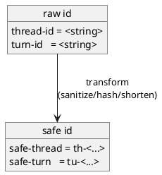

# adr-00003 Filename safe id format（ファイル名の safe id 形式）

## 結論（Decision） (必須)
- **未決（TBD）**: `.codex-log/logs/<ts>_<safe-thread>_<safe-turn>__NN.md` の `<safe-*>` 生成方式を決める。
- ステータス運用:
  - 結論が未決の間は `状態: draft`
  - 結論が確定したら `accepted`
- 決めたいこと:
  - `thread-id` / `turn-id` を **ファイル名に安全に埋め込む** safe id の形式（Option A / B）
- 決定（決定後に記入）:
  - ...

## 背景（Context） (必須)
- 背景/制約（なぜ今決める必要があるか）:
  - `thread-id` / `turn-id` を生でファイル名に入れると、危険文字/長さ/パストラバーサル等のリスクがあるため禁止する。
  - ただし運用上は「どのセッション/ターンのログか」を追える必要があるため、ファイル名には safe id を入れる。
  - 衝突（同名ファイル）は **排他的作成 + サフィックス**で上書きを避けるため、safe id は「強い一意性」よりも「安全で短いこと」が重要。
- 前提:
  - SSOT は Markdown 内の raw JSON（生の `thread-id`/`turn-id` は本文に残る）。
  - ファイル名は「人間の可読性」よりも「安全性/安定性」を優先してよい（必要なら本文を見る）。

### UML（ID → safe id の変換イメージ）

## 選択肢（Options considered） (必須)
- Option A: `sha256(id)[:8]`（短縮ハッシュのみ）
  - 概要:
    - `safe-thread = "th-" + sha256(thread-id)[:8]`
    - `safe-turn   = "tu-" + sha256(turn-id)[:8]`
  - Pros:
    - 安全・短い・一定長で扱いやすい
    - 危険文字の問題が出ない
    - 実装がシンプル
  - Cons:
    - ファイル名だけでは内容が分かりにくい（本文のヘッダー/JSON を見る必要）

- Option B: `slug + hash`（可読性のための短い slug を付与）
  - 概要:
    - `slug = [a-z0-9-]` のみで短縮した可読部分（長さ上限あり）
    - `safe = slug + "-" + sha256(id)[:4]` のようにハッシュで一意性を担保
  - Pros:
    - ファイル名だけで多少の可読性がある
  - Cons:
    - slugify の仕様が増え、バグ/揺れの余地が増える
    - 長さ管理が複雑（特に `thread-id` が長い/非ASCIIのケース）

## 判断理由（Rationale） (必須)
- 判断軸:
  - ファイル名としての安全性（危険文字/長さ）
  - 実装の単純さ（壊れにくさ）
  - 追跡可能性（本文に生値が残る前提で十分か）
- 推奨案（暫定）:
  - Option A（短縮ハッシュのみ）

## 影響（Consequences） (必須)
- Positive（良い点）:
  - Option A は実装が単純で、ファイル名起因の事故を避けやすい
- Negative / Debt（悪い点 / 将来負債）:
  - Option A はファイル名単体の可読性が低い（ただし本文にメタ情報を記載する）
- 影響範囲（コード/テスト/運用/データ）:
  - `epic-local-00001` のログファイル命名とテスト
- 移行/ロールバック:
  - safe id 方式を変更するとファイル名パターンが変わるが、summary は `logs/*.md` を結合するだけなので互換は保ちやすい
- Follow-ups（追加の Epic/Issue/ADR）:
  - 決定後、`accepted` に更新し、`epic-local-00001` の TBD を解消する

## 参考（References） (任意)
- 関連仕様（requirement/design/plan/report）:
  - `spec-dock/initiatives/init-local-00001-codex-notify-json-logger/epics/epic-local-00001-local-logging-and-summary/requirement.md`
  - `spec-dock/initiatives/init-local-00001-codex-notify-json-logger/epics/epic-local-00001-local-logging-and-summary/plan.md`
- PR/実装:
  - （未実装）
- 外部資料:
  - N/A
