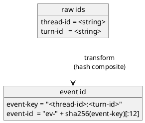

# adr-00003 Filename safe id format（ファイル名の safe id 形式）

## 結論（Decision） (必須)
- 決定: ファイル名に埋め込む safe id は **複合ID（thread-id + turn-id）の短縮ハッシュのみ**（Option B）を採用する。
  - `event-key = f"{thread-id}:{turn-id}"`（欠損時はセンチネル文字列で補完してから生成）
  - `event-id  = "ev-" + sha256(event-key)[:12]`
- 対象ファイル（例）:
  - `.codex-log/logs/<ts>_<event-id>.json`
  - 衝突時のみ suffix を付与:
    - `.codex-log/logs/<ts>_<event-id>__01.json`
    - `.codex-log/logs/<ts>_<event-id>__02.json`

## 背景（Context） (必須)
- 背景/制約（なぜ今決める必要があるか）:
  - `thread-id` / `turn-id` を生でファイル名に入れると、危険文字/長さ/パストラバーサル等のリスクがあるため禁止する。
  - ただし運用上は「どのセッション/ターンのログか」を追える必要があるため、ファイル名には safe id を入れる。
  - 衝突（同名ファイル）は **排他的作成 + 衝突時のみ suffix**で上書きを避ける。
- 前提:
  - SSOT は `.codex-log/logs/*.json` に保存した raw JSON（生の `thread-id`/`turn-id` は JSON 内に残る）。
  - ファイル名は「人間の可読性」よりも「安全性/安定性」を優先してよい（必要なら本文を見る）。

### UML（ID → safe id の変換イメージ）

## 選択肢（Options considered） (必須)
- Option A: `safe-thread + safe-turn`（それぞれ短縮ハッシュを付与）
  - 概要:
    - `safe-thread = "th-" + sha256(thread-id)[:8]`
    - `safe-turn   = "tu-" + sha256(turn-id)[:8]`
    - `.codex-log/logs/<ts>_<safe-thread>_<safe-turn>.json` のように埋め込む
  - Pros:
    - 安全・短い・一定長で扱いやすい
    - 危険文字の問題が出ない
    - `thread-id` と `turn-id` が別々に見える
  - Cons:
    - ファイル名だけでは内容が分かりにくい（本文のヘッダー/JSON を見る必要）

- Option B: `event-id = sha256(thread-id + turn-id)[:N]`（複合IDの短縮ハッシュのみ、採用）
  - 概要:
    - `event-key = f"{thread-id}:{turn-id}"`
    - `event-id  = "ev-" + sha256(event-key)[:12]`
    - `.codex-log/logs/<ts>_<event-id>.json` とする（衝突時のみ suffix）
  - Pros:
    - ファイル名が短く、実装も単純
    - `__NN` のような固定連番を不要にできる（衝突時のみ suffix）
  - Cons:
    - ファイル名から `thread-id` / `turn-id` を直接推定できない（ただし raw JSON が SSOT）

- Option C: `slug + hash`（可読性のための短い slug を付与）
  - 概要:
    - `slug = [a-z0-9-]` のみで短縮した可読部分（長さ上限あり）
    - `safe = slug + "-" + sha256(id)[:4]` のようにハッシュで一意性を担保
  - Pros:
    - ファイル名だけで多少の可読性がある
  - Cons:
    - slugify の仕様が増え、バグ/揺れの余地が増える
    - 長さ管理が複雑（特に `thread-id` が長い/非ASCIIのケース）

## 判断理由（Rationale） (必須)
- 判断軸:
  - ファイル名としての安全性（危険文字/長さ）
  - 実装の単純さ（壊れにくさ）
  - 追跡可能性（本文に生値が残る前提で十分か）
- 結論:
  - Option B（複合IDの短縮ハッシュのみ）

## 影響（Consequences） (必須)
- Positive（良い点）:
  - `event-id` は短く安全で、ファイル名起因の事故を避けやすい
  - 通常は suffix 無しでよく、衝突時のみ suffix を付与すればよい
- Negative / Debt（悪い点 / 将来負債）:
  - ファイル名単体の可読性は低い（ただし raw JSON が SSOT のため、必要時は JSON を見る）
- 影響範囲（コード/テスト/運用/データ）:
  - `epic-local-00001` のログファイル命名とテスト
- 移行/ロールバック:
  - safe id 方式を変更するとファイル名パターンが変わるが、summary は `logs/*.json` を走査して再生成するため互換は保ちやすい
- Follow-ups（追加の Epic/Issue/ADR）:
  - 決定後、`accepted` に更新し、`epic-local-00001` の TBD を解消する

## 参考（References） (任意)
- 関連仕様（requirement/design/plan/report）:
  - `spec-dock/initiatives/init-local-00001-codex-notify-json-logger/epics/epic-local-00001-local-logging-and-summary/requirement.md`
  - `spec-dock/initiatives/init-local-00001-codex-notify-json-logger/epics/epic-local-00001-local-logging-and-summary/plan.md`
- PR/実装:
  - （未実装）
- 外部資料:
  - N/A
