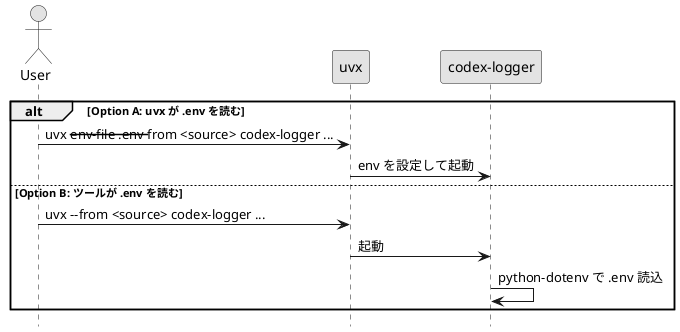

# adr-00005 Dotenv loading strategy（`.env` の取り扱い）

## 結論（Decision） (必須)
- **未決（TBD）**: Telegram の環境変数（例: `TELEGRAM_BOT_TOKEN`, `TELEGRAM_CHAT_ID`）を `.env` から注入する方式を決める。
- ステータス運用:
  - 結論が未決の間は `状態: draft`
  - 結論が確定したら `accepted`
- 決定（決定後に記入）:
  - ...

## 背景（Context） (必須)
- 背景/制約（なぜ今決める必要があるか）:
  - Telegram 連携は環境変数で設定するが、手元運用では `.env` を使いたいケースが多い。
  - どの層（uvx / ツール本体）が `.env` を解釈するかで、依存や運用が変わる。
- 前提:
  - `--telegram` 指定時のみ Telegram を送る（ログ保存は常に行う）。
  - `.env` の自動読込は「便利だが依存が増える」トレードオフがある。

### UML（`.env` の注入方式）

## 選択肢（Options considered） (必須)
- Option A: uvx の `--env-file` を README で推奨（ツールは自動読込しない）
  - 概要:
    - `uvx --env-file .env ...` で、uvx に環境変数注入を委譲する
  - Pros:
    - ツール側の依存追加なし（シンプル）
    - 「どの `.env` を使うか」がコマンドで明示できる
  - Cons:
    - `notify` 設定に `--env-file` を書く必要がある
  - 棄却理由（棄却する場合）:
    - （未決）
- Option B: ツール側で `.env` を自動読込（python-dotenv を導入）
  - 概要:
    - `cwd`（payload 由来）で `.env` を探索/読込し、環境変数を補完する
  - Pros:
    - `notify` 設定が簡潔になる（`--env-file` 不要）
  - Cons:
    - 依存追加（python-dotenv）
    - `.env` 探索ルールが増え、意図しない `.env` を読む事故の可能性がある
  - 棄却理由（棄却する場合）:
    - （未決）

## 判断理由（Rationale） (必須)
- 判断軸:
  - 依存を増やさずに運用できるか（MVP の簡潔さ）
  - 誤読込の事故を避けられるか（明示性）
- 推奨案（暫定）:
  - Option A（uvx `--env-file` 推奨）

## 影響（Consequences） (必須)
- Positive（良い点）:
  - Option A はツール側が軽量で、責務が明確（env は起動側が注入）
- Negative / Debt（悪い点 / 将来負債）:
  - Option A は `notify` 設定に記述が増える
- 影響範囲（コード/テスト/運用/データ）:
  - `epic-local-00003` の README（実行例）
  - `epic-local-00002` の env 不足時 warn（何が不足か）
- 移行/ロールバック:
  - 将来 Option B に切替える場合、依存追加と探索規則の導入が必要
- Follow-ups（追加の Epic/Issue/ADR）:
  - 結論確定後、この ADR を `accepted` にし、`epic-local-00003` の TBD を解消する

## 参考（References） (任意)
- 関連仕様（requirement/design/plan/report）:
  - `spec-dock/initiatives/init-local-00001-codex-notify-json-logger/epics/epic-local-00003-packaging-and-cli/design.md`
  - `spec-dock/initiatives/init-local-00001-codex-notify-json-logger/epics/epic-local-00002-telegram-topics-delivery/design.md`
- PR/実装:
  - （未実装）
- 外部資料:
  - uvx `--env-file`
