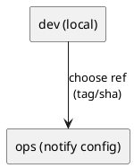

# adr-00006 Uvx ref pinning strategy（uvx の ref 固定運用）

## 結論（Decision） (必須)
- **未決（TBD）**: `uvx --from git+...@<ref>` の `<ref>` をどう固定して運用するかを決める（tag / commit）。
- ステータス運用:
  - 結論が未決の間は `状態: draft`
  - 結論が確定したら `accepted`
- 決定（決定後に記入）:
  - ...

## 背景（Context） (必須)
- 背景/制約（なぜ今決める必要があるか）:
  - `notify` は開発中も頻繁に発火するため、意図しない更新で挙動が変わると事故になり得る。
  - 一方で、更新を止めすぎるとバグ修正が反映されない。
- 前提:
  - uvx は git URL に `@tag` / `@commit` を付けて固定できる。
  - `--from .`（ローカルパス）でも実行できる。

### UML（運用のイメージ）

## 選択肢（Options considered） (必須)
- Option A: tag 固定を基本（通常は `@vX.Y.Z`、緊急時のみ `@<sha>`）
  - 概要:
    - 通常はセマンティックな tag を切って固定し、緊急時のみ commit sha を使う
  - Pros:
    - 人間が扱いやすい（運用が分かりやすい）
    - rollback も tag の差し替えでできる
  - Cons:
    - tag の運用（リリース）を行う必要がある
  - 棄却理由（棄却する場合）:
    - （未決）
- Option B: commit sha 固定を基本（常に `@<sha>`）
  - 概要:
    - 常に commit sha で固定し、最大限の再現性を優先する
  - Pros:
    - 再現性が最も高い
  - Cons:
    - 人間が扱いにくい（どの版か分かりにくい）
    - notify 設定が可読でなくなる
  - 棄却理由（棄却する場合）:
    - （未決）

## 判断理由（Rationale） (必須)
- 判断軸:
  - 運用の分かりやすさ（人間が読める）
  - 再現性（いつでも同じものが動く）
  - rollback の容易さ
- 推奨案（暫定）:
  - Option A（tag 基本 + 緊急時 sha）

## 影響（Consequences） (必須)
- Positive（良い点）:
  - tag 運用を行うと「どのバージョンを使っているか」が明確になる
- Negative / Debt（悪い点 / 将来負債）:
  - tag を切らない運用だと、notify での固定が曖昧になりがち
- 影響範囲（コード/テスト/運用/データ）:
  - `epic-local-00003` の README（`uvx --from git+...@...` 例）
  - ロールアウト/ロールバック手順
- 移行/ロールバック:
  - tag/sha の差し替えで切替可能
- Follow-ups（追加の Epic/Issue/ADR）:
  - 結論確定後、この ADR を `accepted` にし、README と運用手順へ反映する

## 参考（References） (任意)
- 関連仕様（requirement/design/plan/report）:
  - `spec-dock/initiatives/init-local-00001-codex-notify-json-logger/epics/epic-local-00003-packaging-and-cli/plan.md`
- PR/実装:
  - （未実装）
- 外部資料:
  - uvx git URL `@ref`
