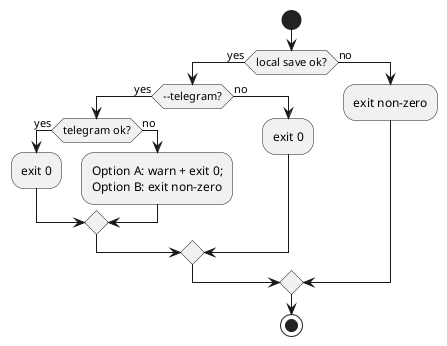

# adr-00008 Telegram failure exit codes（Telegram 失敗時の exit code）

## 結論（Decision） (必須)
- 決定: Telegram 送信失敗は **warn + exit 0**（Option A）とする（ローカル保存優先）。
  - ただしローカル保存（個別ログ/summary）に失敗した場合は Telegram の成否に関わらず **非0** とする。

## 背景（Context） (必須)
- 背景/制約（なぜ今決める必要があるか）:
  - ローカル保存は必達（失敗は非0）。
  - Telegram は任意（外部依存）だが、`--telegram` を付けた場合は「失敗を CI/運用で検知したい」ニーズもあり得る。
- 前提:
  - 現行方針（暫定）は「Telegram 失敗は warn + exit 0」（ローカル保存優先）。
  - env 不足時は warn を出して送らない（既決）。

### UML（exit code の分岐）

## 選択肢（Options considered） (必須)
- Option A: Telegram 失敗は warn + exit 0（ローカル保存優先）
  - 概要:
    - Telegram はベストエフォート扱いにし、失敗してもプロセスは成功扱い（ただし stderr に warn）
  - Pros:
    - 外部要因（429/ネットワーク）で `notify` が「失敗」扱いになりにくい
  - Cons:
    - 監視しないと失敗を見落としやすい（stderr 依存）
  - 棄却理由（棄却する場合）:
    - （未決）
- Option B: `--telegram` 時に Telegram 失敗は非0（厳格）
  - 概要:
    - ローカル保存が成功していても、Telegram が失敗したら exit non-zero
  - Pros:
    - 失敗が確実に検知できる（パイプラインに乗せやすい）
  - Cons:
    - 一時的な外部要因で `notify` が失敗扱いになりやすい
  - 棄却理由（棄却する場合）:
    - （未決）

## 判断理由（Rationale） (必須)
- 判断軸:
  - ローカル必達（最優先）の方針に合うか
  - 外部依存（Telegram）で運用が不安定にならないか
  - 失敗検知のしやすさ（stderr 監視 vs exit code）
- 結論:
  - Option A（warn + exit 0）

## 影響（Consequences） (必須)
- Positive（良い点）:
  - Option A はローカル保存の信頼性を優先しつつ、Telegram を段階導入しやすい
- Negative / Debt（悪い点 / 将来負債）:
  - Option A は「stderr の監視/ログ確認」が前提になる
- 影響範囲（コード/テスト/運用/データ）:
  - `epic-local-00002` のエラーハンドリングとテスト
- 移行/ロールバック:
  - 方針変更は exit code のみであり、保存データには影響しない
- Follow-ups（追加の Epic/Issue/ADR）:
  - （必要なら）`--telegram-strict` の追加を別 ADR/Issue として検討

## 参考（References） (任意)
- 関連仕様（requirement/design/plan/report）:
  - `spec-dock/initiatives/init-local-00001-codex-notify-json-logger/adrs/adr-00001-notify-logger-output-and-telegram.md`
  - `spec-dock/initiatives/init-local-00001-codex-notify-json-logger/epics/epic-local-00002-telegram-topics-delivery/design.md`
- PR/実装:
  - （未実装）
- 外部資料:
  - Telegram Bot API
