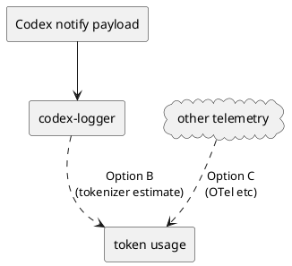

# adr-00009 Token usage logging（token 使用量の扱い）

## 結論（Decision） (必須)
- 決定: MVP では token 使用量は扱わない（Option A）。

## 背景（Context） (必須)
- 背景/制約（なぜ今決める必要があるか）:
  - 「どのくらいの入力/出力があったか」を後から把握したい（コスト/性能/品質の観点）。
  - しかし現行の Codex CLI `notify` payload には token 使用量が含まれない（調査メモで確認済み）。
- 前提:
  - MVP は「raw JSON を SSOT として保存」し、後から再解析できることを優先する。

### UML（取得経路の候補）

## 選択肢（Options considered） (必須)
- Option A: MVP では扱わない（raw JSON + 最終アウトプットの運用で十分）
  - 概要:
    - token 使用量はログに含めない（将来必要になったら別途対応）
  - Pros:
    - 仕様が単純で壊れにくい（payload に無いものを無理に推定しない）
  - Cons:
    - token 使用量を直接は把握できない
  - 棄却理由（棄却する場合）:
    - （未決）
- Option B: 受信側で tokenizer により推定
  - 概要:
    - `input-messages` と `last-assistant-message` を tokenizer にかけて token 数を推定する
  - Pros:
    - 追加の外部連携なしで概算できる
  - Cons:
    - モデル差分/バージョン差分で誤差が出る
    - 正しい tokenizer の選定が難しい（payload にモデル情報が無い）
  - 棄却理由（棄却する場合）:
    - （未決）
- Option C: OTel 等の別経路で取得して紐づけ
  - 概要:
    - 別の観測経路（トレース/ログ）で token 使用量を取得し、`thread-id`/`turn-id` 等で紐づける
  - Pros:
    - 正確性が高い（取得元に依存）
  - Cons:
    - 仕組みが別系統になり、MVP の範囲を超える

## 判断理由（Rationale） (必須)
- 判断軸:
  - 正確性（推定か実測か）
  - MVP の範囲と複雑さ
  - payload と独立に実現できるか
- 結論:
  - Option A（MVP では扱わない）

## 影響（Consequences） (必須)
- Positive（良い点）:
  - Option A は仕様が単純で、ログ保存/集約/配信の完成を優先できる
- Negative / Debt（悪い点 / 将来負債）:
  - token 使用量が必要になったら追加実装が必要
- 影響範囲（コード/テスト/運用/データ）:
  - ログ Markdown の表示項目（将来拡張）
- 移行/ロールバック:
  - Option B/C を採る場合でも raw JSON は残るため後方互換にしやすい
- Follow-ups（追加の Epic/Issue/ADR）:
  - token を扱う場合は別 Epic/Issue を起票する（MVP 完了後）

## 参考（References） (任意)
- 関連仕様（requirement/design/plan/report）:
  - `spec-dock/initiatives/init-local-00001-codex-notify-json-logger/requirement.md`
  - `spec-dock/initiatives/init-local-00001-codex-notify-json-logger/artifacts/notify-payload.md`
- PR/実装:
  - （未実装）
- 外部資料:
  - N/A
