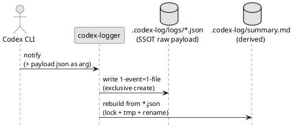

# adr-00010 Event log format (JSON files)（個別ログはJSON、サマリはMarkdown）

## 結論（Decision） (必須)
- 決定:
  - `.codex-log/logs/` の「1イベント=1ファイル」は **Markdownではなく JSON** とする（raw payload をそのまま保存）。
    - ファイル: `<cwd>/.codex-log/logs/<ts>_<event-id>.json`（safe id は `adr-00003`）
      - 衝突時のみ suffix を付与（例: `...__01.json`, `...__02.json`）
    - 内容: 受信した notify payload の JSON 文字列（整形しない。受信内容を保持する）
  - `summary.md` は `.codex-log/logs/*.json` を都度パースし、**Markdown へ変換して再生成**する（派生物）。
    - lock → `summary.md.tmp` → rename の原子置換で更新する
  - 個別の Markdown ログ（`logs/*.md`）は作らない（summary を主に見る運用のため）。

## 背景（Context） (必須)
- 背景/制約（なぜ今決める必要があるか）:
  - `notify` payload のスキーマは今後変わる可能性があるため、可読フォーマットへ変換したログだけを保存すると将来の再解析が難しくなる。
  - 運用上は個別ログより `summary.md` を主に参照するため、個別ログは「将来の再解析用の raw」を優先したい。
- 前提:
  - raw JSON は `.codex-log/logs/*.json` を SSOT とする。
  - `summary.md` は常に再生成可能（派生物）とする。

### UML（保存と再生成の関係）

## 選択肢（Options considered） (必須)
- Option A: 個別ログを Markdown（+ raw JSON を埋め込み）で保存し、summary はそれを結合
  - 概要:
    - `logs/*.md` を保存し、`summary.md` は Markdown を結合して再生成する
  - Pros:
    - 個別ファイルがそのまま読める
  - Cons:
    - 変換済み Markdown が主となり、スキーマ変更時の再解析がしにくい
    - summary が肥大化しやすい（raw JSON を含めると特に）

- Option B: 個別ログは JSON（raw）、summary のみ Markdown（採用）
  - 概要:
    - `logs/*.json` を SSOT として保存し、`summary.md` は JSON をパースして生成する
  - Pros:
    - 将来の仕様変更に強い（raw が残る）
    - summary を「読み物」として最適化しやすい（raw を含めない）
  - Cons:
    - 個別ログは人間には読みづらい（ただし必要時のみ参照する前提）

## 判断理由（Rationale） (必須)
- 結論は Option B。
- 理由:
  - raw JSON を保存しておけば、後からスキーマ変更に追従した再解析ができる
  - summary を再生成することで「可読性」と「将来の再解析」を両立できる

## 影響（Consequences） (必須)
- Positive（良い点）:
  - `.codex-log/logs/*.json` が SSOT となり、将来の仕様変更時も再解析可能
  - `summary.md` のレイアウト/表示項目は後から改善しやすい（派生物のため）
- Negative / Debt（悪い点 / 将来負債）:
  - summary 生成ロジック（JSON→Markdown）を維持する必要がある
- 影響範囲（コード/テスト/運用/データ）:
  - `epic-local-00001`（ローカル保存/summary）の requirement/design/plan
  - `.codex-log/` の出力仕様（拡張子/summary生成方式）
- 移行/ロールバック:
  - 旧方式（`logs/*.md`）は採用しない（本番運用前の仕様変更のため）。
- Follow-ups（追加の Epic/Issue/ADR）:
  - `adr-00001`（出力/summary/Telegram）にも本決定を反映する（矛盾回避）

## 参考（References） (任意)
- 関連仕様（requirement/design/plan/report）:
  - `spec-dock/initiatives/init-local-00001-codex-notify-json-logger/requirement.md`
  - `spec-dock/initiatives/init-local-00001-codex-notify-json-logger/design.md`
  - `spec-dock/initiatives/init-local-00001-codex-notify-json-logger/epics/epic-local-00001-local-logging-and-summary/design.md`
- PR/実装:
  - （未実装）
- 外部資料:
  - N/A
