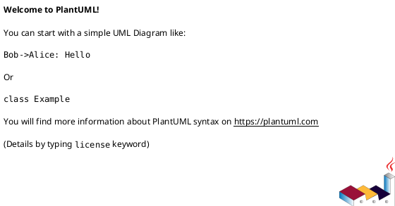

# init-local-00001 Codex Notify Json Logger — 設計（HOW / Guardrails）

## アーキテクチャ上の狙い（Architectural drivers） (必須)
- 信頼性: ローカル保存を最優先し、外部送信（Telegram）が失敗してもログは残る
- 変更容易性: notify payload のフィールド追加/変更に耐える（raw JSON を SSOT とする）
- 運用性: `.codex` を汚さず、`<cwd>/.codexlog/` に閉じた運用にする
- 安全性: Telegram へは最終アウトプットのみ送る（入力/トークン等は送らない）

## 現状の把握（As-Is） (必須)
- システム構成（簡易）:
  - Codex CLI の `notify` で外部コマンド実行は可能だが、保存/集約/配信の規約がない
- 主要な問題の根（ボトルネック/技術的負債/運用負債）:
  - 受信 JSON を体系的に保存/検索できず、後追い調査が難しい
  - 外部共有が必要でも、入力を含む全文は送れない（内容の切り分けが必要）

## 目指す姿（To-Be） (必須)
- To-Be 概要（文章でOK。図は必要なら各セクション内の UML 小項目に）:
  - `notify` handler（ツール）は argv[1] の JSON payload を受け取り、`<cwd>/.codexlog/` へ保存する。
  - `logs/` に「1イベント=1ファイル」を残し、`summary.md` は毎回フル再構築して **原子的に置換**する（`summary.md.tmp` → rename）。
  - Telegram は任意で、環境変数が揃って **かつ argv[2] に `--telegram` が指定された場合のみ**、`last-assistant-message` を topic へ送る。
- 境界（モジュール/責務/データ境界の方針）:
  - 入力（payload）: Codex CLI notify JSON（raw を SSOT）
  - 出力（永続）: Markdown ログ（+ raw JSON を同梱）
  - 外部送信: Telegram（最終アウトプットのみ）

### UML（任意） (任意)

## システム境界 / 依存（Context） (必須)
- 対象範囲（in scope のシステム/モジュール）:
  - notify handler（CLI から呼び出されるスクリプト/バイナリ）
  - ローカル保存（`.codexlog/`）とサマリ生成
- 外部依存（他サービス/外部API/チーム）:
  - Telegram Bot API（任意）
- 互換性の方針（後方互換/段階移行/破壊的変更の扱い）:
  - raw JSON を常に保存し、Markdown の「表示フィールド」は追加/変更があっても破壊しにくい形にする

### UML（任意） (任意)

## ガードレール（Must-follow constraints） (必須)
- 互換性（API/データ）:
  - notify payload は未知フィールドが増える前提で、パース失敗時も raw を保存する
- セキュリティ（権限/監査/PII）:
  - Telegram に送るのは `last-assistant-message` のみ（入力/トークン等は送らない）
  - `.codex` を汚さない（ログは `.codexlog/` のみ）
  - ファイル名へ `thread-id`/`turn-id` を生で埋め込まない（正規化/短縮/ハッシュ等で安全化し、生値は raw JSON に残す）
- 観測性（ログ/メトリクス/トレース）:
  - 失敗は stderr に出し、exit code で検知できるようにする（ローカル保存の失敗は非許容）
- 品質ゲート（必須テスト/レビュー条件）:
  - ログ生成（ファイル名/内容）と summary 再生成の E2E テスト
  - Telegram 分割送信（改行境界/4096 超過）のユニットテスト
  - Telegram 分割で改行が無い超長文に対し、強制分割フォールバックがある

## 契約（外部I/F・データ境界） (必須)
- 外部I/F（API/イベント/ファイル等）:
  - 入力: argv[1] の JSON 文字列（`notify` payload）
  - 出力: `<cwd>/.codexlog/logs/*.md`, `<cwd>/.codexlog/summary.md`
  - 外部API（任意）: Telegram Bot API（topic 作成、メッセージ投稿）
- データ境界（どこが正で、どこまで整合性を要求するか）:
  - SSOT: 保存した raw JSON（ログ Markdown 内の JSON ブロック）
  - summary.md は派生物（常に `logs/` から再生成可能）

## 移行 / ロールアウト方針（原則） (必須)
- 段階導入:
  - Phase 1: ローカル保存 + summary 再生成のみ
  - Phase 2: Telegram topic 作成/送信（環境変数が揃っている場合のみ）
- ロールバック:
  - Telegram を無効化（環境変数未設定）してもローカル保存は継続できる

## 観測性（Observability） (必須)
- ログ（必須キー、マスキング、サンプリング）:
  - handler 自身の stderr ログ: ファイル保存失敗、JSON パース失敗、Telegram API 失敗
- メトリクス（成功/失敗/レイテンシ/キュー長など）:
  - （任意）将来的に、保存成功/失敗カウンタや Telegram 成功/失敗を追加
- アラート（SLO/しきい値/対応導線）:
  - 初期は無し（ローカル運用）。必要なら CI/ログ収集で検知する

## 非機能（NFR）設計（性能/可用性/監査/セキュリティ） (必須)
- 性能:
  - 受信ごとに `summary.md` を再生成するため O(n)（n=ログ件数）。まずは簡潔さ/安全性を優先する。
- 可用性/信頼性:
  - ローカル保存は必達。Telegram はベストエフォート（失敗してもログは残す）。
  - `summary.md` と `telegram-topics.json` は一時ファイル経由の原子的置換で破損しにくくする。
- 監査:
  - raw JSON を保存することで追跡可能性を担保する（ただし機密の扱いは別途検討）
- セキュリティ:
  - Telegram 送信は最終アウトプットのみ + 送信先は環境変数で制御

## 主要リスクと軽減策 (必須)
- R-001: ログに機密が混入（影響: 情報漏洩 / 対応: Telegram 送信は最終アウトプットのみ、将来マスキング方針）
- R-002: Telegram topics 前提（影響: 送信不可 / 対応: 無効化してローカル保存のみで運用可能にする）

## ADR index（意思決定の一覧） (必須)
- adr-00001-notify-logger-output-and-telegram: 出力先/summary/Telegram topics/分割送信の方針

## 未確定事項（TBD） (必須)
- Q-001:
  - 質問: token 使用量を扱う場合、どの取得経路を採るか？（現行 notify payload には token 情報が無い）
  - 選択肢:
    - A: 扱わない（MVP は raw 保存 + 最終アウトプット）
    - B: 受信側で tokenizer により推定（モデル依存）
    - C: OTel 等の別経路で取得し紐づけ（実装が別系統）
  - 推奨案（暫定）:
    - A: MVP では扱わず、必要なら別ADRで意思決定する
  - 影響範囲:
    - Markdown の表示、テスト観点

## 失敗時ポリシー（暫定） (必須)
- ローカル保存（個別ログ or summary）に失敗: 非0で終了（通知フック失敗として検知できる）
- Telegram 送信に失敗: stderr に warn を出し、原則は 0 で終了（ローカル保存優先）
  - ただし「Telegram も必達」にしたい場合は、後続 ADR で明文化する

## 省略/例外メモ (必須)
- 該当なし
