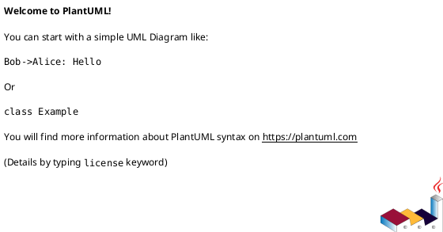

# epic-local-00001 Local Logging and Summary — 計画（Issues / Order）

## Issue 分割（縦切り方針） (必須)
- 価値の縦切り（UI→API→DBまで通す） / 移行の縦切り（expand→...）:
  - 価値の縦切り: 「ログ 1 件を確実に保存できる」→「summary を原子的に生成できる」
- 分割方針（原則）:
  - 1 issue = 1 つの観測可能な振る舞い（E2E）
- 例外（分割方針を破る条件）:
  - なし（まずは最小分割で進める）

## Issue 一覧（順序付き） (必須)
- iss-xxxx-... (MVP: log 保存 + summary 生成):
  - 目的:
    - notify payload を `.codexlog/` に保存し、summary を原子的に再生成する
  - 成果物（Deliverable）:
    - `.codexlog/logs/*.md` の生成
    - `.codexlog/summary.md` のフル再構築 + 原子的置換
    - ファイル名の安全化（ID 正規化）
  - 対応する E-RQ / E-AC:
    - E-RQ-001..003 / E-AC-001..002
  - Depends on:
    - ...
- iss-xxxx-...:
  - ...

### UML（任意） (任意)

## 品質ゲート（Epic） (必須)
- [ ] 各 Issue が AC/EC を満たす自動テストを持つ（例外は理由がある）
- [ ] Epic の統合観点（E-AC）が確認できる（自動/半自動/手順のいずれか）
- [ ] 観測性（ログ/メトリクス/アラート）が入る（該当する場合）
- [ ] 移行手順/ロールバックが文書化される（該当する場合）

## ロールアウト / 移行 (必須)
- Feature flag:
  - ...
- 段階公開（カナリア/一部テナント/内部先行など）:
  - ...
- ロールバック:
  - ...

## Issue Definition of Ready（Issue に求める着手可能条件） (必須)
- [ ] Issue requirement に AC/EC がテスト可能な形で書けている
- [ ] Issue requirement に MUST/MUST NOT/OUT OF SCOPE と Always/Ask/Never がある
- [ ] Issue design に変更計画（パス単位）と要件→設計マッピングがある
- [ ] Issue design にテスト戦略（AC/EC→テスト）がある（該当なしの場合は理由がある）
- [ ] Issue plan が 1ステップ=1つの観測可能な振る舞いになっている
- [ ] 未確定事項が「質問/選択肢/推奨案/影響範囲」で整理されている

## 実行コマンド（必要なら） (任意)
- Test: `<command>`
- Lint/Format: `<command>`
- Typecheck: `<command>`

## 未確定事項（TBD） (必須)
- Q-001:
  - 質問: TBD ...
  - 選択肢:
    - A: ...
    - B: ...
  - 推奨案（暫定）:
    - ...
  - 影響範囲:
    - Issue分割 / 順序 / ロールアウト / 品質ゲート / ...

## 省略/例外メモ (必須)
- 該当なし
