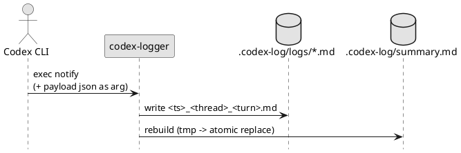

# epic-local-00001 Local Logging and Summary — 要件定義（WHAT / WHY）

## 目的（Initiativeとの紐づき） (必須)
- Initiative のどの Goal / Metric に効くか:
  - Metric 1（`agent-turn-complete` 受信のたびにローカルログ生成 100%）
- この Epic が提供する能力（E2E）:
  - `notify` payload（コマンド引数として付与され、`codex-logger` では **末尾引数を JSON として解釈**）を受信し、`<cwd>/.codex-log/logs/` に 1イベント=1ファイルで保存できる
  - `summary.md` を毎回フル再構築して原子的に置換できる

## ユースケース（User journeys） (必須)
- Happy path:
  - `agent-turn-complete` を受信 → `.codex-log/logs/*.md` を作成 → `summary.md` を再生成
- 例外/運用シナリオ:
  - `.codex-log/` が無い状態から初回実行する
  - 既存ログが多数ある状態でも、毎回 `summary.md` が壊れずに生成される
  - payload の任意フィールド欠損（`last-assistant-message` 無し等）でも raw 保存が継続される

### UML（任意） (任意)

## 要求（Epic-level requirements） (必須)
> “Issueに分割して実装される前提の、E2E要求” を列挙する。

- E-RQ-001（MUST）: `<cwd>/.codex-log/logs/` にログ Markdown を保存できる（raw JSON 同梱）
- E-RQ-002（MUST）: `summary.md` を `logs/` からフル再構築し、原子的に置換できる（結合順はファイル名昇順で決定的）
- E-RQ-003（MUST）: ファイル名に `thread-id`/`turn-id` を生で埋め込まない（正規化/短縮/ハッシュ等）
- E-RQ-004（SHOULD）: payload の未知フィールド/任意フィールド欠損に耐える（raw は常に残す）
- E-RQ-005（MUST）: 同名ファイルが発生しても上書きせず、排他的作成 + サフィックス等で必ず別名保存できる
- E-RQ-006（MUST）: `summary.md` の再構築は同時実行でも壊れない（ロック等で再構築区間を排他する）

## 受け入れ条件（Epic DoD / E2E） (必須)
- E-AC-001:
  - Given: `agent-turn-complete` の notify payload を受け取る
  - When: handler を実行する
  - Then: `.codex-log/logs/` に 1 ファイルが作成され、raw JSON が保存されている
  - 観測点（UI/HTTP/DB/Log 等）:
    - filesystem
- E-AC-002:
  - Given: `.codex-log/logs/` に複数ログが存在する
  - When: handler を実行する
  - Then: `.codex-log/summary.md` が `logs/` の時系列順で結合され、壊れない（原子的置換）
- E-AC-003:
  - Given: 同じファイル名になり得る条件（同一 `<ts>_<safe-thread>_<safe-turn>`）で既存ログが存在する
  - When: handler を実行する
  - Then: 既存ログを上書きせず、別名（例: `__01` など）で新しいログが保存される
- E-AC-004:
  - Given: 同一 `cwd` に対して handler が同時に複数起動される
  - When: それぞれがログ保存 + summary 再構築まで実行する
  - Then: `summary.md` が破損せず、最終的に全ログが含まれる（古いログ集合で上書きされない）

## スコープ (必須)
- MUST:
  - `.codex-log/` 配下への保存と summary 生成
- MUST NOT:
  - Telegram 送信（別 Epic）
- OUT OF SCOPE:
  - ログの自動削除/ローテーション

## 境界（Always / Ask / Never） (必須)
- Always（常に守る）:
  - raw JSON を SSOT として残す
- Ask（迷ったら相談）:
  - マスキング方針（機密/PII）
- Never（絶対にしない）:
  - `.codex` 配下にログを置かない

## 非機能要件（NFR） (必須)
- 性能:
  - `summary.md` 再生成は O(n) だが安全性優先（n=ログ件数）
- 信頼性/整合性:
  - `summary.md` は一時ファイル経由で原子的に置換（失敗時は旧ファイルを保持）
- セキュリティ:
  - ログは入力を含む可能性があるため取り扱い注意（外部送信はしない）
  - `.codex-log/` と `logs/` は 0700、ログファイルは 0600 を意図し、可能な範囲で restrictive に作成する
- 運用性（監視/アラート/Runbook）:
  - 失敗は stderr に出し、exit code で検知できる

## 依存 / 影響範囲 (必須)
- 影響コンポーネント（FE/BE/DB/ジョブ/外部連携）:
  - ローカル filesystem（`.codex-log/`）
- 外部依存（他チーム/外部API/権限/契約）:
  - なし
- 互換性（破壊的変更の有無 / バージョニング方針）:
  - raw JSON を保存するため、表示項目の追加は後方互換にしやすい
  - ...

## リスク/懸念（Risks） (任意)
- R-001: <リスク>（影響: ... / 対応: ...）
- ...

## 未確定事項（TBD） (必須)
- Q-001:
  - 質問: ファイル名の safe id 形式はどれを採るか？
  - 選択肢:
    - A: `sha256(id)[:8]` のみ（安全/短いが可読性低い）
    - B: slug + hash（可読性はあるが実装が少し増える）
  - 推奨案（暫定）:
    - A
  - 影響範囲:
    - E-RQ / E-AC / テスト / 運用（ファイル名）
  - 関連ADR:
    - `../../adrs/adr-00003-filename-safe-id-format.md`

## Definition of Ready（着手可能条件） (必須)
- [ ] Initiative との紐づき（Goal/Metric）が明記されている
- [ ] E-RQ と E-AC があり、E2Eで観測可能な形になっている
- [ ] MUST/MUST NOT/OUT OF SCOPE が書けている
- [ ] Always/Ask/Never が書けている
- [ ] NFR が書けている（該当なしの場合は理由がある）
- [ ] 依存/影響範囲が書けている
- [ ] 未確定事項が「質問/選択肢/推奨案/影響範囲」で整理されている

## Definition of Done（完了条件） (必須)
- E-AC が満たされている（統合動作として確認できる）
- （必要なら）ロールアウト/移行が完了している
- （必要なら）監視/アラート/Runbook が整備されている
- フォローアップが Issue として切られている（必要な分）

## 省略/例外メモ (必須)
- 該当なし
