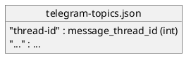

# epic-local-00002 Telegram Topics Delivery — 設計（HOW）

## 全体像（Context / Scope） (必須)
- 対象境界（モジュール/責務/データ境界）:
  - 入力:
    - notify payload の `thread-id` / `last-assistant-message`
    - env: `TELEGRAM_BOT_TOKEN`, `TELEGRAM_CHAT_ID`
      - `.env` は `<cwd>/.env` を自動読込（存在する場合のみ、環境変数が優先。`adr-00005`）
    - CLI flag: `--telegram`
  - 出力:
    - topic 作成（必要な場合） + `sendMessage`（分割送信）
    - `.codex-log/telegram-topics.json`（topic mapping）
- 既存フローとの関係:
  - ローカル保存（epic-local-00001）後に **ベストエフォート**で送信（ローカル保存が SSOT）
- 影響範囲（FE/BE/DB/ジョブ/外部連携）:
  - Telegram Bot API

### UML（任意） (任意)
```plantuml
@startuml
skinparam monochrome true
hide footbox

actor "Codex CLI" as Codex
participant "codex-logger" as Handler
database ".codex-log/telegram-topics.json" as Map
cloud "Telegram Bot API" as TG

Codex -> Handler: exec notify\n(+ payload json)
alt --telegram flag
  Handler -> Map: read mapping
  Handler -> TG: createForumTopic (if missing)
  Handler -> Map: update mapping\n(lock + atomic replace)
  Handler -> TG: sendMessage (chunked)\n(message_thread_id)
else no flag
  Handler -> Handler: skip Telegram
end
@enduml
```

## 契約（API/イベント/データ境界） (必須)
### 外部 API（Telegram Bot API）
- API-001: `createForumTopic`（topic 作成）
  - Request（最小）:
    - `chat_id`: `TELEGRAM_CHAT_ID`
    - `name`: topic 名（`adr-00002` に従い `<cwd_basename> (<thread-id>)`）
      - 制約: UTF-8 で 128 bytes 以下（超える場合は `thread-id` 短縮 + `cwd_basename` 切り詰めで収める）
  - Response（使うもの）:
    - `result.message_thread_id`
  - Errors（代表）:
    - 403: bot 権限不足 / 400: forum 無効 / 429: rate limit
- API-002: `sendMessage`（メッセージ投稿）
  - Request（最小）:
    - `chat_id`: `TELEGRAM_CHAT_ID`
    - `message_thread_id`: mapping の値
    - `text`: 4096 文字以下の本文（分割済み）
  - Errors（代表）:
    - 400/403/429/network

### Event（ある場合）
- EVT-001: `agent-turn-complete`（notify payload）
  - Producer: Codex CLI
  - Consumer: `codex-logger`
  - Payload: `thread-id`, `last-assistant-message`（他は raw 保存側で利用）

### データ境界（System of Record / 整合性）
- SoR（正のデータ）:
  - `.codex-log/telegram-topics.json`（`thread-id -> message_thread_id`）
- 整合性モデル:
  - 結果整合で良い（Telegram 送信はベストエフォート）

## データモデル設計 (必須)
> DB ではなくファイル保存。破損しないための不変条件を定める。

- 変更点（ファイル）:
  - `.codex-log/telegram-topics.json`
- バリデーション/不変条件（Invariant）:
  - JSON が壊れない（ロック + tmp + rename）
  - `thread-id` をキーとして扱える（文字列キー）
  - 値（`message_thread_id`）は整数

### UML（任意） (任意)


## 主要フロー（高レベル） (必須)
- Flow A（E-AC-001）:
  1) `--telegram` でなければ送信しない（E-AC-003）
  2) env 未設定なら送信しない（warn; 不足キーが分かる文言/理由コードを stderr に出す）
  3) payload を検証し、送信可否を決める
     - `thread-id` が欠損/空なら warn して送信しない（topic が作れないため）
     - `last-assistant-message` が欠損/空なら warn して送信しない（送る本文が無いため）
  4) mapping をロード（無ければ空）
  5) `thread-id` の topic が無ければ `createForumTopic` で作成し、mapping を保存
  6) `last-assistant-message` を分割して `sendMessage`（複数回）
  - Flow B（E-AC-002）:
  - 4) の分割アルゴリズムを適用し、4096 文字以内のチャンク列へ変換して送信する
    - 分割は改行境界優先 + 強制分割フォールバック
    - 各チャンク先頭に `(i/n)\\n` を付与する（`adr-00007`）
      - 分割は prefix 長を差し引いて行う（例: `max_body_len = 4096 - len(prefix)`）

### UML（任意） (任意)
```plantuml
@startuml
skinparam monochrome true
hide footbox

participant "codex-logger" as Handler
database "telegram-topics.json" as Map
cloud "Telegram Bot API" as TG

Handler -> Map: load
alt missing mapping
  Handler -> TG: createForumTopic
  Handler -> Map: save (lock+atomic)
end
loop chunks
  Handler -> TG: sendMessage
end
@enduml
```

## 失敗設計（Error handling / Retry / Idempotency） (必須)
- 想定故障モード:
  - env 未設定（送信しない）
  - forum 無効/権限不足（topic 作成/送信失敗）
  - rate limit / ネットワーク
  - mapping 破損（JSON parse 失敗）
- リトライ方針:
  - MVP は「リトライ無し」（warn）。必要になれば 429 の `retry_after` を尊重して限定リトライを検討する
- 冪等性/重複排除:
  - 送信は idempotent ではない（重複投稿の可能性は許容）
- 部分失敗の扱い:
  - Telegram 失敗は stderr warn（`adr-00008`）。ローカル保存は別 Epic で必達

## 移行戦略（Migration / Rollout） (必須)
- 戦略:
  - `--telegram` を付けたときだけ送る（段階導入が容易）
- ロールバック:
  - `--telegram` を外す（送信しない）

## 観測性（Observability） (必須)
- ログ（必須キー）:
  - `thread_id`, `topic_thread_id`, `chunks`, `telegram_enabled`
  - 失敗時は `error_type`, `status_code`（わかる範囲）
- メトリクス/アラート:
  - MVP では不要

## セキュリティ / 権限 / 監査 (必須)
- PII/機微情報の扱い:
  - 送るのは `last-assistant-message` のみ（入力/トークン等は送らない）
  - token をログに出さない（env 値は出力しない）

## テスト戦略（Epic） (必須)
- Unit:
  - 4096 分割（改行優先 + 強制分割フォールバック）
  - `--telegram` 未指定で API を呼ばない
- Integration:
  - Telegram API client をモックして topic 作成/送信の呼び出しを検証
- E2E:
  - `.codex-log/telegram-topics.json` の生成/更新を含めて検証
- 回帰/負荷:
  - MVP では不要

### E-AC → テスト対応 (必須)
- E-AC-001 → `tests/test_telegram.py::test_creates_topic_and_sends`
- E-AC-002 → `tests/test_telegram.py::test_splits_long_message`
- E-AC-003 → `tests/test_telegram.py::test_skips_without_flag`
- E-AC-004 → `tests/test_telegram.py::test_warns_when_env_missing_with_flag`

## ADR index（重要な決定は ADR に寄せる） (必須)
- adr-00001-notify-logger-output-and-telegram: `.codex-log` 構成、Telegram 方針（optional）
- adr-00002-telegram-topic-naming: topic 命名（`<cwd_basename> (<thread-id>)`）
- adr-00005-dotenv-loading-strategy: `<cwd>/.env` 自動読込（env 優先）
- adr-00007-telegram-chunk-numbering: 分割連番（`(i/n)\\n`）
- adr-00008-telegram-failure-exit-codes: Telegram 失敗時は warn + exit 0

## 未確定事項（TBD） (必須)
- 該当なし（意思決定済み: `adr-00002`）

## 省略/例外メモ (必須)
- 該当なし
