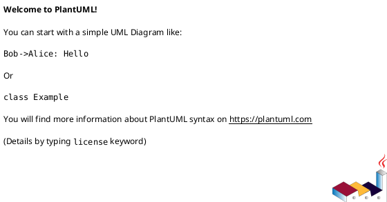

# epic-local-00002 Telegram Topics Delivery — 設計（HOW）

## 全体像（Context / Scope） (必須)
- 対象境界（モジュール/責務/データ境界）:
  - 入力: notify payload の `thread-id` / `last-assistant-message`
  - 出力: Telegram topic 作成 + `sendMessage`
- 既存フローとの関係:
  - ローカル保存（epic-local-00001）後にベストエフォートで送信
- 影響範囲（FE/BE/DB/ジョブ/外部連携）:
  - Telegram Bot API

### UML（任意） (任意)

## 契約（API/イベント/データ境界） (必須)
### API（ある場合）
- API-001: `<METHOD> <PATH>`
  - 認証/認可:
    - ...
  - Request:
    - ...
  - Response:
    - ...
  - Errors:
    - ...

### Event（ある場合）
- EVT-001: `<event_name>`
  - Producer:
    - ...
  - Consumer:
    - ...
  - Payload:
    - ...
  - 発行タイミング:
    - ...

### データ境界（System of Record / 整合性）
- SoR（正のデータ）:
  - ...
- 整合性モデル（強整合/結果整合）:
  - ...

## データモデル設計 (必須)
- 変更点（テーブル/カラム/インデックス）:
  - ...
- バリデーション/不変条件（Invariant）:
  - ...

### UML（任意） (任意)

## 主要フロー（高レベル） (必須)
- Flow A（E-AC-001）:
  1) ...
  2) ...
  3) ...
- Flow B（E-AC-002）:
  - ...

### UML（任意） (任意)

## 失敗設計（Error handling / Retry / Idempotency） (必須)
- 想定故障モード:
  - ...
- リトライ方針:
  - ...
- 冪等性/重複排除:
  - ...
- 部分失敗の扱い（補償/再実行/整合性）:
  - ...

## 移行戦略（Migration / Rollout） (必須)
- 戦略（例: expand → backfill → switch → contract）:
  - ...
- 二重書き/読み替え（必要なら）:
  - ...
- ロールバック方針:
  - ...

## 観測性（Observability） (必須)
- ログ（必須キー、マスキング、サンプリング）:
  - ...
- メトリクス（成功/失敗/レイテンシ/処理件数）:
  - ...
- アラート（しきい値/対応導線）:
  - ...

## セキュリティ / 権限 / 監査 (必須)
- 役割モデル:
  - ...
- 監査ログ:
  - ...
- PII/機微情報の扱い:
  - ...

## テスト戦略（Epic） (必須)
- Unit:
  - ...
- Integration:
  - ...
- E2E:
  - ...
- 回帰/負荷:
  - ...

### E-AC → テスト対応 (必須)
- E-AC-001 → `<test_file_path>::<test_name>` / `<scenario>`
- E-AC-002 → ...

## ADR index（重要な決定は ADR に寄せる） (必須)
- adr-xxxx-...: <1行要約>
- ...

## 未確定事項（TBD） (必須)
- Q-001:
  - 質問: TBD ...
  - 選択肢:
    - A: ...
    - B: ...
  - 推奨案（暫定）:
    - ...
  - 影響範囲:
    - API / EVT / データモデル / 移行 / 観測性 / テスト / ...

## 省略/例外メモ (必須)
- 該当なし
